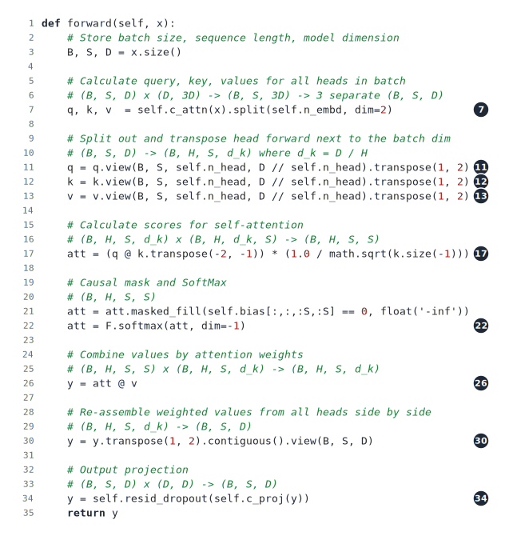
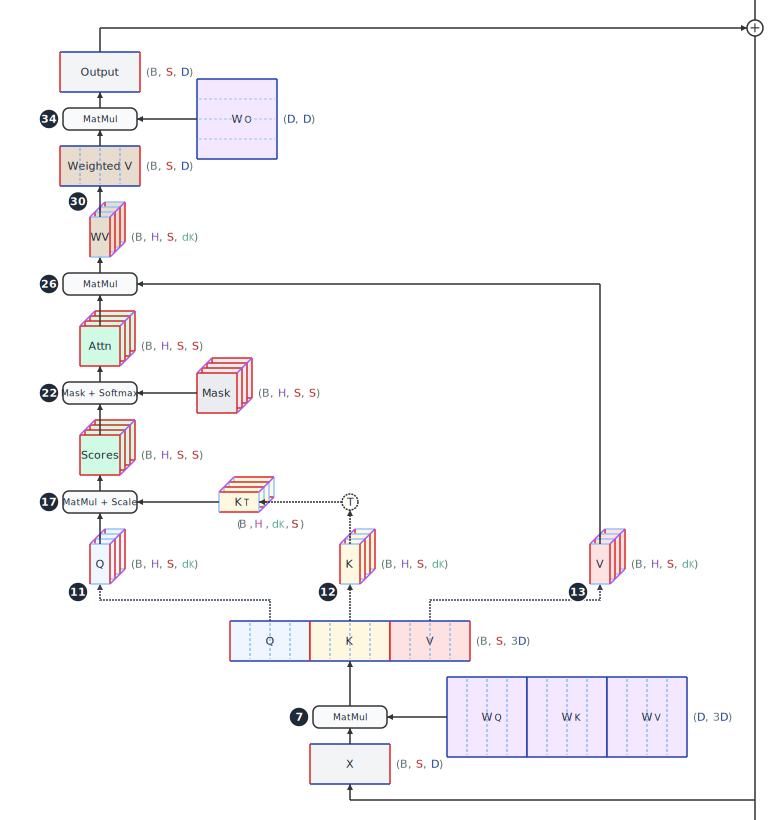
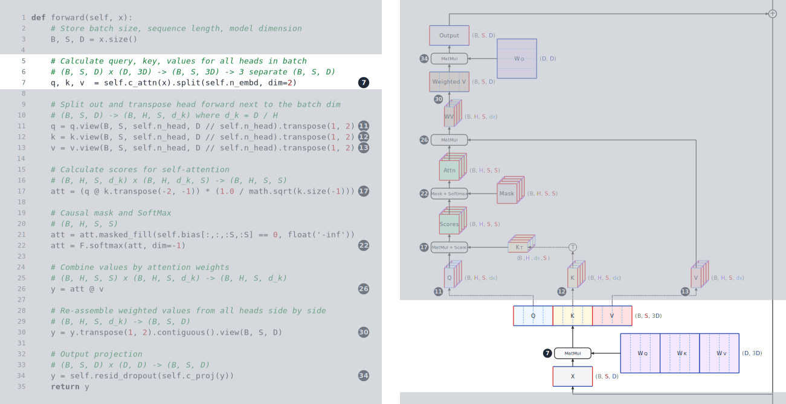
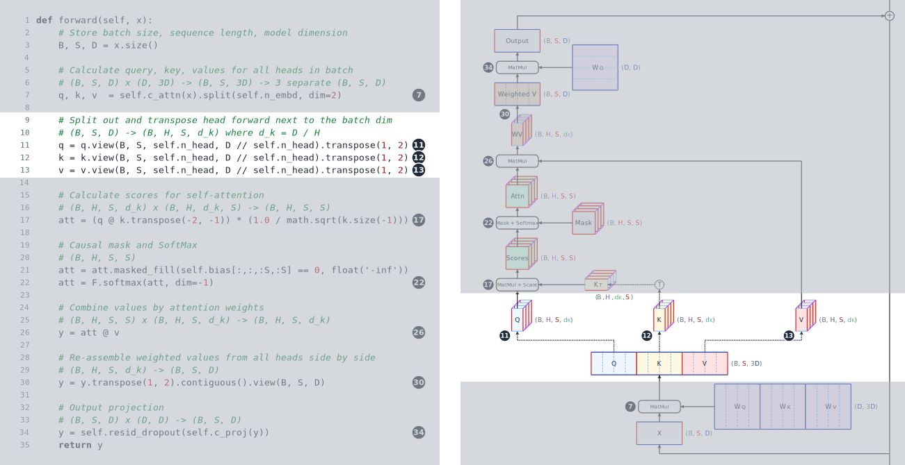
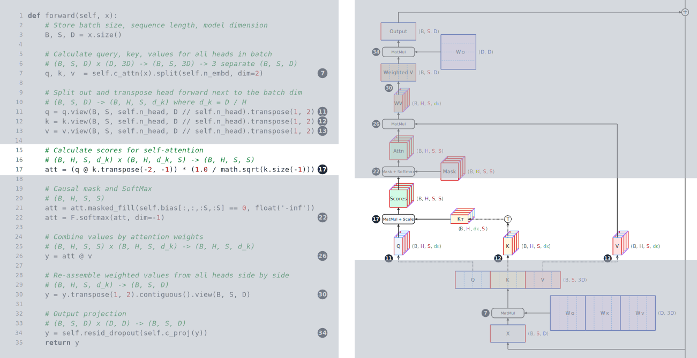
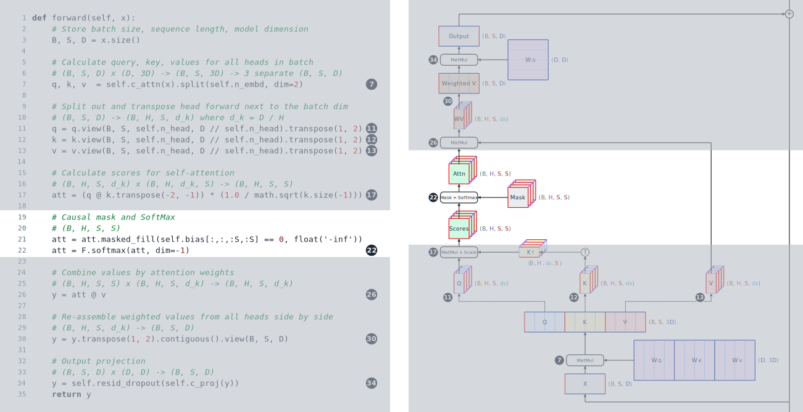
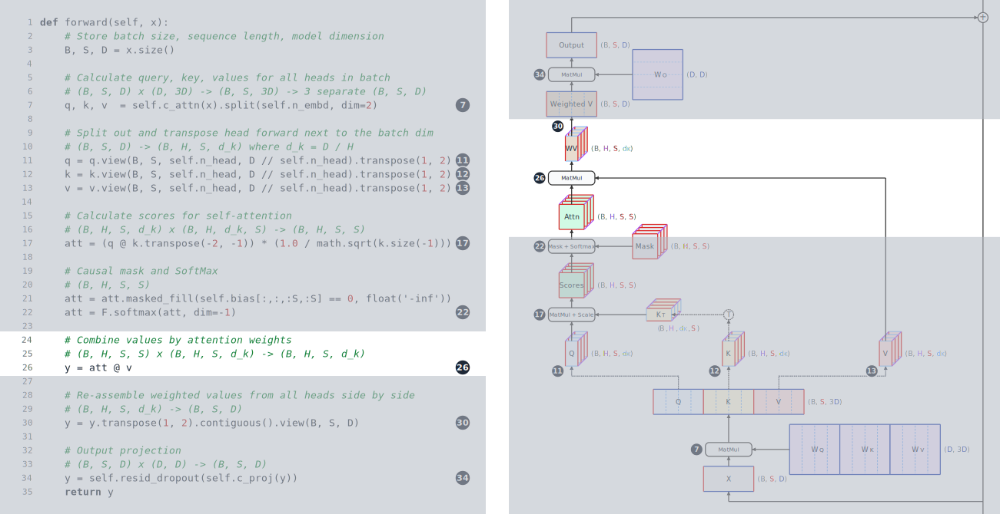
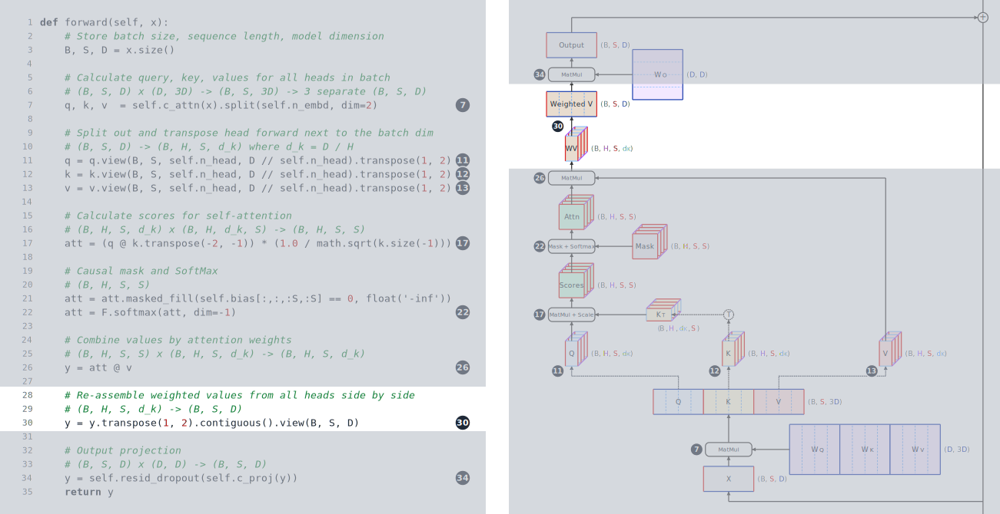
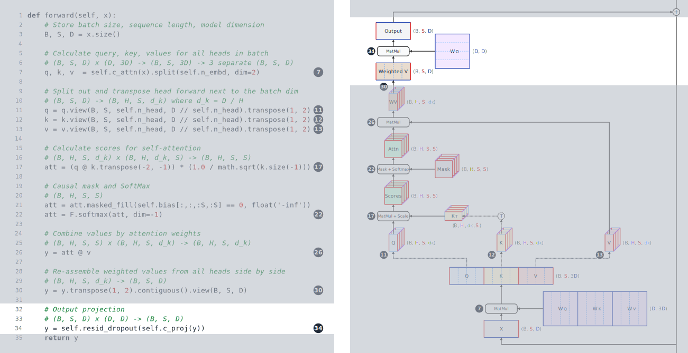

# Additional Material {#sec-additional}

This appendix contains additional material to supplement the main content of the book.

## Attention calculation {#sec-attn-calc}

In order to deeply understand the self-attention mechanism in LLMs, it is helpful to understand the concepts being applied, the size of the data, and how the data flows through the calculations.
In this section, we will walk through the multi-head attention tensor data flow diagram in depth, illustrating exactly how the masked self-attention works.
We will walk through sample code and the diagram, side-by-side, to provide a unified picture of both the concepts and the data flow.

```{=html}
<!-- Sample code

```{#lst-attn .python code-line-numbers=true lst-cap="Attention forward pass in PyTorch"}
def forward(self, x):
    # Store batch size, sequence length, model dimension
    B, S, D = x.size() 

    # Calculate query, key, values for all heads in batch 
    # (B, S, D) x (D, 3D) -> (B, S, 3D) -> 3 separate (B, S, D)
    q, k, v  = self.c_attn(x).split(self.n_embd, dim=2) 

    # Split out and transpose head forward next to the batch dim
    # (B, S, D) -> (B, H, S, d_k) where d_k = D / H
    q = q.view(B, S, self.n_head, D // self.n_head).transpose(1, 2)
    k = k.view(B, S, self.n_head, D // self.n_head).transpose(1, 2)
    v = v.view(B, S, self.n_head, D // self.n_head).transpose(1, 2)

    # Calculate scores for self-attention
    # (B, H, S, d_k) x (B, H, d_k, S) -> (B, H, S, S)
    att = (q @ k.transpose(-2, -1)) * (1.0 / math.sqrt(k.size(-1)))

    # Causal mask and SoftMax
    # (B, H, S, S)
    att = att.masked_fill(self.bias[:,:,:S,:S] == 0, float('-inf'))
    att = F.softmax(att, dim=-1)

    # Combine values by attention weights
    # (B, H, S, S) x (B, H, S, d_k) -> (B, H, S, d_k)
    y = att @ v 

    # Re-assemble weighted values from all heads side by side
    # (B, H, S, d_k) -> (B, S, D)
    y = y.transpose(1, 2).contiguous().view(B, S, D) 

    # Output projection
    # (B, S, D) x (D, D) -> (B, S, D)
    y = self.resid_dropout(self.c_proj(y))
    return y
-->
```

{#fig-attn-code-num .lightbox}

@Fig-attn-code-num is a listing of the PyTorch code we will use for our walk through.
It was based on the implementation from Andrej Karpathy's nanoGPT repository [@karpathy2022nanogpt].
(A copy of the listing can be downloaded from the [book repo source](https://github.com/tedkyi/llm-inference/blob/main/chapters/images/attn_code.py), and the full LLM implementation can be reviewed in the nanoGPT repo.)
Note that the weight matrices are inside linear layers named `c_attn` and `c_proj`, which are not included in the listing for brevity.
Since this code provides the full batched implementation of attention, we will include the batch dimension, **B**, in the tensor dimension labels, so that they match the code.
Variable names and comments for other dimensions, such as **[S]{.dim-s}** for the sequence length, have been changed in the code to match the naming conventions in this book (which are listed in the **Conventions** section in the front matter).
@Fig-attn-flow-num provides an overview of the full data flow.

{#fig-attn-flow-num .lightbox}

Next, we will walk through the code line by line.

### Step 1: calculating Q, K, and V

{#fig-attn-step-1 .lightbox}

Line 7 is the first data operation in the forward pass.
We see it highlighted, along with the relevant portion of the data flow, in @fig-attn-step-1.
Our input, $X$, is a tensor of shape **(B, [S]{.dim-s}, [D]{.dim-d})**, where **B** is the batch size, **[S]{.dim-s}** the sequence length (number of tokens), and **[D]{.dim-d}** the model dimension (embedding size) of the LLM.
The input is multiplied by the three weight matrices for the queries, keys, and values.
Mathematically, this is the embedding for $Q$, $K$, and $V$:
$$Q = X W_Q, \quad K = X W_K, \quad V = X W_V$$
Conceptually, the queries represent the kind of information being sought in prior tokens, the keys list the kinds of information available for each token, and the values hold the information to be copied when the queries and keys match.

Line 7 sends the input batch to `c_attn`, a linear layer with a single matrix with all three sets of weights concatenated, for efficiency.
$W_Q$, $W_K$, and $W_V$ each have shape **([D]{.dim-d}, [D]{.dim-d})**, so **([D]{.dim-d}, 3[D]{.dim-d})** when concatenated.
The weight matrix is broadcast along the batch dimension when the input $X$ is multiplied with it.
Once split, each of the outputs Q, K, and V each has shape **(B, [S]{.dim-s}, [D]{.dim-d})**.

Note that in this data flow diagram, **[S]{.dim-s}** edges are drawn shorter than **[D]{.dim-d}** edges. 
Llama 3 70B has model dimension **[D]{.dim-d}** = 8192, so this will be accurate when **[S]{.dim-s}** < 8192. 
If the sequence were longer and we had **[S]{.dim-s}** > 8192, then the **[S]{.dim-s}** edges would be longer than **[D]{.dim-d}** edges, though this static diagram cannot show the change.

### Step 2: splitting Q, K, and V into heads

{#fig-attn-step-2 .lightbox}

The second step in the attention calculation, on lines 11-13, splits the $Q$, $K$, and $V$ tensors into heads and reorders the dimensions. 
Having multiple heads allows multiple query-key patterns to be matched for each token.
Mathematically, this splitting and reshaping involves reinterpreting the last dimension --- breaking **[D]{.dim-d}** into **[H]{.dim-h}** groups of size $\dimdk{d_K}$ --- and transposing the dimensions so that the head dimension comes before the sequence dimension.
This does not require any computation or data movement --- just changing the metadata describing how to index each tensor.
The tensors have changed from shape **(B, [S]{.dim-s}, [D]{.dim-d})** to **(B, [H]{.dim-h}, [S]{.dim-s}, $\dimdk{d_K}$)**.
In @fig-attn-step-2, dotted line arrows show the view operations that do the reshape on each of $Q$, $K$, and $V$.

If you trace back the individual heads, you will see they represent ranges of columns in the $Q$, $K$, and $V$ tensors.
And if you trace those back further, you will see that independent ranges of columns of the $W_Q$, $W_K$, and $W_V$ weights multiply with $X$ to form those column ranges.
The vertical dashed lines on the weight matrices and $Q$, $K$, and $V$ tensors show the conceptual division of those tensors into heads, even though the explicit reshape doesn't happen until the next step.

### Step 3: calculating and scaling similarity scores

{#fig-attn-step-3 .lightbox}

Step 3 is calculating the similarity scores between queries and keys.
We compute the raw attention scores by taking the dot product of each query with each key.
In matrix notation, we have:
$$\text{Scores} = \frac{Q K^T}{\sqrt{\dimdk{d_K}}}$$
The division by $\sqrt{\dimdk{d_K}}$ prevents the dot products from growing larger as the dimension **$\dimdk{d_K}$** increases.

The multiplication is on line 17 and is highlighted in @fig-attn-step-3.
The transpose is another view operation that changes the $K$ tensor of shape **(B, [H]{.dim-h}, [S]{.dim-s}, $\dimdk{d_K}$)** into the $K^T$ tensor of shape **(B, [H]{.dim-h}, $\dimdk{d_K}$, [S]{.dim-s})**.
The product $Q K^T$ multiplies tensors with shapes **(B, [H]{.dim-h}, [S]{.dim-s}, $\dimdk{d_K}$)** and **(B, [H]{.dim-h}, $\dimdk{d_K}$, [S]{.dim-s})**, producing a scores tensor of shape **(B, [H]{.dim-h}, [S]{.dim-s}, [S]{.dim-s})**. 
For each batch sample and each head, the scores form a matrix with shape **([S]{.dim-s}, [S]{.dim-s})**, where entry $(i, j)$ is the attention score between the query at token position $i$ and the key at token position $j$.

### Step 4: masking the scores and performing the SoftMax

{#fig-attn-step-4 .lightbox}

Next, we apply a causal mask to the scores and perform a SoftMax to convert them to values that sum to 1.
@Fig-attn-step-4 highlights lines 21-22 and the associated portion of the data flow.
Line 21 sets masked out entries to $-\infty$.
These values become zeroes when the SoftMax is applied, on line 22.

All of these operations are working with **(B, [H]{.dim-h}, [S]{.dim-s}, [S]{.dim-s})** shaped tensors.
When the sequence length is small, these tensors don't require much memory, but as **[S]{.dim-s}** grows very large, these become enormous, since they increase quadratically with **[S]{.dim-s}**.
@Sec-attention-kernels discusses how efficient attention kernels avoid materializing the attention tensors in GPU memory.

### Step 5: calculating weighted values

{#fig-attn-step-5 .lightbox}

The fifth step multiplies our attention pattern by the values, creating one weighted value vector for each batch sample, head, and query.
Line 26 performs the matrix multiplication and is shown in @fig-attn-step-5.
After the matrix multiplication, we have calculated:
$$\text{Weighted Values} = \text{SoftMax}\left(\frac{Q K^T}{\sqrt{\dimdk{d_K}}} + \text{mask}\right) V$$
The attention weights have shape **(B, [H]{.dim-h}, [S]{.dim-s}, [S]{.dim-s})** and $V$ has shape **(B, [H]{.dim-h}, [S]{.dim-s}, $\dimdk{d_K}$)**, so the result has shape **(B, [H]{.dim-h}, [S]{.dim-s}, $\dimdk{d_K}$)**.

### Step 6: reshaping the weighted values

{#fig-attn-step-6 .lightbox}

@Fig-attn-step-6 highlights step 6.
The weighted values are reshaped from **(B, [H]{.dim-h}, [S]{.dim-s}, $\dimdk{d_K}$)** to **(B, [S]{.dim-s}, [D]{.dim-d})** by concatenating the **[H]{.dim-h}** heads into the final dimension of length **[D]{.dim-d}**.
This happens on line 30 of the code.
Note that this cannot be accomplished with a view, because the data for the heads of the same batch sample and token position are not contiguous.
This reshape requires copying the data into a new, contiguous memory block.

### Step 7: calculating the final output

{#fig-attn-step-7 .lightbox}

The final step creates the attention layer's output.
Line 34 performs this using `c_proj`, a linear layer with weight matrix $W_O$ (not shown).
The weighted values tensor now has shape **(B, [S]{.dim-s}, [D]{.dim-d})**.
$W_O$ has shape **([D]{.dim-d}, [D]{.dim-d})** and is broadcast along the batch dimension when the input to `c_proj` is multiplied with it.
Note that because the weighted values had the output of attention heads concatenated into ranges of columns, implicitly ranges of rows of $W_O$ act upon individual head values.
This is indicated with the horizontal dashed lines on the $W_O$ weight tensor.

The layer's final output has shape **(B, [S]{.dim-s}, [D]{.dim-d})**.
This is the same as the attention layer's input, so the layer does not modify the shape of the data it processes.
This allows us to stack arbitrary numbers of layers without having to worry about dimensions.

### Putting it all together

Now that we have traced each step in isolation, the data flow diagram in @fig-attn-flow-num can be read end-to-end as a single picture.
The seven steps split naturally into three groups: the input and output projections (steps 1 and 7), the attention computation itself (steps 3 through 5), and the reshapes that bracket the attention block (steps 2 and 6).
The reshapes do little or no real work --- they cost only a metadata change or a single contiguous copy --- while the projections and the attention block account for essentially all of the arithmetic.

A few observations are worth carrying forward as various chapters examine attention through the lens of inference optimization:

- The **(B, [H]{.dim-h}, [S]{.dim-s}, [S]{.dim-s})** attention matrix in the middle of the calculation grows quadratically with sequence length, and is the central memory pressure point that motivates fused attention kernels (@sec-attention-kernels).
- Each attention head operates on its own column range of $W_Q$, $W_K$, $W_V$, and on its own row range of $W_O$, with no cross-talk between heads until the output projection mixes them. This independence is what lets variants like multi-query and grouped-query attention (@sec-efficient-attention) share keys and values across heads without disturbing the rest of the pipeline.
- This column- and row-independence of slices of the weights also makes tensor parallelism (@sec-tensor-parallelism) easy to implement for attention layers by sharding attention heads across devices.
- During prefill, the queries, keys, and values all have the same sequence length **[S]{.dim-s}**.
During decode, there is only one query per batch sample, but the number of keys and values remains **[S]{.dim-s}** because the key and value for the last token are appended to keys and values from prior tokens saved in the KV cache (@sec-kv-cache-intro); a version of the decode data flow is shown in @fig-attn-flow-kv.
- The entire calculation broadcasts cleanly over the batch dimension. Since batch samples never interact with one another, it makes batched inference straightforward to parallelize on GPUs.

We hope this unified presentation of the concepts and the data flow clarifies precisely what is happening inside masked self-attention and gives a solid foundation for the optimization techniques in this book.