# The Decoder-Only Transformer {#sec-appendix-a}

This chapter covers the architecture of the basic decoder-only transformer used by most LLMs such as ChatGPT and Llama.
We will walk through it in enough detail to be able to trace a token through the full model, seeing the parameter and activation tensor dimensions.
If you aren't at all familiar with the transformer, there are many good resources, and a few are listed in the Further Reading (@sec-further-llm) at the end of the chapter.
If you're already comfortable with multi-head self-attention, the KV cache, and gated MLPs, you can skim through this material and move ahead to the next chapter.
We recommend that you examine the tip at the beginning of @sec-forward-pass to understand the conventions used in data flow diagrams before moving ahead to the rest of the book.

We'll use concrete numbers from the Llama family of models in this book.
This is not because Llama is special, but because its architecture is representative of the core that modern LLMs share and its parameters are public.
There are many newer models with better performance, but Llama has a simpler, more canonical architecture which is a good fit for this introduction.
When we say "a 70B model," we mean something with roughly Llama 3 70B's dimensions: 80 layers, a model dimension of 8192, 64 attention heads, and a vocabulary of 128,000 tokens [@grattafiori2024llama3].

## From Encoder-Decoder to Decoder-Only {#sec-enc-dec}

The original transformer architecture introduced in "Attention Is All You Need" [@vaswani2017attention] has two distinct halves: an **encoder** that processes the input sequence and a **decoder** that generates the output sequence.
The encoder builds a rich representation of the input through layers of self-attention.
The decoder then attends to that representation through **cross-attention** layers while also attending to its own previously generated tokens through **masked self-attention**.

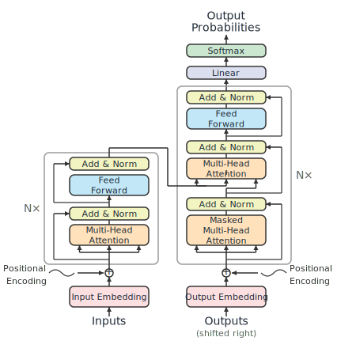{#fig-orig-transformer height=300 .lightbox}

This encoder-decoder design, shown in @fig-orig-transformer, was built for sequence-to-sequence tasks like machine translation, where you have a clear separation between input (such as a sentence in French) and output (its English translation).
The encoder on the left reads the full input and builds a bidirectional representation --- each token can attend to every other token, past and future.
The decoder on the right then generates the output one token at a time, attending both to the encoder's representation and to its own partial output.

The decoder-only transformer, used by GPT-2 [@radford2019gpt2], LLaMA [@touvron2023llama], and virtually all modern large language models in production today, takes this architecture and strips it down.
The entire encoder is removed.
The cross-attention layers in the middle of the decoder are removed.
What's left is a single stack of transformer blocks, each containing masked self-attention and a **feed-forward network (FFN)**, preceded by a token embedding layer and followed by a linear language model head.

::: {#fig-decoder layout-ncol=2 layout-valign="center"}

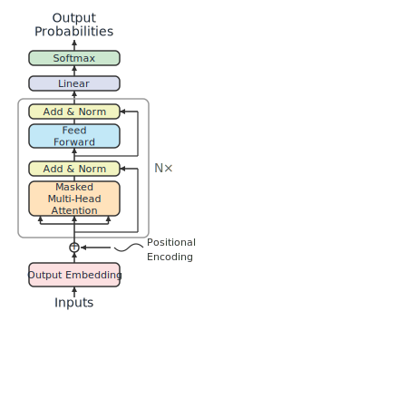{#fig-decoder-only height=300 .lightbox}

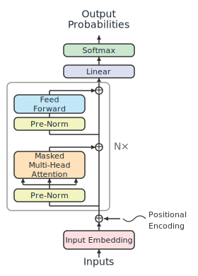{#fig-straight-through height=300 .lightbox}

A decoder-only LLM, shown in two variants
:::

On the left of @fig-decoder is a trimmed down decoder-only version of the original transformer architecture.
Researchers also found that training larger models was more stable when the normalization happened before each attention and FFN block, instead of after.
This design is referred to as the **pre-norm** architecture.
On the right side of @fig-decoder is a pre-norm decoder-only model where the attention and FFN layers have been shifted to the side, making the residual connection path, known as the **residual stream**, more obvious.
Throughout this book, we will use this straight-through arrangement of the pre-norm decoder-only LLM in our examples.

Why did this simpler architecture win?
Three reasons stand out.
First, **simplicity**: one stack of identical blocks is easier to implement, optimize, and scale than two interleaved stacks.
Second, **favorable scaling behavior**: empirically, decoder-only models have shown strong performance scaling with increased parameters and data, as demonstrated by GPT-3, PaLM [@chowdhery2022palm], and the Llama series.
Third, a **unified pretraining objective**: next-token prediction works on any text, requiring no paired input-output data.
You can perform self-supervised training on the entire internet without needing aligned corpora or labeled data.
Another key benefit is that the decoder-only model is faster to train than the original encoder-decoder transformer.

### Layer repetition and weight sharing

Two aspects of the architecture are worth making very explicit, because they matter for understanding inference costs.

First, the "N×" in the architecture diagram means that the same block structure is repeated N times.
Note that each layer has the same structure, shape, and size, but each layer has its own independent set of weights.
For example, Layer 0's attention weights are completely separate from Layer 1's.
A 70B model with 80 layers has 80 distinct sets of attention and feed-forward weights.
During inference, the model must read each layer's weights from memory --- there is no reuse across layers in the standard LLM.

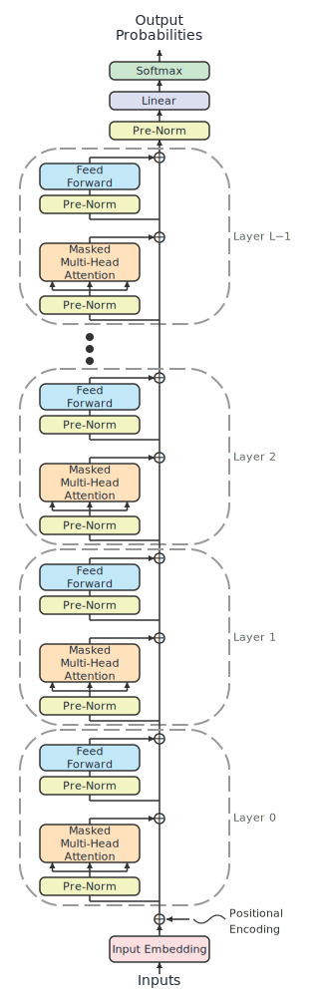{#fig-vert-stack height=500 .lightbox}

A diagram making the N copies explicit is shown in @fig-vert-stack.
This is what a decoder-only LLM really looks like, and if you review the PyTorch code for one, you will see this exact structure.
The "N×" is shorthand, and it saves space in diagrams, but in actual GPU memory, all of those many copies do exist and take up a lot of room.
Please also note that each layer must be calculated before the next layer can be calculated.
(If you are familiar with earlier work with RNNs and LSTMs, we have eliminated the sequential dependency in the sequence length direction, but we now have a sequential dependency in the layer direction.)
We will also mention here that the input to the first layer is a vector of floating point numbers of length $d_{\text{model}}$, which we will abbreviate **([D]{.dim-d})**.

The second architectural understanding needed is that the model is applied identically across every token position in the sequence, sharing all weights.
When we process a sequence of **[S]{.dim-s}** tokens, the same weight matrices are applied to every token position.
@Fig-model-grid shows a first intuition of the model being copied repeatedly for each token position.
Unlike the layers in the vertical direction that are real, the copies of each block in the same layer at different token positions are conceptual and share weights.
For example, the FFN weights in layer 2 for token 0 are identical to the FFN weights in layer 2 for token 1.
There is only one FFN for layer 2, and the horizontal copies are just a mental model.

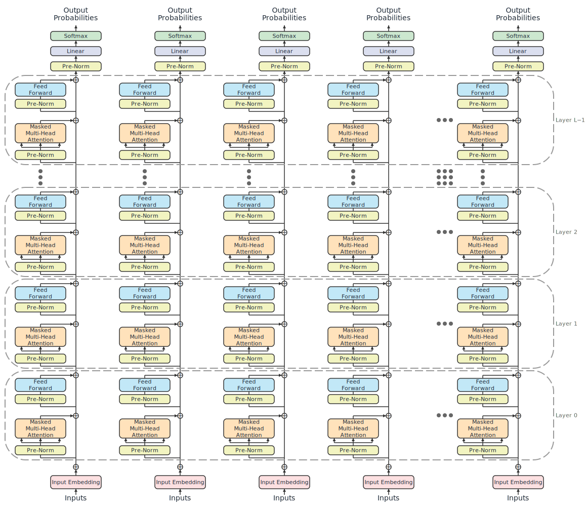{#fig-model-grid .lightbox}

One aspect of the data flow that is not yet captured in this diagram is that the attention calculation processes information across token positions.
All of the other blocks, such as embedding or FFN, process each token position's input in the same way, regardless of what is in other token positions.
Masked multi-head attention looks at information from the other token positions, so we add an orange line in @fig-model-attn-comm to explicitly show that data flows from earlier tokens to all later tokens.
Wiring up separate vertical stacks would also require connecting attention layers in this way.
We are modeling this conceptually at this time, and we will see in @sec-kv-cache-intro that a fundamental optimization will implement this orange path in a data store called the KV cache.

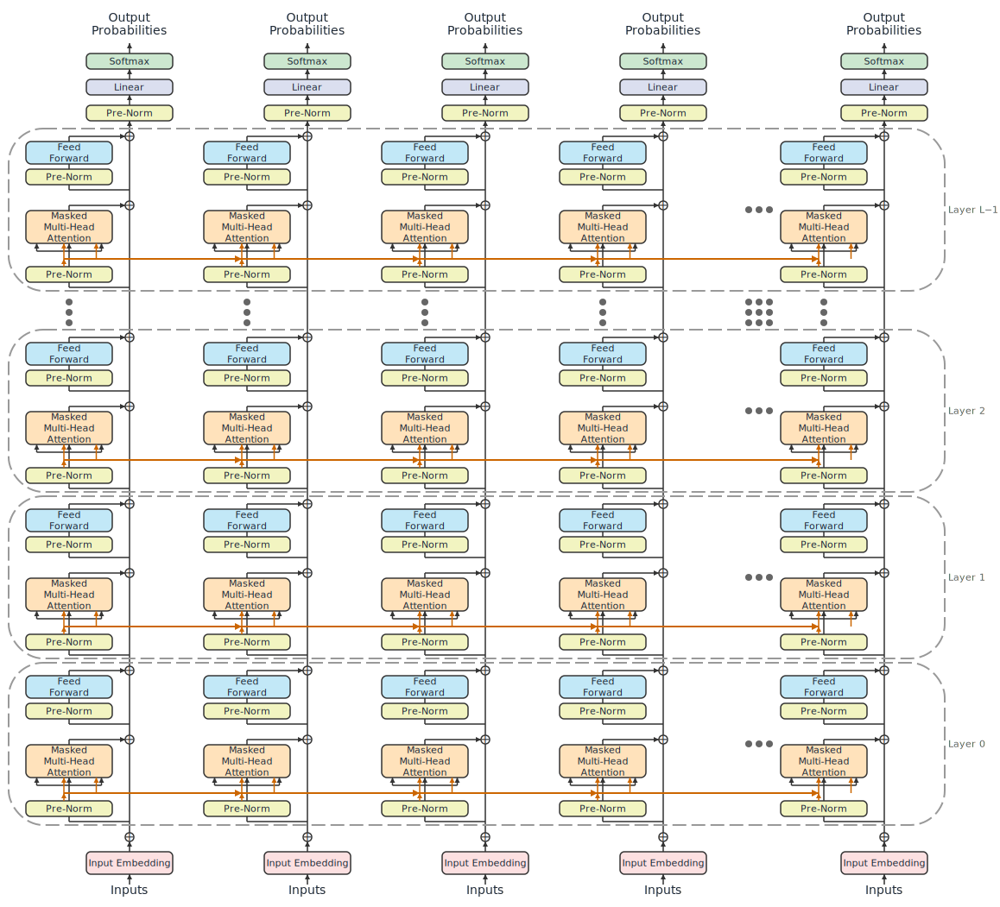{#fig-model-attn-comm .lightbox}

If we were to make a separate physical copy of the model for each token position, this would give us a correct answer, but it would consume massive amounts of memory for longer sequences.
This idea of multiple copies of our model is a good mental model to understand data flow across token positions.
However, this is not how model inference happens.
Rather than making copies of the model, we simply take our vertical stack model and change the input from a 1D vector of shape **([D]{.dim-d})** to a 2D tensor of shape **([S]{.dim-s}, [D]{.dim-d})**.
Passing this 2D tensor into a single copy of the model yields a single tensor with outputs identical to what multiple copies of the model would have produced.

::: callout-note
For efficiency reasons, almost all deep learning training and inference happens in batches.
This is true as well for LLM inference, and we will discuss batching in @sec-batching.
For the sake of brevity, especially in diagrams, we will discuss non-batched data flow and omit the explicit mention of the batch dimension.
For LLMs, the full batched shape of the input to the first layer is **(B, [S]{.dim-s}, [D]{.dim-d})**, which we abbreviate to **([S]{.dim-s}, [D]{.dim-d})** for non-batched inputs.
Wherever data tensor shapes are mentioned without a leading batch dimension, it is appropriate to think about batched processing adding a single dimension to the beginning of the shape.
Weight tensors do not grow when processing data in batches. Rather, they are broadcast in the batch dimension.
We hope this convention of using non-batched shapes simplifies diagrams and eases intuition without any loss of generality for the batched use case.
:::


## Forward Pass Data Flow {#sec-forward-pass}

To gain a deeper understanding of how inference works, we will examine what happens when we send data through a forward pass of the model.
We will start at the big picture and work our way down into the individual components.
Our diagrams will trace input tensors through all of the operations until we reach the output tensor, annotating every tensor's shape along the way.
We call these **tensor data flow diagrams**, and they focus on the shapes of the tensors passed into operations more than the math of the calculation being performed.
The focus on tensors is so we can understand the size and shape of the data, which directly affects transfer speeds and computation costs.
The purpose of the data flow diagrams is to make properties of the tensors explicit so it is easier to have an intuition about the computations being performed.
We still need to be familiar with the operands, especially to know how the inputs can be partitioned, and how much data must be exchanged between partitions.

::: {.callout-tip}
Before diving into the data flow, here are a few conventions used in the tensor data flow diagrams.
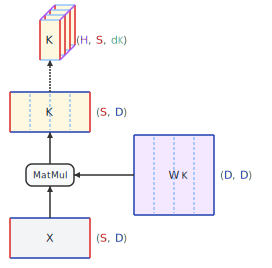{#fig-tensor .lightbox}

In this example data flow diagram, the tensors are represented by rectangles, and the operand by a rounded rectangle.

**Dimensions and edge color**: Each tensor's shape is shown next to it on the right side, unless there isn't room.
The first tensor on the bottom has shape **([S]{.dim-s}, [D]{.dim-d})**, where **[S]{.dim-s}** is the number of rows and **[D]{.dim-d}** is the number of columns.
Notice that the left and right edges are colored red, and every tensor with a dimension that is length **[S]{.dim-s}** will have that dimension colored red.
Similarly, the top and bottom edges are colored blue because the number of columns is **[D]{.dim-d}**, and all other dimensions of length **[D]{.dim-d}** will be the same color.

**Fill color**: The fill color of the bottom tensor is gray. For convenience, tensors holding similar semantic information will have similar fill colors.
Weights are fixed model tensors, and they always have the same purple fill color.

**3D tensors**: The tensor at the top of the diagram is 3D with shape **([H]{.dim-h}, [S]{.dim-s}, $\dimdk{d_K}$)**.
Because it is 3D, it is shown with a "stacked" rectangle shape.
The leading dimension, **[H]{.dim-h}**, is the stacked dimension. The third dimension's purple edge color corresponds to this dimension.

**Views**: The middle tensor and the top tensor are connected by an arrow with a dotted line. 
The dotted stroke indicates that there is a change of view, but no actual operation is performed.

:::


### The input

The input to our LLM model is a list of integer token IDs.
Its shape is **([S]{.dim-s})**, where **[S]{.dim-s}** is the sequence length (number of tokens).
As a reminder, in this book we are using the simpler notation of non-batched processing.
(For batched processing, the input shape would be **(B, [S]{.dim-s})**.)
The value of **[S]{.dim-s}** varies.
**[S]{.dim-s}** starts as the length of the prompt, and it increases as generated tokens are appended.
It is reasonable that **[S]{.dim-s}** might be less than **[D]{.dim-d}** at the beginning of generation, and then **[S]{.dim-s}** grows to be greater than **[D]{.dim-d}** by the end of generating a long response.

### The full model

The complete forward pass stacks **[L]{.dim-l}** decoder layers between the embedding layer and the language model head, as shown in @fig-llm-flow.
This is functionally equivalent to @fig-vert-stack, except this tensor data flow diagram exposes the shapes of the weight and data tensors.

```{=html}
<!-- FIGURE 11: Full Model Architecture — Token IDs to Logits
    ═══════════════════════════════════════════════════════════
    PARAMETER COUNT (Llama 3 70B, approximate):
    ═══════════════════════════════════════════════════════════

    Component                Count           Notes
    ─────────────────────────────────────────────────────
    Token embedding          V × D = 1049M   (128000 × 8192)
    Per-layer attention      ~201M           (reduced by GQA)
    Per-layer FFN            ~704M           (SwiGLU, F=28672)
    Per-layer LayerNorm      2 × D = 16K     (negligible)
    × 80 layers              ~72.4B
    Final LayerNorm          D = 8K          (negligible)
    LM Head                  D × V = 1049M  (may be tied)
    ─────────────────────────────────────────────────────
    Total                    ~70B

-->
```
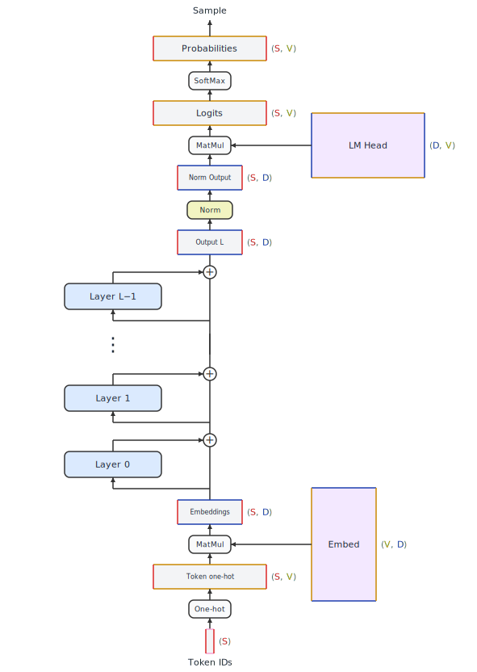{#fig-llm-flow .lightbox}

We see our input with shape **([S]{.dim-s})** at the bottom of @fig-llm-flow.
It is converted to a sequence of one-hot vectors, and the input is now shape **([S]{.dim-s}, [V]{.dim-v})**.
This flows into a matrix multiply with the embedding weights, which are a giant matrix of shape **([V]{.dim-v}, [D]{.dim-d})**.
We now have a dense input matrix of shape **([S]{.dim-s}, [D]{.dim-d})**.
This is fed to Layer 0, whose output is the same shape, **([S]{.dim-s}, [D]{.dim-d})**, and the layer output is added to the existing values.
As the data flows through all **[L]{.dim-l}** layers, the shape never changes from **([S]{.dim-s}, [D]{.dim-d})** as the layer outputs continue to get added to the residual stream.
After the last layer, the data passes through a final normalization layer, retaining its **([S]{.dim-s}, [D]{.dim-d})** shape.
Finally, a Linear prediction head does a matrix multiply with a language modeling output weight matrix of shape **([D]{.dim-d}, [V]{.dim-v})** and it outputs the probability logits, which are shape **([S]{.dim-s}, [V]{.dim-v})**.
These can be sharpened by passing through a SoftMax, and a sampling method must be performed to finalize the next token prediction.

The most important observation to take away from @fig-llm-flow is that the data along the residual stream is always shape **([S]{.dim-s}, [D]{.dim-d})**.
When we drill into the decoder layer and its attention and feed forward components, our inputs and outputs will always be **([S]{.dim-s}, [D]{.dim-d})**.
Most of the compute and memory access cost of a forward pass, especially for models with many layers, is associated with the decoder layers.
There isn't much to be gained from modifying how the embedding or linear output projection are performed.

### Positional encoding

One detail we've glossed over: how does the model know the order of the input tokens?
The self-attention computation is permutation-equivariant, which means that if you shuffle the input tokens, the output gets shuffled the same way (ignoring the causal mask).
For this reason, position information must be explicitly injected through a separate pathway.

The technical details and pros and cons of different position embedding techniques are beyond the scope of this section. Some approaches worth mentioning are:

**Sinusoidal position embeddings**: the position embeddings used in the original "Attention Is All You Need" paper. 
A special embedding table of shape **([S]{.dim-s}, [D]{.dim-d})** is added to the token embeddings before they are input to the first decoder layer. 
This is shown at the bottom of each of @fig-orig-transformer through @fig-vert-stack. 
In the embedding table, position 0 gets one vector, position 1 gets another, and so on.
These are called sinusoidal because the values in each length **[D]{.dim-d}** position vector are based on the trigonometric functions sine and cosine.

**Learned absolute embeddings** (GPT-2 [@radford2019gpt2]): a variant of the embedding table of shape **([S]{.dim-s}, [D]{.dim-d})** that is added to the token embeddings, except the values for each embedding vector are learned during training along with all the other model parameters.

**Rotary Position Embeddings (RoPE)** [@su2021rope]: instead of adding position information to the input, RoPE applies a position-dependent rotation to the query and key vectors inside the attention computation. 
The rotation is defined such that the dot product between a query at position $i$ and a key at position $j$ depends only on the relative distance $i - j$.
This is what most modern LLMs use, including Llama and its derivatives. 
RoPE enables better length generalization.
Applying RoPE rotations to the query and key vectors is relatively inexpensive, so we omit its details from our diagrams and discussion.

**Others**: Another notable technique, called **ALiBi** [@press2021alibi] adds a value dependent on the token position to the keys.
This value increases linearly with the token position number.
**NoPE** [@kazemnejad2023nope] is a newer technique that is gaining traction when mixed with other techniques like RoPE, usually on a layer-by-layer basis.
In NoPE, no positional information is added.
While it is surprising that having no position information would work, research has shown that NoPE can be highly effective when mixed with other approaches.

### Weight tying

Some architectures share weights between the token embedding layer, whose parameter shape is **([V]{.dim-v}, [D]{.dim-d})**, and the LM head, whose parameter shape is **([D]{.dim-d}, [V]{.dim-v})** --- which is the transpose of the embedding layer.
When embedding tokens, the **([V]{.dim-v}, [D]{.dim-d})** weights are used, and when obtaining logits, the transpose of these weights is used.
This is called **weight tying**.
When the vocabulary is large, these matrices are very large.
For Llama 3 70B, where **[V]{.dim-v}** = 128,000 and **[D]{.dim-d}** = 8192, each matrix has just over 1B parameters, so 2B combined.
Tying them saves 1B parameters and ensures that the model's input and output representations are in the same space.

Weight tying doesn't affect model speed, but it does reduce the parameter count.
The percentage savings is greater for small models, which is why we see weight tying used in some small LLMs.
Because of the minimal impact on speed, we will keep things simple in this book and assume the weights are not tied.

## The decoder block {#sec-decoder-block}

Drilling into each layer in the model, each decoder block in a modern LLM uses the **pre-norm** formulation:
$$\begin{aligned}
\hat{X} &= X + \text{SelfAttention}(\text{Norm}(X)) \\
y &= \hat{X} + \text{FFN}(\text{Norm}(\hat{X}))
\end{aligned}$$
The data flow diagram for this is shown in @fig-decoder-flow.

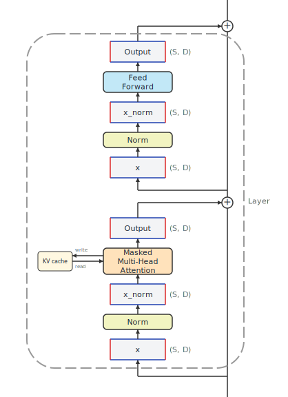{#fig-decoder-flow height=500 .lightbox}

The normalization in transformers, which originally was **LayerNorm** [@ba2016layernorm], is applied before each sub-layer (self-attention and FFN), and the sub-layer's output is added to its input via the residual connection.
This is the pre-norm formulation, used by GPT-2 [@radford2019gpt2] and almost all modern LLMs.
Another normalization layer which has replaced LayerNorm in popularity is **RMSNorm** [@zhang2019rmsnorm].
Both of these operations calculate the magnitude of each input vector across the model dimension **[D]{.dim-d}**, then scale the input vectors.
The need to calculate across **[D]{.dim-d}** will impact tensor parallelism, as we will see in @sec-tensor-parallelism.

The residual connections are critical for training deep networks.
They allow gradients to flow through the network's layers without vanishing.
For inference, they're simple addition operations that don't add meaningful compute cost.

Our data flow here is all of shape **([S]{.dim-s}, [D]{.dim-d})**, and there's not much computational overhead.
There isn't much to optimize in what is shown here.
We are now ready to drill into the sub-layers where the majority of the overhead lies.
We will start with attention.


## Self-Attention Mechanics {#sec-self-attention}

Self-attention is the mechanism that lets each token's representation incorporate information from other tokens in the sequence.
This is what makes a transformer more than just a position-independent feature extractor.
It lets the model understand that "bank" means something different in "river bank" versus "bank account."
We'll walk through the computation step by step, tracking tensor shapes throughout.
We will dissect the components and data flow of the attention layer in this section.
If the reader is unfamiliar with attention, we recommend some of the resources in the Further Reading (@sec-further-llm) at the end of this chapter.

### The input

The input to a self-attention layer is a tensor of shape **([S]{.dim-s}, [D]{.dim-d})**, where **[S]{.dim-s}** is the sequence length (number of tokens), and **[D]{.dim-d}** is the model dimension (the width of each token's representation vector).
As a reminder, in this book we are using the simpler notation of non-batched processing.
For batched processing, the input shape would be **(B, [S]{.dim-s}, [D]{.dim-d})**.
As a concrete example, in Llama 3 70B, **[D]{.dim-d}** = 8192.

### Q, K, V projections

The first step of self-attention is to project the input into three separate representations: **queries** (Q), **keys** (K), and **values** (V).
Each projection is a learned linear transformation:

$$Q = X W_Q, \quad K = X W_K, \quad V = X W_V$$

where $X$ has shape **([S]{.dim-s}, [D]{.dim-d})** and $W_Q$, $W_K$, $W_V$ each have shape **([D]{.dim-d}, [D]{.dim-d})**. 
The outputs Q, K, and V all have shape **([S]{.dim-s}, [D]{.dim-d})**, as shown in @fig-attn-flow. 
In this data flow diagram, **[S]{.dim-s}** edges are drawn shorter than **[D]{.dim-d}** edges. 
This will be accurate for Llama 3 70B when **[S]{.dim-s}** < 8192. 
As the sequence gets longer and we have **[S]{.dim-s}** > 8192, these dimensions will be longer, despite this static diagram not being able to dynamically show the change.

The intuition for Q, K, and V is roughly this: the query represents "what this token is looking for," the key represents "what this token offers to other tokens," and the value represents "the information this token will contribute when attended to."
These are loose analogies, but they help build intuition for why we need three separate projections rather than just one or two.

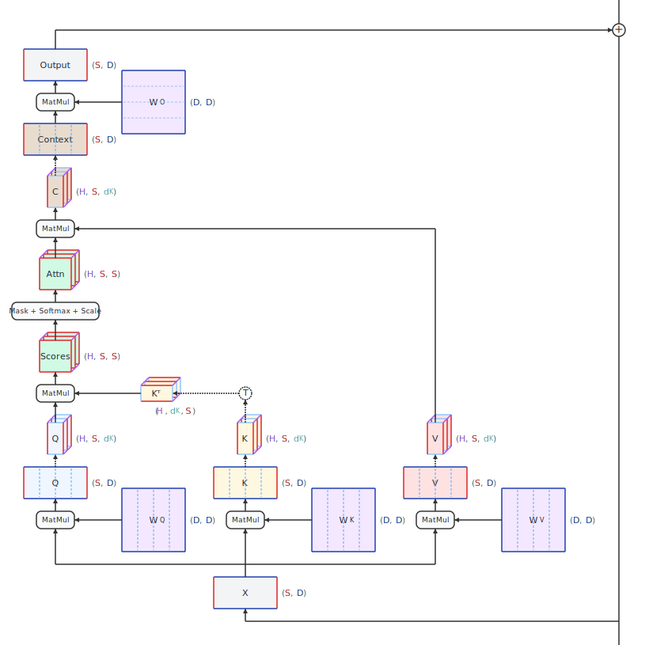{#fig-attn-flow height=700 .lightbox}

### Multi-head attention and the reshape

Rather than computing a single attention function over the full D-dimensional space, we split the computation into **[H]{.dim-h}** parallel heads, each operating on a subspace of dimension $\dimdk{d_K} = \dimd{\text{D}} / \dimh{H}$.
For Llama 3 70B, **[D]{.dim-d}** = 8192, **[H]{.dim-h}** = 64 heads, and $\dimdk{d_K}$ = 128.
This head dimension, **$\dimdk{d_K}$**, of 128 is an extremely common choice in LLMs.

After the linear projections, we reshape Q, K, and V from **([S]{.dim-s}, [D]{.dim-d})** to **([H]{.dim-h}, [S]{.dim-s}, $\dimdk{d_K}$)**.
Mathematically, this is just reshaping the last dimension --- breaking **[D]{.dim-d}** into **[H]{.dim-h}** groups of $\dimdk{d_K}$ --- and transposing so that the head dimension comes before the sequence dimension.
No additional computation is required.
In @fig-attn-flow, dotted line arrows show the view operation that does the reshape.
In addition, dashed lines on the weight matrices and Q, K, and V tensors show the conceptual division of those tensors into heads, even before the reshape.
Note that these are divided into heads by groups of columns.

Why multiple heads?
A single attention head computes a single attention pattern --- one set of weights determining how much each position attends to every other position.
Multiple heads allow the model to attend to different aspects of the input simultaneously.
One head might focus on syntactic relationships, another on semantic similarity, and another on positional proximity.
In practice, learned attention patterns are more complex than these examples, but the principle holds: multiple heads provide multiple "channels" for cross-position communication.

### Attention score computation

With Q and K reshaped to **([H]{.dim-h}, [S]{.dim-s}, $\dimdk{d_K}$)**, we compute the raw attention scores by taking the dot product of queries with keys:

$$\text{Scores} = \frac{Q K^T}{\sqrt{d_K}}$$

The matrix multiplication $Q K^T$ produces a tensor of shape **([H]{.dim-h}, [S]{.dim-s}, [S]{.dim-s})**. 
For each head, we get a matrix with shape **([S]{.dim-s}, [S]{.dim-s})**, where entry $(i, j)$ is the raw attention score between the query at token position $i$ and the key at token position $j$.
The division by $\sqrt{d_K}$ prevents the dot products from growing too large as the dimension **$\dimdk{d_K}$** increases, which would push SoftMax into regions with vanishing gradients.

This **([H]{.dim-h}, [S]{.dim-s}, [S]{.dim-s})** attention matrix is the computational signature of standard self-attention.
Its size is quadratic in sequence length. For a 4096-token prompt, each head produces a 4096×4096 matrix, and when **[S]{.dim-s}** = 100,000, each head's attention matrix is 100,000×100,000 and has 10 billion entries.
In @fig-attn-flow, the score tensor looks small for small values of **[S]{.dim-s}**, but if drawn to scale, for large values of **[S]{.dim-s}** it would be huge compared to other tensors.
This quadratic scaling is why long-context inference is expensive and why we will see that techniques like FlashAttention [@dao2022flashattention] (@sec-attention-kernels) are so important.
FlashAttention computes the exact same result but avoids materializing the full **[S]{.dim-s}**×**[S]{.dim-s}** matrix in GPU memory by tiling the computation to fit one piece at a time.

### The causal mask

In a decoder-only model used for autoregressive generation, each token should only attend to itself and to tokens that came before it --- never to future tokens.
This is enforced by a **causal mask**: an upper-triangular matrix of $-\infty$ values added to the attention scores before SoftMax, as shown in @fig-causal-mask.

![How the causal mask is applied in self-attention, shown for only one attention head for **[S]{.dim-s}** = 5](images/causal_mask.svg){#fig-causal-mask .lightbox}

Note that the mask is shape **([S]{.dim-s}, [S]{.dim-s})**, so it has to be broadcast across the **[H]{.dim-h}** dimension in order to be added to the scores tensor.
After adding the mask, we apply SoftMax along the key dimension (the last dimension).
Any number added to $-\infty$ results in $-\infty$, and these $-\infty$ values become zero after SoftMax.
This prevents the masked-out positions from getting any attention weight, ensuring each position's attention weights sum to 1 over only the allowed (past and current) positions.

### Weighted sum and output projection

The SoftMax output gives us the attention weights: a **([H]{.dim-h}, [S]{.dim-s}, [S]{.dim-s})** tensor where each row sums to 1.
We use these weights to compute a weighted sum of the value vectors:

$$\text{Weighted Values} = \text{SoftMax}\left(\frac{Q K^T}{\sqrt{d_K}} + \text{mask}\right) V$$

The attention weights have shape **([H]{.dim-h}, [S]{.dim-s}, [S]{.dim-s})** and V has shape **([H]{.dim-h}, [S]{.dim-s}, $\dimdk{d_K}$)**, so the result has shape **([H]{.dim-h}, [S]{.dim-s}, $\dimdk{d_K}$)**.
We then reshape this back from **([H]{.dim-h}, [S]{.dim-s}, $\dimdk{d_K}$)** to **([S]{.dim-s}, [D]{.dim-d})** by concatenating the **[H]{.dim-h}** heads, and apply a final output projection $W_O$ of shape **([D]{.dim-d}, [D]{.dim-d})**:

$$\text{Output}(X) = \text{Concat}(\text{head}_1, \ldots, \text{head}_{\dimh{H}}) \cdot W_O$$

The full self-attention block transformed an input of shape **([S]{.dim-s}, [D]{.dim-d})** to an output of the same shape **([S]{.dim-s}, [D]{.dim-d})**.
The shape is preserved.

### Parameter count

For standard multi-head attention with **[D]{.dim-d}** = 8192, the parameter count per layer is:

- $W_Q$: $\dimd{\text{D}} \times \dimd{\text{D}}$ = 67.1M
- $W_K$: $\dimd{\text{D}} \times \dimd{\text{D}}$ = 67.1M
- $W_V$: $\dimd{\text{D}} \times \dimd{\text{D}}$ = 67.1M
- $W_O$: $\dimd{\text{D}} \times \dimd{\text{D}}$ = 67.1M
- **Total**: $4\dimd{\text{D}}^2 \approx$ 268M parameters per attention layer

With 80 layers, the attention parameters alone account for about 21.5B of Llama 3 70B's parameter count.
The rest is mostly in the feed-forward layers, which we'll cover in @sec-ffn.

::: callout-note
**Grouped-Query Attention (GQA) and friends.** Modern models often use fewer key-value heads than query heads. Llama 3 70B uses GQA [@ainslie2023gqa] with 64 query heads but only 8 KV heads, reducing $W_K$ and $W_V$ from **([D]{.dim-d}, [D]{.dim-d})** to **([D]{.dim-d}, $8 \times \dimdk{d_K}$)** = (8192, 1024).
This saves parameters and, more importantly, reduces the KV cache size by 8x.
Multi-Query Attention (MQA) [@shazeer2019mqa] takes this further with a single KV head. Multi-head Latent Attention (MLA) [@liu2024deepseekv2] compresses the KV cache through learned low-rank projections. These attention variants are covered in @sec-efficient-attention.
:::


## The KV Cache {#sec-kv-cache-intro}

The KV cache is one of the most important concepts in LLM inference.
It's a simple idea with far-reaching consequences for memory management, scheduling, and system design.
This section explains why the cache exists, what it stores, and how much memory it consumes.

### Training vs. inference

During training, the full sequence is available upfront.
The model processes all **[S]{.dim-s}** tokens at once, computing Q, K, and V for every position simultaneously.
The causal mask ensures that position $i$ only attends to positions $0, 1, \ldots, i$, but all positions are computed in parallel.
There's no need to cache anything --- the K and V tensors for all positions are computed in one pass, used immediately, and never needed again.

During standard inference, tokens are generated one at a time.
At decode step $t$, the model generates token $t$ based on all previous tokens $0, 1, \ldots, t-1$.
The new token's query needs to attend to the keys and values of all previous positions.
This creates a choice:

**The naive approach**: at each step, feed all $t$ tokens through the model from scratch.
This recomputes K and V for positions $0$ through $t-1$, even though they haven't changed since the last step.
Each token $t$ uses computation $O({t}^{2})$ for attention, and over **[S]{.dim-s}** decode steps, the total computation for long sequences is $O(\dims{\text{S}}^{3})$.
We recompute increasingly longer sequences for each new token, and this is extremely wasteful.

**The KV cache approach**: store the K and V tensors from all token positions, accumulating one more of each with each step.
At each decode step, compute K and V for *only* the new token, append them to the cache, and use the full cached K and V for the attention computation.
This reduces the per-token computation to $O({t})$ and the total computation to $O(\dims{\text{S}}^{2})$ across all decode steps.
The naive and KV cache approaches are contrasted in @fig-kv-cache.

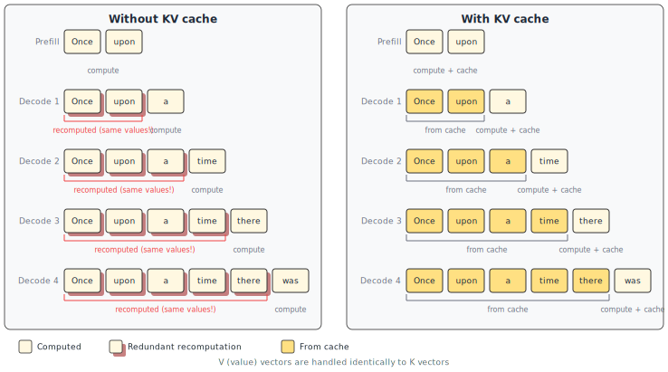{#fig-kv-cache .lightbox}

When we do inference with a KV cache, the attention calculation becomes much less computationally expensive because our query tensor shrinks from **([S]{.dim-s}, [D]{.dim-d})** to **([1]{.dim-one}, [D]{.dim-d})**.
You can see this effect by comparing the original data flow for attention in @fig-attn-flow to the KV cache attention data flow in @fig-attn-flow-kv.

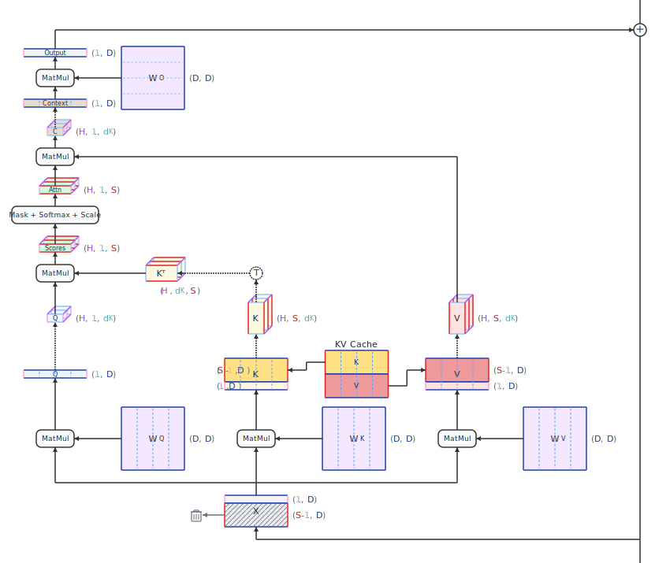{#fig-attn-flow-kv .lightbox}

### Memory consumption

The KV cache stores keys and values for every layer, every KV head, every cached position, and every element of the head dimension.
The total memory for a single request is:

$$\text{KV cache memory} = 2 \times \diml{L} \times \dimhkv{H_{\text{KV}}} \times \dims{S} \times \dimdk{d_K} \times b$$

where **[L]{.dim-l}** is the number of layers, $\dimhkv{H_{\text{KV}}}$ is the number of key-value heads (which is the same as **[H]{.dim-h}** in a vanilla attention architecture), **[S]{.dim-s}** is the current sequence length, $\dimdk{d_K}$ is the head dimension, and $b$ is the number of bytes per element (2 for FP16/BF16).

For Llama 3 70B with GQA (8 KV heads), FP16 precision, and a 4096-token sequence:

$$2 \times 80 \times 8 \times 4096 \times 128 \times 2 \approx 1.34 \text{ GB}$$

That's 1.34 GB for a *single request*.
If you're serving 40 concurrent requests, the KV cache alone consumes over 50 GB, which would be more than half of the memory on an 80 GB GPU that also needs to hold the model weights.
This is why KV cache memory management is such a central concern in LLM serving systems.

The cache grows by a fixed amount at each decode step: $2 \times \diml{L} \times \dimhkv{H_{\text{kv}}} \times \dimdk{d_K} \times b$ bytes per token.
For the Llama 70B numbers above, that's about 328 KB per token per request.

::: {.callout-note}
**Forward references**: The KV cache drives many of the optimization techniques covered in the main chapters. 
@sec-efficient-attention covers architectural techniques including reducing the number of KV heads, reducing the size of KV entries, and sharing KV cache entries across layers. 
@sec-kv-cache covers runtime techniques for managing the cache including PagedAttention [@kwon2023vllm] which eliminates memory fragmentation, quantization which reduces the bytes per element, and eviction policies which remove cache entries under memory pressure.
:::

### Attention alternatives

Standard multi-head attention dominates deployed LLMs today, but it's not the only option.
**State-space models** like **Mamba** [@gu2023mamba] and **linear attention** variants such as **Kimi Linear** [@kimiteam2025linear] replace the **([H]{.dim-h}, [S]{.dim-s}, [S]{.dim-s})** attention matrix with a fixed-size recurrent state.
Instead of caching all past keys and values (which grows linearly with sequence length), they maintain a constant-size state that gets updated at each step.
This eliminates the problem of KV caches growing large, giving a fundamentally different inference profile --- constant memory regardless of sequence length, instead of memory that grows linearly with it.

These architectures are out of scope for this book.
We focus on standard multi-head attention because it remains dominant in the models that practitioners actually deploy at scale.
There are model variants that reduce the number of layers running multi-head attention, but so far there are no top-performing models which exclusively use attention alternatives.
It's worth knowing that alternatives exist, especially since the KV cache is a major source of inference complexity, but so far nothing less expensive has matched the capabilities of multi-head attention.


## The Feed-Forward Network {#sec-ffn}

Every transformer layer contains two main sub-layers: self-attention and a **feed-forward network (FFN)**, also called the **MLP** (multi-layer perceptron) block.
While self-attention handles cross-position communication, the FFN operates on each position independently, transforming the representation at each position through nonlinear learned mappings.
The FFN is where the majority of a model's parameters live.

### Standard FFN

The original transformer [@vaswani2017attention] uses a two-layer FFN with a ReLU activation:

$$\text{FFN}(x) = \text{ReLU}(x W_1 + b_1) W_2 + b_2$$

We can see the data flow in @fig-mlp-flow.
For simplicity, we do not show the bias terms, which could be abstracted as part of the matrix multiplication.
The input $x$ has shape **([S]{.dim-s}, [D]{.dim-d})**.
The first linear layer projects up from **[D]{.dim-d}** to an intermediate dimension **[F]{.dim-f}**, originally **[F]{.dim-f}** = 4**[D]{.dim-d}**.
The activation function is applied element-wise.
Then, the second linear layer projects down from **[F]{.dim-f}** back to **[D]{.dim-d}**.
When **[F]{.dim-f}** = 4**[D]{.dim-d}**, each weight matrix has $4\dimd{\text{D}}^2$ parameters, for a total of $8\dimd{\text{D}}^2$ parameters.

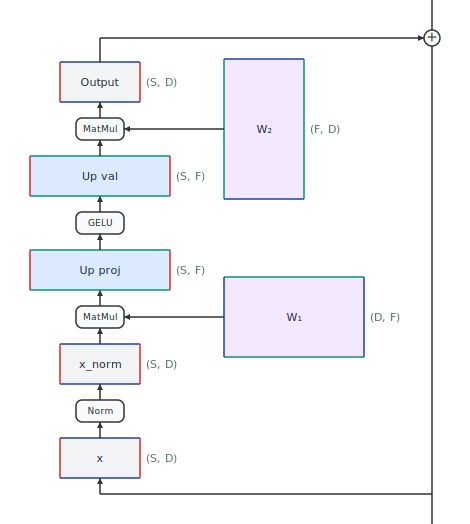{#fig-mlp-flow .lightbox}

### Gated MLP (SwiGLU)

Modern LLMs like Llama and PaLM don't use the standard FFN.
They use a **gated** variant of the MLP called **SwiGLU** [@shazeer2020glu], which adds a third linear layer and uses a gating mechanism:

$$\text{FFN}_{\text{SwiGLU}}(x) = (\text{SiLU}(x W_{\text{gate}}) \odot x W_{\text{up}}) W_{\text{down}}$$

where $\odot$ denotes element-wise multiplication and SiLU (also called Swish) is the activation function $\text{SiLU}(x) = x \cdot \sigma(x)$.

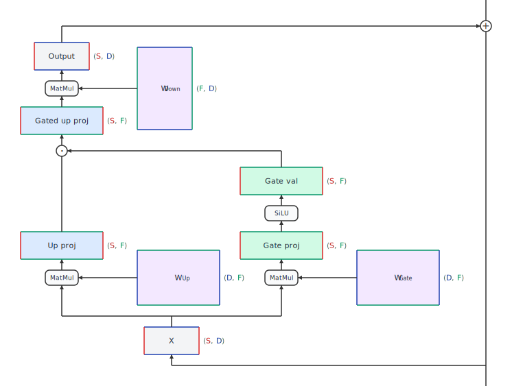{#fig-gated-mlp-flow .lightbox}

The flow for the gated MLP is shown in @fig-gated-mlp-flow.
The up and gate projections run in parallel, both mapping from **[D]{.dim-d}** to a higher intermediate dimension **[F]{.dim-f}**.
Their outputs are combined by element-wise multiplication.
The intuition is that the gate values select which features from the up-projection pass through.
When an element of the gate is 0, the corresponding up projection element is zeroed out.
When an element of the gate is 1, the corresponding up projection element is passed through as is.
The gated up projection result is then projected down back to **[D]{.dim-d}**.

Why go from two weight matrices to three?
The gating mechanism has been shown empirically to improve model quality for a given parameter budget [@shazeer2020glu].
The intermediate dimension **[F]{.dim-f}** is adjusted downward (from $4\dimd{\text{D}}$ to roughly $\frac{8}{3}\dimd{\text{D}}$) to keep the total parameter count approximately equal: $3 \times \dimd{\text{D}} \times \frac{8}{3}\dimd{\text{D}} = 8\dimd{\text{D}}^2$, the same as the standard FFN's $2 \times \dimd{\text{D}} \times 4\dimd{\text{D}} = 8\dimd{\text{D}}^2$ parameters. 
With **[D]{.dim-d}** = 8192, the parameter count is $8\dimd{\text{D}}^2 \approx$ 537M parameters per FFN layer.
The FFN layers have double the number of parameters as the attention layers, so the FFNs comprise about two-thirds of the parameters, and the attention layers have about one-third of the parameters in a vanilla, traditional LLM.

### Mixture of Experts (MoE)

Standard LLM models have one MLP per layer, and they have no choice but to apply the same MLP to every token.
**Mixture of Experts (MoE)** architectures replace the single MLP with multiple MLPs called **experts** and a lightweight **router** that selects which experts to use for each token.
Because not all of the MLP weights are used for each token, this is often referred to as a **sparse MLP**.
In contrast, the original MLP architecture is referred to as a **dense MLP** architecture.

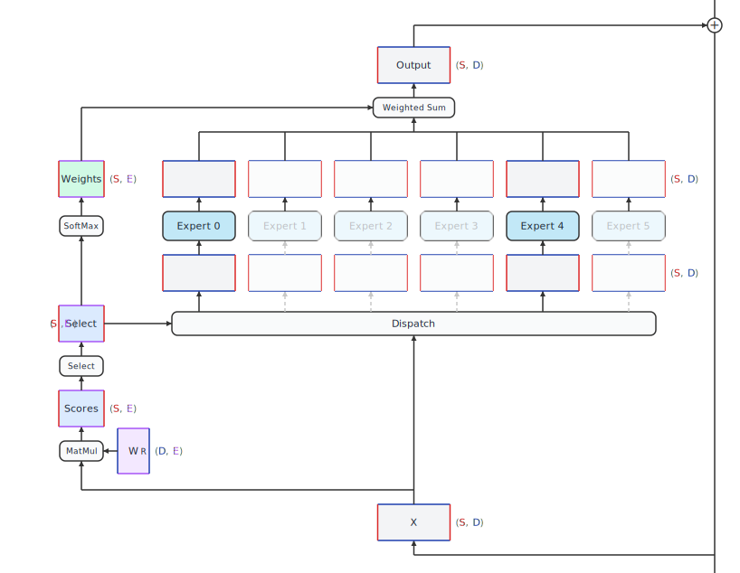{#fig-moe-flow .lightbox}

@Fig-moe-flow shows the data flow for an MoE MLP layer.
The router in MoE is usually a simple learned linear layer that produces a score for each expert.
If there are **E** experts, the router has a weight matrix of shape **([D]{.dim-d}, E)**.
There are different designs for how the experts are chosen, and one of the simplest methods is for the router to select the top $k$ experts with the highest scores.
These top-$k$ experts are said to be **active**.
Note that there is a router in every layer, so the choice of experts differs each layer --- this is not at all like having **E** separate full models which are chosen at the beginning based on the input token.
The science of MoE layers is outside the scope of this book, but we will highlight a recent trend.
Early MoE LLMs such as **Mixtral** [@jiang2024mixtral] had only a few experts, such as 8, and set $k$ to a very small value, such as 2.
More recent LLMs such as **Qwen 3** [@yang2025qwen3] have hundreds of experts and set $k$ to a higher number, such as 8.
They also have the concept of always-on experts called **shared experts**. 
@Fig-moe-flow shows what the vanilla data flow looks like in an MoE configuration with 6 total experts, 2 of which are active.

The outputs of the selected experts are combined using the router's SoftMax weights.

The key trade-off of MoE for inference is clear: **memory footprint is large** (all expert weights must reside in GPU memory) but **per-token compute is modest** (only $k$ of **E** experts are active and consuming FLOPS).
Mixtral 8×7B [@jiang2024mixtral] has roughly 47B total parameters but only ~13B active per token.
This means the model takes up as much GPU memory as a 47B dense model but computes each token about as fast as a 13B dense model.

For multi-GPU serving, MoE models naturally lend themselves to **expert parallelism** --- placing different experts on different GPUs.
But this introduces all-to-all communication as tokens are routed to the GPU holding their selected expert.
Load balancing across experts also matters: if the router sends most tokens to the same few experts, some GPUs do much more work than others.
We'll discuss expert parallelism in @sec-expert-parallelism.

### Why the FFN matters for inference

The MLP layers typically account for roughly two-thirds of a model's parameters.
On one hand, all these parameters require a lot of resources.
All of the active parameters must be loaded from GPU memory as computational inputs, so this costs bandwidth.
These active parameters are used in matrix multiplication, requiring a lot of compute.
On the other hand, modern GPUs are highly optimized for this use case of loading tensors and doing matrix multiplication.
GPUs perform the FFN calculations quickly, and there's not much that can be done to speed them up other than not doing them.

We wrap up the data flow conversation here.
With this background into the nuts and bolts of the data and operations inside the LLM, we can now shift our attention to the bigger picture of how the model forward pass is used in inference and how we can measure and assess inference performance.


## Further Reading {#sec-further-llm}

The original transformer paper [@vaswani2017attention] is the essential starting point.
Even though the decoder-only variant drops half the architecture, the core ideas --- scaled dot-product attention, multi-head attention, positional encoding, and the feed-forward network --- are all introduced there.

For intuitive explanations of the transformer architecture:

- Jay Alammar's "The Illustrated Transformer" [@alammar2018illustrated] is considered a classic for explaining the original transformer architecture, with many beautiful diagrams.
- 3Blue1Brown's deep learning series [@sanderson2024attention] provides what may be the clearest visual explanation of attention and the transformer architecture available anywhere. Grant Sanderson's animations build the mechanism step by step, making the matrix operations and information flow genuinely intuitive.
- "The Annotated Transformer" [@rush2018annotated] walks you through Python code to understand the original transformer architecture, and is incredibly well written.
- Peter Bloem's "Transformers from Scratch" [@bloem2019transformers] builds the architecture from first principles with clear diagrams.
- Lilian Weng's "The Transformer Family Version 2.0" [@weng2023transformer] offers a more technical treatment, surveying transformer variants including the attention alternatives mentioned in @sec-self-attention.
- Andrej Karpathy's "Let's build GPT: from scratch, in code" [@karpathy2023gpt] walks through a complete implementation in about two hours.

For interactive visualizations that let you explore the architecture hands-on:

- Brendan Bycroft's "LLM Visualization" [@bycroft2023llmviz] is a 3D interactive walkthrough of GPT-style inference that lets you trace data flow down to every add and multiply. It is an excellent companion to the tensor data flow diagrams in this chapter.
- "Transformer Explainer" [@cho2024transformerexplainer] from Georgia Tech runs a live GPT-2 model directly in the browser. It uses Sankey-style diagrams showing how data flows through embeddings, attention heads, and transformer blocks, and lets you type in your own text and watch the model predict the next token in real time.

For the specific architectural choices used in LLMs, the Llama papers [@touvron2023llama; @touvron2023llama2; @grattafiori2024llama3] are a good reference because they clearly document the model dimensions and design decisions (SwiGLU, RoPE, GQA).
The PaLM paper [@chowdhery2022palm] provides a thorough analysis of scaling behavior that motivates the decoder-only design.
For more modern LLMs, Sebastian Raschka does a brilliant job covering all of the different architectures. A good starting point for his writings is "LLM Architecture Gallery" [@raschka2025gallery].

The MQA [@shazeer2019mqa] and GQA [@ainslie2023gqa] attention variants are covered in @sec-efficient-attention.
FlashAttention [@dao2022flashattention] is covered in @sec-attention-kernels.
