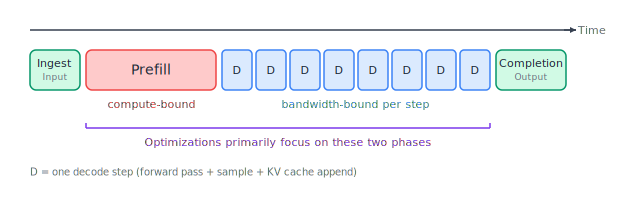
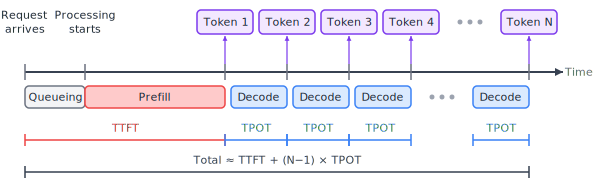
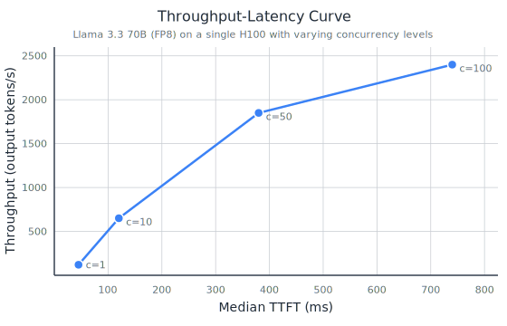
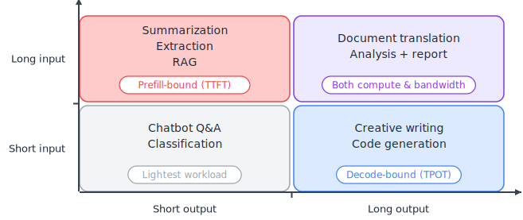
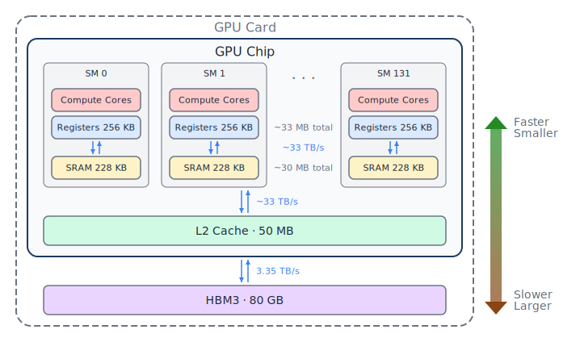
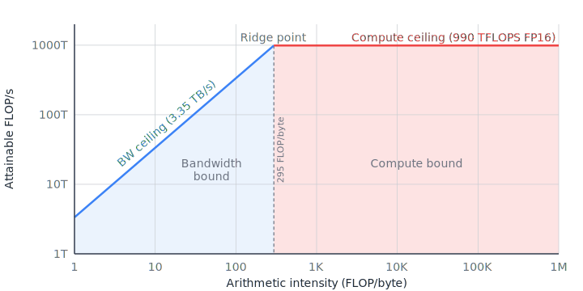

# Framing LLM Inference {#sec-framing}

Now that we are familiar with the decoder-only LLM and how data flows through it, let's go deeper into the autoregressive nature of vanilla text generation and discuss how to quantify its performance.
We will develop an understanding of the stages of inference, how we measure inference, and the performance model that underlies our computing hardware, in particular GPUs.

## The Inference Pipeline {#sec-inference-pipeline}

From the time you send a prompt to an LLM until you get a response back, a lot happens between those two moments.
The full journey of a single request breaks down into a few stages.
Some of these are one-time setup costs, some happen once per request, and some repeat for every output token.
Understanding the characteristics of the stages will help you focus your attention on the ones that actually dominate wall-clock time.
In this section, as with most of the book, we will assume the LLM is running on a computer with a GPU.
The principles will be the same if it is running on CPU, TPU, or other hardware.

### The stages of inference {#sec-pipeline-stages}

Let's walk through the stages needed to load an LLM and process a user request.
We will break this down into four stages that have distinct properties in terms of when they happen, where they happen, and what kinds of resources they consume.
These stages are shown in @fig-pipeline-stages.

{#fig-pipeline-stages .lightbox}

We will assume the model is already loaded into GPU main memory.
For a 70-billion-parameter model stored in FP16 (2 bytes per parameter), the weights alone are about 140 GB.
Loading that volume of data from an NVMe SSD at 7 GB/s takes about 20 seconds, and from a network file system, it could take longer.
Because this is so slow, on typical inference software, the weights are loaded into GPU memory at startup and they stay there for the lifetime of the serving session.

**Ingestion** is the entry point for each request.
The system takes your prompt and forms a new request.
Your prompt may be merged with other content, such as a system prompt.
Next, this finalized raw text is tokenized --- converted from characters into the integer token IDs that the model actually works with --- and any additional validation or preprocessing is applied.
This stage is fast compared to the resource-intensive work involving the neural network model that follows and is typically handled on the CPU.
This stage may also involve queuing.
In a production system, requests may wait in a queue until there are resources available to process them, and if the system has multiple priority levels, lower priority requests may wait longer.
We are skipping many details about the steps within ingestion because what they have in common is that they usually happen once and are relatively fast.
One area where ingestion has a dramatic impact on speed and user experience is in the timing and granularity of scheduling request work, and we will discuss scheduling in @sec-scheduling.

**Prefill** is where the heavy lifting begins.
The model processes the entire set of input tokens in a single forward pass through the entire network — all layers, all attention heads, all MLP blocks.
In particular, the attention layers calculate attention scores across all of the input tokens.
Since the attention scores are a square whose sides are the number of tokens, this grows quadratically with respect to the sequence length, and becomes very expensive when there are many input tokens.
Because all input tokens are known up front, the attention calculation can be done all at once using a large matrix-matrix multiplication between queries and keys.
Despite how efficiently modern GPUs perform matrix multiplication, the size of the matrices involved means that prefill for all but the shortest prompts is **compute-bound** — the bottleneck is how fast the GPU can do the arithmetic, not how fast it can move data into the computational cores.

During prefill, each attention layer computes query, key, and value tensors for all of the input tokens.
The keys and values will be needed again in the upcoming decoding stage.
Rather than throwing these away and recomputing them during decoding, the system stores them in a structure called the **KV cache**, and initializing the KV cache is the primary function of the prefill stage in modern LLM serving systems.
The KV cache holds the key and value tensors for every attention head at every layer, for all tokens processed so far.
The KV cache trades memory for compute: it uses GPU memory to store these tensors, but it eliminates the need to recompute them.
The size of the KV cache created during prefill is:

$$\text{KV cache size} = 2 \times L \times H_{\text{kv}} \times d_{\text{head}} \times b_{\text{kv}} \times S$$

where the factor of 2 accounts for storing both keys and values, $L$ is the number of layers, $H_{\text{kv}}$ is the number of key-value heads (which may be less than the number of query heads, as discussed in @sec-efficient-attention), $d_{\text{head}}$ is the dimension of each head, $b_{\text{kv}}$ is the number of bytes per element, and **[S]{.dim-s}** is the sequence length. For a concrete example, consider a Llama-style 70B model with 80 layers, 8 KV heads per layer, head dimension of 128, and FP16 KV cache entries (2 bytes each). For a 4,096-token prompt:

$$\text{KV cache} = 2 \times 80 \times 8 \times 128 \times 2 \text{ bytes} \times 4{,}096 \approx 1.34 \text{ GB}$$

That's 1.34 GB of GPU memory consumed by a single request's KV cache, just from the input tokens.
This memory usage is one of the primary constraints on how many requests can be served concurrently, which we'll explore in @sec-kv-cache and @sec-memory-preemption.

TODO: update forward references for KV cache memory and concurrency.

After prefill completes, the system has two things: the KV cache populated with entries for all input tokens and the logits for the last input position's next token prediction, which are used to sample the first output token.

::: callout-note
For a detailed look at exactly how the key, value, and query projections are computed during the transformer's forward pass and how they relate to the KV cache, see Appendix sections [-@sec-self-attention] and [-@sec-kv-cache-intro].
:::

TODO: Without the KV cache, every decode step would need to recompute keys and values for all previous tokens -- an enormous amount of redundant work that would make decoding quadratic in sequence length instead of linear.

**Decode** is the phase where the LLM's response is generated (except for the first token).
The model typically produces output tokens one at a time, where each new token depends on all previously generated tokens.
This sequential dependency comes from how the model defines the probability of an output sequence.
Given input tokens $x$, the probability of generating output sequence $y = (y_1, y_2, \ldots, y_T)$ is decomposed using the chain rule of probability, where each output token's probability distribution is conditioned on both the prompt $x$ and all of the prior output tokens:

$$p(y \mid x) = \prod_{t=1}^{T} p(y_t \mid y_{<t}, x)$$

The model estimates each conditional probability $p(y_t \mid y_{<t}, x)$ with a forward pass.
Because each token's probability depends on all previously generated tokens, the model doesn't generate token $y_t$ until it has committed to tokens $y_1$ through $y_{t-1}$.
This gives us the familiar autoregressive loop: run a forward pass for one new token, reading all weights and the full KV cache; obtain the logit distribution over the vocabulary; sample a token; append new key-value entries to the KV cache; and repeat until the model generates a stop token or hits a length limit.

Each iteration of this basic loop is called a **decode step**.
The forward pass in a decode step processes just one token (or one token per batch entry, in a batch), so the query-key operations are **matrix-vector multiplications** rather than the matrix-matrix multiplications of prefill.
The keys are still a matrix of **[S]{.dim-s}** vectors, but now they're being multiplied by a single query vector instead of a matrix of **[S]{.dim-s}** vectors.

The one-token-at-a-time nature of typical decoding is the central challenge of LLM inference.
Each decode step involves reading all the model weights and the full KV cache, but only to compute a single token's worth of output.
The ratio of computation to data movement is very low, which makes decode steps typically **memory-bandwidth-bound**.
Here, the bottleneck is how fast the GPU can read data from GPU memory, not how fast it can do math.
A large portion of this book is about techniques to make this phase less painful.

It's worth noting that the left-to-right, one-token-at-a-time autoregressive factorization is not the *only* mathematically valid way to express the joint probability of a sequence.
There are other approaches that express the same joint distribution differently.
The left-to-right decomposition is a convenient modeling choice, but it imposes a strict sequential dependency at inference time.
Several techniques in @sec-speculative -- speculative decoding, multi-token prediction, and Medusa heads -- work by finding ways to break or shortcut this sequential dependency while preserving the same output distribution.

At the end of each decode step, **sampling** selects the next token.
After the forward pass has produced a logit vector over the vocabulary, one token ID is selected.
Common strategies include greedy decoding (always pick the highest-probability token), temperature sampling (scale logits before sampling randomly), top-k sampling (restrict to the $k$ most probable tokens), and top-p / nucleus sampling (restrict sampling to the smallest set of tokens whose cumulative probability exceeds $p$).
Sampling adds negligible overhead relative to the preceding forward pass.
The forward pass involves billions of multiply-accumulate operations across all the model's layers; sampling involves a softmax over the vocabulary (typically 30K-200K entries) and a random draw.
It's not where the time goes.

**Completion** wraps things up.
The model has finished because it either generated a stop token, hit a maximum length limit, or has been interrupted by the serving system.
The accumulated response is detokenized back into text, the KV cache memory is freed, and the result is returned to the user.
In most production deployments, the response is **streamed** back to the user as tokens are generated, rather than waiting for the full response to complete.
Streaming doesn't change what's happening on the GPU -- each decode step produces the same token whether it's streamed immediately or batched for delivery later -- but it reduces how long users have to wait to see the beginning of the LLM response.
Whether batch or streaming, completion steps are like ingestion in that they are usually fast one-time operations that happen on the CPU.

### Where the time goes

Of the five stages above, the vast majority of compute and memory bandwidth is consumed by prefill and decode.
Model loading is a one-time cost.
Ingestion and completion are fast operations on CPU that together account for a tiny fraction of request latency.
(TODO: We are excluding queueing time from ingestion for now, treating that as a fixed cost associated with workload.) The rest of this chapter, and indeed the rest of this book, focuses almost exclusively on prefill and decode.

### Two fundamentally different regimes

While prefill and decode are both expensive, the contrast between the types of resources they need is worth emphasizing.

During prefill, we have a large set of tokens to process, so we can keep the GPU's compute units busy with very large matrix multiplications.
During decode, we're typically generating one token at a time, so we need many forward passes which each require much smaller computations that mostly involve reading a lot of data.

This means prefill and decode need different resources from the hardware.
Prefill wants raw compute horsepower.
Decode wants memory bandwidth.
As we'll see in @sec-bottleneck-framework, the roofline model gives us a precise way to reason about where the boundary between these two bottlenecks falls for a given GPU or hardware accelerator.

Many of the optimizations covered in this book target just prefill or just decode, and some of the techniques span between the two of them.
Understanding the fundamental difference in resource needs between prefill and decode will provide a good foundation for everything that follows.

::: callout-note
If you're not familiar with how the transformer's forward pass works in a decoder-only LLM like ChatGPT, you can read @sec-appendix-a before continuing.
You should be comfortable with how self-attention computes queries, keys, and values, and how the KV cache avoids recomputation.
The rest of this book assumes you have this background.
:::

## Performance Metrics {#sec-metrics}

Now that we have a mental model of what happens during inference, the natural next question is: how do we know if our system is doing it *well*?
This section introduces the metrics you'll encounter throughout the rest of the book.
We'll group them by what they measure, because different concerns utilize different metrics.

### User-facing latency metrics

The metrics that matter most in interactive applications are the ones users actually feel.

**Time to First Token (TTFT)** is the wall-clock time from when a request is submitted to when the first output token is produced.
In a chat application, this is how long the user stares at a blank screen before text starts appearing.
TTFT is significantly impacted by the duration of the prefill phase because ingestion usually is fast, we don't need to decode many tokens to start returning text to the user, and completion is also fast.
Since the system has to process the entire input before it can begin generating any output, longer prompts mean longer prefill, which means higher TTFT.

Note that TTFT isn't as simple as the prefill duration plus fixed costs for the other phases.
In systems under heavy load, the request may sit in a queue before being serviced.
Also, in streaming deployments, the first token might be generated by the model but not immediately delivered to the user.
Tokens can be buffered for various reasons, including network batching, detokenization requiring multiple tokens to resolve a word boundary, or framework-level batching of streamed chunks.
So the TTFT the user experiences can be somewhat higher than the time the inference engine measures internally for prefill and generation of the first token.

**Time Per Output Token (TPOT)**, also called **Inter-Token Latency (ITL)**, is the average time between successive output tokens during generation.
This is what governs how fast text appears to stream after that first token shows up.
TPOT is a function of the decode process.
When each decode step produces one token, TPOT is essentially the time per decode step.
For a fluent reading experience in interactive applications, you generally want TPOT below about 50–100 milliseconds.
Go much higher and the output starts to feel sluggish.

TPOT is an average, and individual decode steps can vary.
The KV cache grows with each token, so later decode steps read slightly more data than earlier ones.
In practice, this variation is usually small relative to the total step time, but it can matter for very long sequences.

{#fig-ttft-tpot .lightbox}

Together, TTFT and TPOT define the end-to-end latency of a request, as shown in @fig-ttft-tpot.
The total time to generate a response of $N$ output tokens is approximately $\text{TTFT} + (N - 1) \times \text{TPOT}$.
For short outputs, TTFT dominates.
For long outputs, TPOT dominates.
This is why the workload shape — the ratio of input length to output length — matters so much for understanding metrics and performing optimizations, as we'll see in @sec-workloads.

### Throughput

While latency metrics describe the experience of a single request, **throughput** measures how much total work the system gets done.
The most common unit is **tokens per second (TPS)** –- specifically, output tokens per second combined across all requests currently being served.
You'll also see **requests per second (RPS)** and **requests per minute (RPM)**, which measure how many complete requests the system finishes in a given time window.
Note that a system processing one request that generates 100 tokens per second has 100 TPS, and a system processing 100 requests that each generate 1 token per second also has 100 TPS.
RPS is highly dependent on the workload.

### The latency–throughput tradeoff

Latency and throughput are in fundamental tension, and this tradeoff is at the heart of inference system configuration.

One key mechanism impacting latency and throughput is **batching**.
If you process requests one at a time, each request gets the lowest possible latency while being serviced –- there's no waiting to fill a batch, and the hardware is entirely dedicated to that single request.
But the GPU is badly underutilized, especially during decode, where a single request doesn't generate enough arithmetic to keep the compute units busy.

If instead you batch multiple requests together, the GPU can do more useful work per memory read.
Reading the model weights once and applying them to 32 requests in a batch is far more efficient than reading them 32 separate times.
With larger batches, throughput goes up, but now each individual request might have to wait before processing begins, because the system is pausing to accumulate enough requests for a full batch.
Also, each decode step takes slightly longer because there's more work per step, so with larger batches, latency goes up a little.

{#fig-throughput-latency}

This tradeoff is not just theoretical.
In production serving, batch configuration significantly impacts scheduler performance, as shown in @fig-throughput-latency.
A scheduler that waits longer to fill batches achieves higher throughput but increases TTFT for waiting requests.
A scheduler that dispatches immediately may keep TTFT lower but hurts throughput.
Finding the right operating point depends on the application's requirements, which is where the next metric comes in.

### Goodput

Raw throughput doesn't tell the whole story.
**Goodput** is throughput counting only responses that actually meet the application's requirements –- its service-level agreement (SLA).
The SLA for a chat application might specify a maximum TTFT, a maximum TPOT, a maximum end-to-end latency, or some combination of these.

A system can have impressive throughput numbers but poor goodput.
If you push batch sizes so high that 30% of requests exceed the latency budget, those requests don't count toward goodput, even though the system did the work.
Similarly, if the system is so overloaded that it starts preempting or dropping requests, the raw TPS might look fine while the actual useful output is much lower.
Goodput is the metric that connects basic system performance to whether users are actually getting a good experience.

### Cost efficiency

At scale, inference cost is often a key optimization target.
**Cost per token** measures how much it costs in dollars (or GPU-hours) to generate one output token.
It's roughly inversely proportional to throughput –- if you double your throughput on the same hardware, you halve your cost per token.
This means that most of the techniques covered in this book that improve throughput will reduce cost.

The picture gets more nuanced when you factor in different hardware devices (each with different cost and performance profiles), different precision formats, and the amortized cost of hardware across many workloads.
But as a first approximation, optimizing for throughput is optimizing for cost.

### Hardware utilization metrics

The metrics above describe what the system achieves.
The next two measure how efficiently it uses the hardware to get there.
To diagnose whether or not you're maximizing the capabilities of your hardware, you need different metrics.

**Model FLOPs Utilization (MFU)** is the fraction of the GPU's peak floating-point throughput that is actually used for model computation.
This metric was introduced in the PaLM paper [@chowdhery2022palm] and has become a standard efficiency metric.
If your GPU can do 990 TFLOP/s at FP16, and your model computation actually achieves 300 TFLOP/s, your MFU is about 30%.

MFU is most useful for characterizing compute-bound workloads like prefill.
A low MFU during prefill suggests that something is preventing the GPU from doing math at full speed –- perhaps memory transfers, kernel launch overhead, or poorly shaped matrix multiplications.
We'll see how to use the roofline model to reason about this precisely in @sec-bottleneck-framework.

**Model Bandwidth Utilization (MBU)** is the analogous metric for memory bandwidth.
MBU is the fraction of peak memory bandwidth that is actually used for reading model data.
During decode, the bottleneck is typically how fast you can stream model weights and KV cache entries from HBM.
If your GPU has 3.35 TB/s of HBM bandwidth and your decode step actually achieves 2.5 TB/s, your MBU is about 75%.

MBU is a good diagnostic for decode activity.
A low MBU during decode means the memory system is not being fully utilized –- perhaps due to small batch sizes, kernel launch gaps between layers, or overhead from memory management.
Together, MFU and MBU give you a quick read on whether your system is limited by compute efficiency, memory bandwidth efficiency, or something else entirely.
Note that manufacturers often report peak compute and bandwidth numbers on very specific workloads that yield the highest numbers.
You should not expect to get close to 100% MFU or MBU for any real world use case.

### Capacity metrics

These metrics describe the system's resource utilization.

**Concurrency** is the average number of in-flight requests the system is serving simultaneously.
This is primarily bounded by GPU memory: each active request needs space for its KV cache, and the KV cache grows with sequence length.
If your GPU has 80 GB of HBM and your model weights consume 30 GB, you have roughly 50 GB left for KV caches (minus some overhead).
How many requests fit in that budget depends on the model architecture, the precision of the KV cache, and how long the sequences are.
The scheduler policy dictates whether to reserve memory conservatively or to pack it more aggressively and risk running out of memory.

**GPU memory usage** is the average amount of GPU memory that is being used.
Usage is comprised of four components: model weights, KV cache, activations temporarily stored during the forward pass, and framework overhead (memory allocated by the CUDA runtime, the serving framework, and so on).
The weights are fixed once the model is loaded.
Activations are transient and relatively small.
The KV cache is the variable that dominates, and it scales with both concurrency and sequence length.
We'll revisit this decomposition in detail in @sec-inference-pipeline.

**Maximum sequence length supported** is the longest sequence (counting both input and output tokens) that the system can handle.
Note that even if the model was trained to support 128K tokens, your deployment might be limited to 32K if that's all the KV cache memory you can afford while maintaining your target concurrency.
This is usually a hard constraint that is set up front.

### Preemption metrics

When the system runs out of KV cache memory to serve all active requests, something has to give.
The scheduler may **preempt** a request, forcing it back to the waiting queue and freeing its KV cache entries to make more memory available.
When the preempted request resumes, the system either recomputes its KV cache from scratch or stores it and swaps it back in later.

Three metrics diagnose preemption behavior: the **preemption rate** (how often preemption happens), **recomputation overhead** (the extra prefill work to rebuild evicted KV caches), and **swap latency** (the time to move KV cache data between GPU and CPU memory).
These are important in high-load scenarios -- a system that preempts too aggressively can waste significant resources on preemption.
We will cover preemption policies and their tradeoffs in detail when we discuss scheduling and memory management in @sec-production.

### Putting it all together

These metrics are not independent.
Increasing batch size improves throughput and MBU but can hurt TTFT and TPOT.
High concurrency improves throughput but can increase preemption rate.
The art of inference optimization navigates these tradeoffs, trying to maximize user experience while minimizing cost.

For a thorough treatment of how to measure these metrics reproducibly and avoid common benchmarking pitfalls, see @anyscale2024metrics.

## Workload Patterns {#sec-workloads}

Not all LLM requests look the same.
A one-line classification question and a multi-page document summary put very different demands on the inference system, even if they're running on the same model with the same hardware.
Before we get into the mechanics of how inference systems are built and optimized, it's worth stepping back and thinking about what kinds of work they're actually asked to do.
The shape of the workload greatly impacts many metrics.

### The input/output quadrants

The simplest way to characterize an LLM workload is by the length of the input and the length of the output.
These two dimensions create four quadrants, and each one has a distinct performance profile.

{#fig-io-quadrants .lightbox}

**Short input, short output** is the lightest quadrant.
Think of a simple one-off chatbot exchange or a classification task: a sentence or two goes in, and a sentence or two comes out.
Prefill is fast because there aren't many input tokens.
Decode is fast because there aren't many output tokens to generate.
The KV cache stays small.
Individually, these requests are cheap.
For these requests serving systems will achieve the highest requests per minute, because they are so cheap.

**Short input, long output** is what you get with creative writing, open-ended code generation, or detailed explanations.
Prefill is still quick, but decode dominates the request's lifetime because the model has to generate hundreds or thousands of tokens sequentially.
The KV cache grows with each decode step, so memory pressure increases over the life of the request.
For the user, what matters here is the sustained token generation rate --- the TPOT we defined in @sec-metrics.
A slow decode loop means a long wait for the full response.

**Long input, short output** is the pattern you see in summarization, information extraction, and retrieval-augmented generation (RAG).
A large document or a long retrieved context goes in, and a relatively brief answer comes out.
Prefill is expensive because the model has to process a large number of input tokens.
But once prefill is done, decode finishes quickly.
The KV cache is large from the start, but it doesn't grow much further.
For the user, TTFT is the metric that matters most, since the wait is almost entirely in prefill.

**Long input, long output** is the most demanding quadrant.
Document translation, detailed analysis with a lengthy report, and long multi-turn conversations all fall here.
Prefill is expensive, decode is expensive, and the KV cache is large throughout.
These requests consume the most GPU memory and occupy a batch slot for the most time.
They're also the hardest to schedule efficiently alongside other requests, because they consume so many resources.

### Why the quadrants matter

The quadrant a request falls into determines where the system's bottlenecks will show up.
Long inputs mean expensive prefills and large initial KV caches.
Long outputs mean many decode steps and growing KV caches.
Sequence length directly affects how many requests can be batched together, because the KV cache for each active request takes up GPU memory.
A batch of long-context requests might only fit a handful of concurrent requests, while a batch of short exchanges might fit many.

In practice, most production workloads are a mix of quadrants.
A serving system might see a stream of short chatbot queries punctuated by occasional long summarization requests.
The long requests consume disproportionate memory and compute, which can slow down the short requests sharing the same GPU.
Managing this mix efficiently is one of the challenges of inference scheduling, which we'll explore in @sec-scheduling.

### Batch vs. real-time inference

Beyond the shape of individual requests, the other major dimension of a workload is whether it runs in **batch** (offline) mode or **real-time** (online) mode.
This distinction changes which metrics you care about and how aggressively you can optimize.

In **batch inference**, you have a known set of requests to process and no one is waiting on the other end for an immediate response.
Maybe the user is scoring a dataset, generating synthetic training data, or running evaluations.
The metric that matters most is **throughput** –- tokens per second across all requests –- and its close relative, **cost per token**.
Because there's no latency constraint, the goal is to take the time to plan the best way to minimize the total cost of processing these requests.
You can fill batches to capacity, use cheaper or slower hardware, and let individual requests wait while the system finds the most efficient packing.
Larger batches mean better GPU utilization, which means lower cost.

In **real-time inference**, a user (or another system) is waiting for a response, and how fast that response arrives directly affects the experience.
Here, the metrics from @sec-metrics that matter most are **TTFT** and **TPOT**.
A chatbot that takes five seconds to start responding feels broken, even if its overall throughput is excellent.
This means the serving system has to balance resource utilization against latency.
You can't hold requests in a queue too long to form larger batches, because that increases TTFT for every waiting request.

Some systems serve both kinds of traffic, and some offer different priority tiers -- high-priority real-time requests that get scheduled immediately, and lower-priority requests that can wait to fill in the gaps.
Batch inference is the easier workload to optimize for, so many of the optimizations in this book will focus on real-time latency issues.
The concept of goodput really helps interpret system performance in a way that measures user experience.

### Arrival patterns

The final piece of the workload picture is how requests arrive over time.
Even in a real-time serving scenario, the demands on the system vary dramatically depending on the **arrival rate** and its **burstiness**.

If requests arrive at a steady, predictable rate, the system can maintain a stable batch size and keep GPU utilization relatively consistent.
But real-world traffic is rarely that well-behaved.
User-facing services see spikes –- a sudden surge after a product launch, peak hours during the workday, or a viral moment that sends traffic through the roof.
During a burst, the system has to either queue requests (increasing latency), drop them, or have enough spare capacity to absorb the spike.

The arrival pattern also affects how well the scheduling system can batch requests together.
Requests that arrive close together in time can potentially share a batch.
Requests that arrive in isolation may run in small, inefficient batches, wasting GPU compute.
The more variable the arrival pattern, the harder it is to maintain consistently high utilization.
We'll see in @sec-batching how modern schedulers use techniques like continuous batching to adapt dynamically to changing arrival patterns, rather than waiting for a fixed batch to fill up.

In summary, understanding your workload –- the mix of input/output lengths, the latency requirements, and the arrival patterns –- is one step toward choosing the right optimizations.
A system tuned for batch summarization of long documents looks very different from one tuned for low-latency chatbot responses, even though they might be serving the same model.

## The Hardware Model and Bottleneck Framework {#sec-bottleneck-framework}

In @sec-inference-pipeline, we explained that prefill is compute-bound and decode is memory-bandwidth-bound.
That's a good start, but to really be able to reason about optimizations more precisely, we need a more detailed picture of the hardware.
This section covers just enough GPU architecture to build that picture, then introduces the roofline model as a framework for categorizing compute and memory bandwidth bottlenecks.
This won't be a GPU deep dive or programming tutorial.
We'll cover just enough to understand inference performance quantitatively.
In the next section, we'll close this chapter with a map of how the rest of the book addresses different classes of bottlenecks.

::: callout-note
This book focuses on NVIDIA GPUs because they dominate the LLM inference landscape today.
However, the bottleneck framework we're about to introduce applies equally to other hardware.
For example, AMD's MI300X, Google's TPUs, and other accelerators all have different compute throughput ceilings and memory bandwidth limits, but the same approach to analyzing bottlenecks will work for those devices as well.
We'll briefly survey alternative hardware in @sec-scaling when we discuss multi-device deployment.
:::

### GPU compute throughput

A modern GPU like the NVIDIA H100 is organized around **streaming multiprocessors (SMs)** that do the computing.
The H100 SXM has 132 SMs, and each SM contains multiple types of execution units.
For LLM inference, the most important of these are the **tensor cores**, the specialized hardware units designed to perform matrix multiplications very fast.
Tensor cores are what give modern GPUs their enormous throughput for the matrix multiplications that dominate neural network models.
All of the SMs on a GPU are able to simultaneously do work in parallel, which scales up their throughput.

The peak throughput of floating point operations (assuming the SMs don't ever have to wait for data) depends on the numerical precision you use.
Lower precision means more operations per cycle, which translates directly into higher throughput.
For the H100 SXM, relative throughput for several data types is shown in @tbl-precision-tflops.

| Precision | Peak throughput (TFLOPS) |
|-----------|--------------------------|
| TF32      | 494                      |
| FP16      | 989                      |
| BF16      | 989                      |
| FP8       | 1,987                    |
| INT8      | 1,987                    |

: Compute throughput figures for the NVIDIA H100 SXM. Source: @nvidia2023h100. {#tbl-precision-tflops .striped}

These numbers are theoretical peaks — the maximum the hardware can deliver if every tensor core is busy on every cycle.
In practice, you never hit the peak, but it sets the ceiling.
You get roughly double the throughput when you halve the precision.
This is one reason quantization (covered in @sec-quantization) is such a useful optimization lever.
When you reduce the precision of model weights and activations, you're saving memory and also increasing compute throughput.

### The memory hierarchy

Raw compute throughput only matters if you can feed data to the tensor cores fast enough.
This is where the memory hierarchy comes in.
A GPU has four levels of memory, shown in @fig-gpu-memory-hierarchy.
As the closest levels are the fastest but also the smallest, and as the levels get larger, they get farther and slower, trading off speed for capacity.

{#fig-gpu-memory-hierarchy .lightbox}

**Registers** are the fastest storage, private to each thread.
They're plentiful in aggregate (about 256 KB per SM on the H100, totaling roughly 33 MB across all SMs) but each thread running on a SM only sees a small portion.
Data in registers is available essentially every clock cycle.

**Shared memory and L1 cache (SRAM)** sit on-chip, shared among threads within an SM.
On the H100, each SM has 256 KB of combined shared memory and L1 cache, giving about 33 MB total across the chip.
SRAM bandwidth is extremely high — on the order of tens of TB/s — but the capacity is small.
This is the memory level that custom CUDA kernels like FlashAttention [@dao2022flashattention] exploit.
By carefully tiling computations to fit in SRAM, they avoid repeated trips to the much slower main memory.

**L2 Cache** is a hardware cache that is not programmable.
There is 50 MB of L2 cache total on the H100.

**High Bandwidth Memory (HBM)** is the GPU's main memory.
This is the large off-chip memory where model weights, the KV cache, activations, and anything else that's not transient live.
The H100 SXM has 80 GB of HBM3 with a peak bandwidth of approximately 3.35 TB/s.
That sounds fast, and it is in absolute terms, but relative to the compute throughput, it's the bottleneck for most inference workloads.
Every byte of model weights that needs to reach a tensor core has to be loaded via HBM's more limited bandwidth first.

The key insight about the GPU memory architecture is the enormous gap between what the compute units can consume and what HBM can deliver.
The tensor cores can perform nearly 990 TFLOPS at FP16 (2 bytes per operand), but the HBM can only deliver 3.35 TB/s.
We'll demonstrate how to compare these numbers in just a moment, when we discuss the roofline model.

### CPU-GPU interaction and kernel launch overhead

There's one more piece of hardware context that matters for inference: the CPU-GPU relationship.
The GPU is told what to do by the CPU.
The CPU orchestrates inference by launching **kernels** -- GPU functions that execute on the SMs.
Each kernel launch involves the CPU sending a command to the GPU, which has a small but non-zero overhead, typically on the order of 5-10 microseconds.

For a single kernel launch, this overhead is negligible.
But a single transformer layer can require multiple kernel launches (matrix multiplications, layer norm, activation functions, attention), and a large model may have 80 or more layers.
During decode, where each step generates just one token, the actual computation per kernel can be very small.
When you're launching hundreds of short kernels per decode step, the cumulative launch overhead starts to matter.

**CUDA graphs** address this problem.
A CUDA graph captures a fixed sequence of kernel launches into a single object that can be replayed with a single launch command.
Instead of the CPU issuing multiple individual kernel launches, it replays one graph.
This amortizes the launch overhead and can noticeably reduce latency for decode steps.
We'll revisit CUDA graphs in more detail in @sec-request, where we'll also discuss their limitations -- primarily that the captured graph must be static, which creates complications when sequence lengths or batch sizes change dynamically.

### The bottleneck framework

With the hardware picture in place, we can now talk about bottlenecks precisely.
GPU-based workloads have three potential bottleneck sources:

1.  **Compute**: the GPU's arithmetic units can't perform operations as fast as the rest of the system.
2.  **Memory bandwidth**: the GPU can't move data from HBM to the compute units as fast as the rest of the system.
3.  **Inter-device communication**: data can't move between GPUs (or between CPU and GPU) as fast as the rest of the system.

For single-GPU inference, compute and memory bandwidth are the two relevant bottlenecks.
Communication becomes critical when you distribute a model across multiple GPUs, which we'll discuss in @sec-scaling.
For now, we'll focus on the first two bottlenecks.

### The roofline model

The **roofline model**, introduced by @williams2009roofline, gives us a simple visual framework for understanding which bottleneck applies to a given workload.
The core idea is that every compute workload has a property called **arithmetic intensity** — the ratio of compute operations to bytes of data moved, measured in FLOPs per byte (FLOP/byte).
Arithmetic intensity tells you how much work the computational unit does for each byte being read from memory.

The roofline model says that a kernel's achievable performance is capped by whichever ceiling it hits first:

- If arithmetic intensity is low (the kernel reads a lot of data but does relatively little math per byte), the kernel is **memory-bandwidth-bound**. Performance is limited by how fast data can be read from HBM, regardless of how much compute is available.
- If arithmetic intensity is high (the kernel does a lot of math per byte read), the kernel is **compute-bound**. Performance is limited by the GPU's peak FLOP/s, regardless of how much bandwidth is available.

The crossover point -- where the compute ceiling and the bandwidth ceiling intersect -- is called the **ridge point**.
For a given GPU, the ridge point is simply the ratio of peak compute throughput to peak memory bandwidth.

| Parameter            | Value           |
|----------------------|-----------------|
| Peak FP16 throughput | 989.4 TFLOPS    |
| HBM3 capacity        | 80 GB           |
| HBM3 bandwidth       | 3.35 TB/s       |
| Ridge point (FP16)   | \~295 FLOP/byte |

: Key hardware parameters for the NVIDIA H100 SXM. {#tbl-h100-specs .striped}

@Tbl-h100-specs summarizes the key hardware parameters for the H100 SXM that we need for the roofline model.
For the H100 SXM at FP16, we calculate:

$$\text{Ridge point} = \frac{\text{Peak FLOP/s}}{\text{Peak bandwidth}} = \frac{989.4 \times 10^{12}}{3.35 \times 10^{12}} \approx 295 \text{ FLOP/byte}$$

This means that any kernel with an arithmetic intensity below about 295 FLOP/byte is memory-bandwidth-bound on the H100 at FP16 precision.
Any kernel above that threshold is compute-bound.
The regions we've discussed are shown on the roofline plot for the H100 SXM in @fig-roofline.
On the left, the attainable FLOPS equals the bandwidth times the arithmetic intensity, so the slope of the blue line is $3.3 \times 10^{12}$.
On the right, the attainable FLOPS is capped at the peak of $989.4 \times 10^{12}$.

{#fig-roofline .lightbox}

If we were calculating the roofline plot for FP8, the peak bandwidth remains the same, but the peak throughput is about double at 1,979 TFLOPS.
The blue line would be extended further up to the right before it hit our 1,979 TFLOPS compute ceiling, so our ridge point would be further right, at 591 FLOP/byte.
When you increase compute throughput through lower precision, the bar for being compute-bound gets higher.
This means that switching to FP8 can actually make some workloads that were compute-bound at FP16 become memory-bandwidth-bound at FP8.
For this reason, workloads don't always run twice as fast when switching from FP16 to FP8.
We will revisit this in @sec-quantization when we discuss model quantization.

## Putting Numbers on a Baseline {#sec-prefill-decode}

With the roofline model in hand, let's look at real numbers for prefill and decode.
We'll use the NVIDIA H100 SXM as our reference hardware and a 70-billion-parameter model as our reference model.
The goal is to establish a **baseline** for inference without any optimizations.
Every technique in the rest of this book is an improvement on this baseline.

### Prefill is compute-bound {#sec-prefill-stage}

During prefill, the model processes **[S]{.dim-s}** input tokens in one forward pass.
A large, fixed cost is the matrix multiplications in the attention projections and MLP layers.
A widely used approximation for the total FLOPs of a forward pass is:

$$\text{FLOPS}_{\text{prefill}} \approx 2 \times P \times S$$

where $P$ is the number of model parameters and **[S]{.dim-s}** is the number of input tokens.
The factor of 2 comes from the fact that each parameter participates in one multiply and one add (a multiply-accumulate operation counts as 2 FLOPs).
This approximation covers the linear layers and is reasonably accurate for large models where attention's quadratic component is small relative to the total.

::: callout-note
This $2 \times P \times S$ approximation counts the FLOPs for the linear projections (QKV projections, output projection, and MLP layers).
It omits the quadratic attention score computation ($O(S^2 \times d_{\text{head}} \times H \times L)$) and smaller operations like layer norms and activations.
For very long sequences, the $S^2$ in the attention cost becomes significant, and adds even more to the arithmetic intensity.
:::

For our 70B model with $S = 4{,}096$ input tokens:

$$\text{FLOPs}_{\text{prefill}} \approx 2 \times 70 \times 10^9 \times 4{,}096 = 5.73 \times 10^{14} \text{ FLOPs} \approx 573 \text{ TFLOP}$$

Now let's compute the arithmetic intensity.
The data that must be read from HBM during prefill is primarily the model weights (the input activations for the first layer come from the embedding lookup and are small by comparison).
In FP16, the weights occupy:

$$\text{Weight bytes} = 70 \times 10^9 \times 2 = 140 \text{ GB}$$

The arithmetic intensity is:

$$\text{AI}_{\text{prefill}} = \frac{573 \times 10^{12}}{140 \times 10^9} \approx 4{,}093 \text{ FLOP/byte}$$

Recall from @sec-bottleneck-framework that the H100 SXM ridge point at FP16 is approximately 295 FLOP/byte.
Our prefill arithmetic intensity of \~4,093 FLOP/byte is more than **13x above the ridge point**.
Prefill is firmly in compute-bound territory.

What does this mean for execution time?
Since we're compute-bound, the time is limited by the GPU's peak compute throughput:

$$t_{\text{prefill}} \geq \frac{573 \times 10^{12}}{989.5 \times 10^{12}} \approx 0.58 \text{ seconds}$$

In practice, you won't achieve 100% of peak throughput due to overhead, memory access patterns that aren't perfectly optimized, and the attention computation.
A realistic MFU of 50-70% would put the actual prefill time at roughly 0.8-1.2 seconds for this workload.

Notice what happens as the prompt gets shorter.
With $S = 256$ tokens:

$$\text{AI}_{\text{prefill}} = \frac{2 \times 70 \times 10^9 \times 256}{140 \times 10^9} = 256 \text{ FLOP/byte}$$

That's just below the H100's ridge point of 295.
Very short prompts could push prefill toward the memory-bandwidth-bound side, though in practice long system prompts tend to prevent requests from ever being this short.

### Decode is memory-bandwidth-bound {#sec-decode-stage}

Now consider a single decode step with batch size 1.
The model runs a forward pass for just one new token.
The approximate FLOPs are:

$$\text{FLOPs}_{\text{decode}} \approx 2 \times P \times 1 = 2 \times 70 \times 10^9 = 140 \times 10^9 \text{ FLOPs} = 140 \text{ GFLOP}$$

But the data movement is nearly the same as prefill -- the GPU still has to read all the model weights from HBM:

$$\text{Weight bytes} = 140 \text{ GB}$$

The arithmetic intensity calculated using only the weight reads is:

$$\text{AI}_{\text{decode}} = \frac{140 \times 10^9}{140 \times 10^9} = 1 \text{ FLOP/byte}$$

One FLOP per byte.
The H100's ridge point is 295 FLOP/byte.
We are **295x below the ridge point**.
Decode is deeply, profoundly memory-bandwidth-bound.

This is the central quantitative insight of LLM inference.
During decode, the GPU reads 140 GB of weight data to perform just 140 GFLOP of computation.
The tensor cores are capable of nearly 990 TFLOP/s, but they're starved for data.
The bottleneck in this scenario is how fast the GPU can stream weights from HBM.

The minimum time for a single decode step is bounded by the time to read the weights:

$$t_{\text{decode}} \geq \frac{140 \text{ GB}}{3.35 \text{ TB/s}} \approx 41.8 \text{ ms}$$

At one decode step per output token, that's a theoretical maximum of about 24 tokens per second for a single request.
In practice, accounting for KV cache reads and other overhead, you might see 15-20 tokens per second for a batch-1, 70B FP16 model on an H100 -- comfortably in the range where text streaming feels smooth, but not exactly fast.

::: callout-note
This is why quantization has such a dramatic effect on decode speed.
If you quantize the weights from FP16 (2 bytes) to INT4 (0.5 bytes), the weight data drops from 140 GB to 35 GB.
The minimum decode step time drops to $35 / 3{,}350 \approx 10.4$ ms, roughly 4x faster.
The arithmetic intensity goes from 1 to 4 FLOP/byte -- still far below the INT4 ridge point, so you're still bandwidth-bound, but you've reduced by 4x the bandwidth needed.
So, not only does quantization help fit models into GPU memory, it also speeds up inference.
We'll cover quantization in detail in @sec-quantization.
:::

### The KV cache adds to reads and writes

The analysis above only accounts for reading the model weights.
But during decode, the attention computation also reads the full KV cache -- all the keys and values from all previous tokens, across all layers.

For our 70B model with 80 layers, 8 KV heads, head dimension 128, and FP16 entries, the KV cache after processing a total of **[S]{.dim-s}** tokens (input + output so far) is:

$$\text{KV cache size} = 2 \times 80 \times 8 \times 128 \times S \times 2 = 327{,}680 \times S \text{ bytes}$$

After a 4,096-token prefill and 512 tokens of decode ($S = 4{,}608$):

$$\text{KV cache} \approx 1.51 \text{ GB}$$

This adds to the data that must be read from HBM at every decode step.
The total bytes read per decode step becomes:

$$\text{Total bytes} = \underbrace{140 \text{ GB}}_{\text{weights}} + \underbrace{1.51 \text{ GB}}_{\text{KV cache}} \approx 141.5 \text{ GB}$$

For a 70B model, this KV cache is a relatively small addition -- about 1% of the total data read.
But consider a smaller model.
For a longer sequence, such as $S = 100{,}000$, the KV cache would be \~33 GB.
At these lengths, KV cache bandwidth becomes a significant factor in decode time.

The KV cache also grows by one entry per layer per KV head per decode step.
Each step must write:

$$\Delta \text{KV cache} = 2 \times L \times H_{\text{kv}} \times d_{\text{head}} \times b_{\text{kv}}$$

For our 70B model: $2 \times 80 \times 8 \times 128 \times 2 = 327{,}680$ bytes $\approx 320$ KB per decode step.
This is a small amount of data to write, but the cumulative effect is what matters: the KV cache grows monotonically, and every subsequent decode step has to read the entire thing.

### Batching changes the picture

So far, we've analyzed decode with batch size 1 --- a single request in isolation.
This is the worst case for GPU utilization.
The key insight is that **batching multiple requests together improves arithmetic intensity** by amortizing the weight reads across more tokens.

When you batch $B$ requests together, each decode step processes $B$ tokens instead of 1.
The model weights are read once and applied to all $B$ tokens.
The FLOPs scale linearly with $B$:

$$\text{FLOPs}_{\text{batch}} \approx 2 \times P \times B$$

But the weight data read stays constant at $P \times b_w$ bytes (where $b_w$ is bytes per weight).
The arithmetic intensity for the weight multiplications becomes:

$$\text{AI}_{\text{batch}} = \frac{2 \times P \times B}{P \times b_w} = \frac{2B}{b_w}$$

For FP16 weights ($b_w = 2$), we end up with $\text{AI}_{\text{batch}} = B \text{ FLOP/byte}$.

| Batch size | Arithmetic intensity (FLOP/byte) | Regime on H100  |
|------------|----------------------------------|-----------------|
| 1          | 1                                | Bandwidth-bound |
| 8          | 8                                | Bandwidth-bound |
| 32         | 32                               | Bandwidth-bound |
| 128        | 128                              | Bandwidth-bound |
| 295        | 295                              | Ridge point     |
| 512        | 512                              | Compute-bound   |

: Arithmetic intensity of decode steps as a function of batch size for FP16 weights on H100 SXM. The ridge point is \~295 FLOP/byte.

{#fig-roofline-batching .lightbox}

This is the fundamental reason batching helps decode throughput.
With batch size 1, you're reading 140 GB to do around 140 GFLOP of work.
With batch size 128, you're reading the same 140 GB but doing 18 TFLOP of work.
You're moving rightward on the roofline, getting more useful computation per byte read.

The throughput gain is substantial.
At batch size 1, the decode throughput is bounded by bandwidth at about 24 tokens/s.
At batch size 128, you're still bandwidth-bound but now generating 128 tokens per step, so the throughput is approximately $128 \times 24 \approx 3{,}072$ tokens/s across all requests.
Each individual request still sees about 24 tokens/s (the step time is the same because we're reading the same weight data), but the system throughput has increased 128x.

::: callout-note
This first order analysis ignores the KV cache reads, which do scale with batch size -- each request has its own KV cache.
At large batch sizes with long sequences, the KV cache bandwidth can become a significant additional cost.
It also ignores the memory capacity constraint: each active request's KV cache occupies HBM, so the maximum batch size is limited by how many KV caches fit in memory alongside the model weights.
:::

To push the arithmetic intensity above the ridge point and become compute-bound, you'd need a batch size of about 295 for FP16 weights on the H100.
In practice, memory capacity limits usually prevent batch sizes this large for big models.
A 70B model with 140 GB of weights leaves only \~40 GB for KV caches on an 80 GB GPU.
If each request's KV cache is 1.5 GB, you can fit about 26 concurrent requests -- far short of the 295 needed to hit the ridge point.
This is why decode for large models remains memory-bandwidth-bound even with batching, and why the optimizations in @sec-kv-cache for reducing KV cache memory usage are so important -- they enable larger batch sizes, which improves throughput.

### Back-of-envelope summary

Let's collect the key numbers for our reference configuration: a 70B parameter model in FP16 on an H100 SXM (80 GB HBM, 3.35 TB/s bandwidth, 989.5 TFLOP/s FP16).

| Quantity | Prefill (S=4096) | Decode (B=1) | Decode (B=32) |
|------------------|-------------------|------------------|------------------|
| FLOPs per step | 573 TFLOP | 140 GFLOP | 4.48 TFLOP |
| Data read (weights) | 140 GB | 140 GB | 140 GB |
| Arithmetic intensity | \~4,093 FLOP/byte | \~1 FLOP/byte | \~32 FLOP/byte |
| Bottleneck | Compute | Bandwidth | Bandwidth |
| Min step time | \~0.58 s (compute) | \~41.8 ms (bandwidth) | \~41.8 ms (bandwidth) |
| Tokens per step | 4,096 (all input) | 1 | 32 |
| Throughput | \~7,000 tok/s | \~24 tok/s | \~766 tok/s |

: Back-of-envelope performance for a 70B FP16 model on H100 SXM. Prefill throughput is computed as $S / t_\text{prefill}$. Decode throughput is $B / t_\text{decode}$. These are theoretical lower bounds on step time; real-world performance will be somewhat lower.

A few things stand out from this table:

1.  **Prefill processes tokens roughly 300x more efficiently than batch-1 decode**, in terms of tokens produced per second. This is the direct consequence of the arithmetic intensity gap.

2.  **Batching is the single most important lever for decode throughput.** Going from batch size 1 to 32 increases system throughput by 32x with essentially no increase in step time, because we're bandwidth-bound either way -- the same weight data is read, just applied to more tokens.

3.  **The step time for decode barely changes with batch size** (as long as we remain bandwidth-bound). This means that batching increases *system* throughput without significantly increasing per-request latency -- a rare win-win, limited mainly by available memory for KV caches.

4.  **Weight memory dominates the data read for large models.** The KV cache is a relatively small fraction of the total data read per step, though it becomes more significant for smaller models and longer sequences.

These numbers are the baseline that every optimization in subsequent chapters maps onto.
When we discuss quantization in @sec-quantization, we'll see how reducing bytes per weight directly reduces the bandwidth denominator.
When we discuss batching strategies in @sec-batching, we'll see how continuous batching and chunked prefill allow the system to maintain high batch sizes.
When we discuss KV cache optimizations in @sec-kv-cache, we'll see how reducing KV cache memory enables larger batches.
And when we discuss speculative decoding in @sec-speculative, we'll see how generating multiple tokens per decode step changes the numerator.

### Map of the book

The next four chapters in this book each focus on a specific class of bottleneck and the techniques that address it:

| Chapter | Bottleneck class | Core lever |
|------------------|-------------------------------|-----------------------|
| @sec-model -- Model Reduction | Model size and compute | Reduce cost per token via decreasing model size |
| @sec-scheduling -- Scheduling and Batching | Pipeline and scheduling | Reduce wasted GPU resources through smarter batching and memory management |
| @sec-request -- Request-Level Optimizations | Request compute and memory; sequential decoding | Optimize individual requests; break the sequential decoding constraint |
| @sec-scaling -- Multi-Device Inference | Hardware capacity | Distribute across devices when one GPU isn't enough |

: How each chapter maps to the bottleneck framework.

This bottleneck framework gives you a way to evaluate any optimization you encounter: what bottleneck does it address, and does that bottleneck actually apply to your workload?
An optimization that reduces compute won't help a memory-bandwidth-bound decode step much.
A technique that reduces memory traffic won't help a compute-bound prefill.
Keeping the roofline in mind as you read the rest of this book will help you understand not just *what* each technique does, but *why* it works and *when* it helps.

The book concludes in @sec-production with a discussion of production LLM serving systems.

## Further Reading

The Anyscale blog post on reproducible performance metrics [@anyscale2024metrics] is a practical guide to measuring the metrics introduced in this chapter -- TTFT, TPOT, throughput, and goodput -- without falling into common benchmarking traps.

The NVIDIA Hopper architecture blog post [@nvidia2024hopper] provides detailed block diagrams of the H100's SM and full-chip layout, including the memory hierarchy, tensor core organization, and the Tensor Memory Accelerator.
@gu2024gpusbrrr from Hazy Research gives a practitioner-oriented walkthrough of GPU memory levels with concrete bandwidth numbers at each tier, which is useful context for understanding why kernel design choices matter so much for inference performance.
For a detailed empirical look at the H100's L2 cache behavior and measured bandwidth at different access patterns, @chipsandcheese2023h100 is an informative deep dive.

For GPU hardware specifics, the NVIDIA H100 datasheet [@nvidia2023h100] and the CUDA Programming Guide [@nvidia2024cuda] are the authoritative references.
The datasheet gives the peak throughput and bandwidth numbers used throughout this book.
The programming guide covers the memory hierarchy, kernel launch mechanics, and CUDA graphs in much more detail than we do here.

The back-of-envelope analysis in this chapter follows the approach laid out by @pope2022scaling, who provide a thorough accounting of FLOPs, memory bandwidth, and arithmetic intensity for each layer of a transformer during inference.
Their paper covers both prefill and decode on TPU hardware, but the methodology translates directly to GPUs.
They also cover the effects of multi-query attention, different parallelism strategies, and how the roofline picture changes as you scale model size.

For an accessible walkthrough of counting parameters and FLOPs in transformer models, Kipply's "Transformer Inference Arithmetic" [@kipply2023arithmetic] is an excellent companion to this chapter.
It works through the same kinds of calculations we've done here -- parameter counts, memory footprints, FLOPs per layer -- with clear explanations of where each number comes from.

For a broader survey of LLM inference techniques and how they fit together, @miao2023efficient covers the full landscape from model compression through serving system design.
It's a useful map of the territory before diving into the detailed treatments in the chapters that follow.

The roofline model was introduced by @williams2009roofline and remains one of the clearest frameworks for reasoning about hardware bottlenecks.
Their original paper uses CPU examples, but the model applies directly to GPUs -- the key insight is the same: compare arithmetic intensity against the ridge point to determine whether you're compute-bound or bandwidth-bound.

A comprehensive, in-depth treatment of hardware performance is in "How to Scale Your Model" [@austin2025scaling]. This book primarily focuses on TPUs, with one specific chapter on GPUs. All of the concepts apply to whatever hardware you have.
