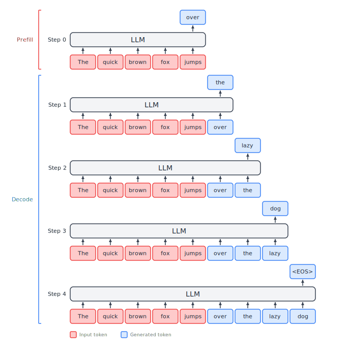

# Introduction {#sec-intro}

Before ChatGPT, most of the focus on language models was on how to train better, smarter models.
Now that we are in a world where millions of people use **large language models (LLMs)** every day, much recent energy has gone into making serving these models more efficient and less expensive.
This book summarizes many of the key advancements with LLM inference.
We will attempt to provide clarity about each concept, but this is not an ML Ops book, and we will not drill down into coding each technique.
In this chapter, we start by understanding the components of LLM inference.
In the remainder of this book, we will look at different bottlenecks and techniques for improving performance.

## Overview {#sec-overview}

LLM inference is the process of generating a text response.
You give the model some input, and it predicts what comes next, one word (technically, one token) at a time.
Before we get into the technical details of how inference systems are built and optimized, let's walk through a simple example to build intuition for what's actually happening.

### A simple example

Suppose we give an LLM the prompt **"The quick brown fox jumps"** — five input tokens. The model's job is to predict what tokens come next.

{#fig-inference-example height=400 .lightbox}

The text generation happens in a series of steps, as shown in @fig-inference-example:

- First, the LLM runs a single **forward pass** of the neural network model using all of the input tokens. After processesing all of these tokens together, it produces its prediction for the next token, **over**.
- In the next step, the predicted token **over** is appended to the end of the input text, and the model is fed **"The quick brown fox jumps over"**. In this step it predicts **the**.
- Once again, the predicted token **the** is appended to the end, the model is fed **"The quick brown fox jumps over the"**, and it predicts **lazy**.
- Continuing this process, the input **"The quick brown fox jumps over the lazy"** predicts **dog**.
- Then, the input **"The quick brown fox jumps over the lazy dog"** outputs a special token **\<EOS\>**. The special token tells the LLM to stop the generation, and the completed response is returned to the user.

In our very first step, the LLM is given all of our input tokens.
In many cases, this input prompt can be quite long.
Because we have so much new data to process, this initial step uses different computing resources than later steps.
We will see in a moment that the first step is called the **prefill** step.

The remaining steps each add only one new token to the inputs that the LLM has seen before.
This has a different computing profile from the prefill.
This portion is callled the **decode** phase, and when a lot of text is generated, it requires many decode steps to complete generation of the response.

This is the process that LLMs such as ChatGPT and Claude use to respond to our requests.
In this book, we will dig deeper to understand the internals of this inference process, then explore techniques for improving it.

```{=html}
<!-- Figure: Show the prefill and decode steps for "The quick brown fox jumps"
ASCII art sketch:
  Input tokens:     [The] [quick] [brown] [fox] [jumps]
                         |
                    Prefill (one forward pass)
                         |
                         v
                      [over]          ← first output token
                         |
                    Decode step 1
                         |
                         v
                      [the]
                         |
                    Decode step 2
                         |
                         v
                      [lazy]
                         |
                    Decode step 3
                         |
                         v
                      [dog]
                         |
                    Decode step 4
                         |
                         v
                      [EOS]           ← stop
-->
```

### Why inference optimization matters

That simple loop — run the model, get a token, repeat — sounds straightforward.
But the raw cost of running it naively is staggering.
A 70-billion-parameter model stores its weights in about 140 GB of GPU memory (at 2 bytes per parameter).
Every single decode step has to read through all of those weights just to produce one token.
Without any optimization, a single request to a 70B model might generate only 15–20 tokens per second on a high-end GPU, and frontier models like Gemini are belived to be ten time larger would be below 2 tokens per second.
Run that for one user at a time with no batching, and you've got an extremely expensive system that can barely output faster than one person can read, while also leaving most of the GPU's capability unused.

The situation gets much better with the right techniques.
Modern serving frameworks like vLLM and SGLang apply a combination of the optimizations covered in this book — smarter batching, memory management, kernel optimization, and more — and the results are dramatic.
In one benchmark, an unoptimized serving setup on an A100 GPU achieved about 80 tokens per second for a 13B model.
The same model served through vLLM achieved roughly 1,900 tokens per second — a 23x improvement [@anyscale2024batching].
On newer hardware, optimized frameworks routinely serve models like Llama 3 8B at over 16,000 tokens per second on a single H100 GPU, with per-token latencies in the single-digit milliseconds.

These aren't gains from better hardware.
They come from understanding the bottlenecks in the LLM inference pipeline and systematically eliminating them.
That's what this book is about.

### About this book

This book is written for ML engineers who know the LLM's neural network architecture and want to understand what else is part of serving LLM requests, and in particular how to make that process faster.
We assume you're familiar with neural networks, the transformer architecture, and self-attention at a conceptual level.
If you need a refresher on how a decoder-only transformer works — how queries, keys, and values flow through the attention mechanism, what the KV cache is, and why it exists, @sec-appendix-a covers these topics with the level of detail needed for the rest of the book.

With that, let's get into the technical details.
We'll start by breaking down the inference pipeline in further detail and building a precise vocabulary for talking about its performance.

