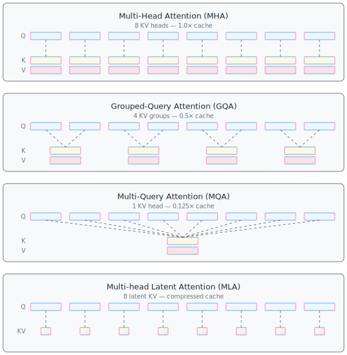
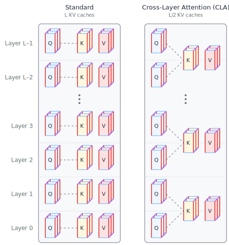
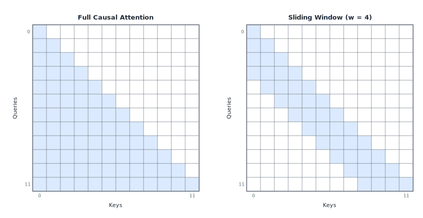
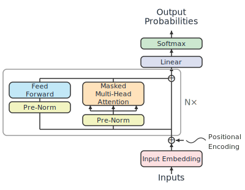

# Model Design Choices {#sec-model}

Now that we have an understanding of the inference pipeline and where the bottlenecks live, starting with this chapter, we shift to doing something about them.

The optimizations in this chapter are about the model itself, separate from request handling.
They change what the hardware has to do per token by reducing the model's compute and memory footprint at the architecture and weight level.
Many of these are choices made by model designers prior to training.
A few can be applied post-training to an existing model.
Either way, the result is the same: fewer bytes to move, fewer FLOPs to compute, or both.

We'll keep the coverage here lighter than in subsequent chapters.
Much of the time, you don't get a choice about the model to be used.
Because of this, much of the focus of this book is on what you can do when you're given a model to serve.
But understanding these techniques is still helpful, whether you have any say in the model design or not.

## Model Quantization {#sec-quantization}

One can make a strong argument that **quantization** is the single most impactful model-level optimization for LLM inference.
The reason is straightforward, and it connects directly to the bottleneck framework from @sec-bottleneck-framework.

During decode, the biggest overall bottleneck is memory bandwidth.
As we've discussed, each decode step reads the entire model's weights from HBM just to produce one token.
If your model has 70 billion parameters stored in FP16 (2 bytes each), that's 140 GB of weight data read per token.
On an H100 with 3.35 TB/s of bandwidth, reading 140 GB takes about 42 milliseconds.
That's a hard floor on your per-token latency, ignoring everything else.
If you quantize those same weights to INT4 (0.5 bytes each), you're reading 35 GB instead, and the floor drops to about 10 milliseconds.
That's a 4x improvement in your theoretical best-case decode speed, and we didn't need to change a single line of serving code.

A further insight is that quantization doesn't just reduce the amount of GPU memory needed to store the model weights (which is a pretty big benefit).
Quantization also reduces the bandwidth demand that dominates decode latency, and it can speed up computation too.
Let's walk through the main approaches to quantization.
We will assume 16-bit weights in FP16 or BF16 are our baseline.

::: callout-note
Floating point arithmetic used to be performed at 32 bits (FP32) for both training and inference, but the last few years have seen a shift to 16-bit floating point (FP16 or BF16).
The dynamic range of FP16 and BF16 is still quite high, which made the transition from FP32 relatively easy, even for training, where automatic mixed precision (AMP) techniques can be used to keep the model stable.
More recently, the focus has shifted to quantization below 16 bits, which requires more careful techniques to avoid quality degradation.
:::

### Lower precision datatypes

There are a number of datatypes supported, especially in the latest generation of GPUs.
While higher precision datatypes, such as FP32, are needed for training, most models can run inference using FP16 without any noticeable difference.
Datatypes that require fewer than 16 bits to store can save even more memory.
@Tbl-datatypes lists commonly supported datatypes.

|	Type	|	Bits	|	Layout	|	Key Properties	|
|-----|------|------|------|
|	FP32	|	32	|	1s + 8e + 23m	|	Standard training precision; baseline	|
|	FP16	|	16	|	1s + 5e + 10m	|	2x compression; narrower dynamic range (max ~65,504)	|
|	BF16	|	16	|	1s + 8e + 7m	|	Same dynamic range as FP32, less mantissa precision; preferred for training stability	|
|	FP8 E4M3	|	8	|	1s + 4e + 3m	|	More precision; used for weights/activations in forward pass	|
|	FP8 E5M2	|	8	|	1s + 5e + 2m	|	More dynamic range; used for gradients	|
|	INT8	|	8	|	signed integer	|	Range [-128, 127]; 4x compression vs FP32	|
|	INT4	|	4	|	signed integer	|	Range [-8, 7]; 8x compression; requires sophisticated algorithms	|
|	NF4	|	4	|	non-uniform	|	16 levels at normal distribution quantiles; information-theoretically optimal for normally-distributed weights (QLoRA)	|
|	FP4	|	4	|	1s + 2e + 1m	|	Less common than NF4 for LLM weights	|

: Common datatype precisions supported. The Layout column shows the number of bits allocated for the sign ("s"), exponent ("e"), and mantissa ("m"). {#tbl-datatypes .striped}

Older GPUs support 32-bit and 16-bit floating point, as well as 8-bit integer matrix multiplication.
FP8 is a newer format supported on H100 and later GPUs.
With the popularity of quantization, newer generations of GPUs are supporting more smaller datatypes.

### Weight-only quantization

The simplest form of quantization leaves the activations in their original precision (typically FP16 or BF16) and only quantizes the weights.
This is called **weight-only quantization**, and it's the most common starting point.
In weight-only quantization, the weights are stored in a smaller datatype, then dequantized back to FP16 on the fly before each matrix multiplication, so the compute still happens at FP16 precision.
The benefit is purely about reducing how much data needs to be read from HBM.

When quantizing below 16-bit precision, the storage space and memory read savings are usually slightly reduced because we also need to store conversion parameters.
If we have both an offset and a scaling parameter, then when $x$ is the higher precision value and $\tilde{x}$ is the quantized value, the conversion is $x = (\tilde{x} - \text{offset}) * \text{scaling}$.
This dequantization step also adds a small amount of compute overhead to model inference.

LLM inference tolerates quantization well.
While the lower precision datatypes could cause cascading rounding errors, in practice the errors tend to cancel out.
Quantizing from FP16 to INT8, known as **W8**, cuts the weight memory in half compared to FP16.
The quality impact is usually negligible for large models --- a 70B model at W8 will behave almost identically to its FP16 counterpart on most benchmarks.
If we drop to **W4** quantization, cutting weight memory by 4x compared to FP16, this is where quality tradeoffs start to become more visible, especially for smaller models.
A 7B model at W4 may show degradation on some tasks, while a 70B model at W4 often remains remarkably capable.
The general pattern is that larger models are more robust to aggressive quantization.

### Weight-activation quantization

Weight-only quantization reduces memory bandwidth demand but doesn't speed up the actual matrix multiplication, since the compute still runs at FP16.
**Weight-activation quantization** takes the next step: quantize both weights *and* activations so that the matrix multiplications themselves can run on lower-precision hardware units.

For example, weight-activation quantization using INT8, known as **W8A8**, quantizes both weights and activations to INT8, allowing the use of INT8 tensor cores.
On the H100, INT8 tensor cores deliver roughly 2x the throughput of FP16 tensor cores.
W8A8 reduces memory traffic for bandwidth-bound operations, and it also increases the compute ceiling for compute-bound operations.
As with weight-only quantization, weight-activation quantization introduces some additional storage and compute overhead associated with the conversion parameters.

### Granularity

Early attempts to quantize below 16-bit floating point took a simple approach that used the same datatype and conversion factor for all values in each weight matrix.
In this scenario, one very large value distorts the conversion scale for the entire weight matrix.
This increases the rounding errors caused by quantization and can also cause small weights to get rounded to zero, which can cause even more problems.
To mitigate the risk of outlier values, quantization can be performed at more fine-grained granularities:

* Per channel(s)
* Per block, potentially in a hierarchy of super-blocks and sub-blocks
* Per token

Fine-grained quantization seeks to group similar values together, and is highly effective.
It does, however, come at a cost of additional memory and compute overhead.
For example, dividing a 2,048 by 2,048 weight matrix into groups of 32 values will require 131,072 scaling parameters and dequantization calculations.
To reduce the storage of the scaling factors, they can themselves be quantized at a cost of additional dequantization overhead.

### When quantization is applied

**Post-Training Quantization (PTQ)** is performed after the model is fully trained.
This is the dominant approach since it can be applied to any model from any source, without requiring any special training.
Simple PTQ only examines the weights, and more advanced PTQ techniques require processing a small set of calibration data through the model so activation information can also be analyzed.

**Quantization-Aware Training (QAT)** modifies the model training procedure to minimize the rounding errors caused by quantization.
While effective, the extra work required has limited adoption rates.

### Techniques

One of the practical challenges of quantization, especially weight-activation quantization, is **activation outliers**.
Large LLMs tend to develop a small number of activation channels with values that are orders of magnitude larger than the rest.
If you try to quantize activations using a single scale factor per tensor, these outliers force a wide quantization range that wastes precision on the many small values.
Addressing activation outliers is an area of active research, and we will mention a few post-training quantization methods and how they try to handle these activation outliers.

**GPTQ** [@frantar2022gptq] uses approximate second-order information to quantize weights to 4 bits (or even 3 bits) with minimal accuracy loss.
It works by quantizing weights one layer at a time and adjusting the remaining weights to compensate for the error introduced by each quantization step.
GPTQ can be applied to a pre-trained model without a large training set.
It only needs a small calibration set.

**AWQ (Activation-aware Weight Quantization)** [@lin2023awq] takes a different approach.
It observes that a small fraction of weights are disproportionately important --- specifically, the weights that correspond to large activation magnitudes.
Rather than treating all weights equally, AWQ protects these salient weights by scaling them up before quantization and scaling the activations down correspondingly.
This keeps the important weights at higher effective precision while allowing aggressive quantization elsewhere.

**SmoothQuant** [@xiao2023smoothquant] addresses activation outliers by migrating the quantization difficulty from activations to weights.
The idea is to apply a per-channel scaling transformation that divides the activation by a smoothing factor and multiplies the corresponding weight by the same factor.
This makes the activation distribution more uniform --- and therefore easier to quantize --- at the cost of making the weight distribution slightly less uniform.
Since weights are fixed and can be quantized offline with more care, this is a favorable tradeoff.

### Connecting quantization to MBU

In @sec-metrics, we introduced Model Bandwidth Utilization (MBU) and Model FLOPs Utilization (MFU) as key metrics for decode efficiency.
Quantization improves the theoretical decode speed by reducing the bytes that need to be read per token.
But it doesn't automatically improve decode linearly. 
If your serving system has overhead that prevents it from saturating HBM bandwidth, quantization reduces the numerator (bytes of model data) but the denominator (peak bandwidth) stays the same.
This means that the improvement in MFU is not necessarily proportional to the reduction in bytes per weight.
In the worst case, if another bottleneck prevents you from running more decode steps, your MBU would drop and your MFU would stay the same.

In practice, quantized models can achieve higher MBU because the smaller data footprint means fewer cache misses, better memory access patterns, and the possibility of fitting the entire model in a single GPU's memory rather than splitting across devices.
These secondary effects can make the real-world speedup even better than the raw byte reduction would suggest.

::: callout-note
Quantization affects the roofline model in an important way.
When you use FP8 or INT8 tensor cores, you raise the compute ceiling (from \~990 TFLOPS to \~1,979 TFLOPS on the H100) while the bandwidth ceiling stays constant.
This shifts the ridge point higher, which means some workloads that were compute-bound at FP16 can become memory-bandwidth-bound at FP8.
Keep this in mind when choosing quantization strategies for prefill-heavy workloads.
:::

## Knowledge Distillation {#sec-distillation}

**Knowledge distillation** is a training technique where a smaller **student** model is trained to mimic the behavior of a larger **teacher** model.
In the original distillation formulation [@hinton2015distilling], the student learns not just from the ground-truth labels, but from the teacher's full output distribution --- the probability the teacher assigns to every token in the vocabulary.
These soft targets carry richer information than hard labels, which is why a distilled student can often outperform a model of the same size trained from scratch.
Newer techniques vary the approach by training on sample outputs from the larger model or using reinforcement learning to impart some of the larger model's capability into the smaller model.

From an inference perspective, the result is simple: you get a smaller model.
Fewer parameters means less data to read from HBM per decode step, a smaller KV cache (assuming the model also has fewer layers or a smaller hidden dimension), and less memory consumed overall.
The inference system doesn't need to know or care that the model was distilled --- it just sees a model with fewer parameters that performs better than you'd expect for its size.

The tradeoff is that distillation requires significant training compute, and you need the larger, more capable teacher model.
This may not be an option for a frontier model, but distillation is popular in research and in use for smaller LLMs.

## Pruning {#sec-pruning}

**Pruning** removes weights or structures from a model that contribute little to its output.
The motivation is similar to quantization: fewer parameters means less data to move, which speeds up bandwidth-bound decode.
But while quantization keeps all the parameters and reduces their precision, pruning eliminates parameters entirely.

### Unstructured pruning

**Unstructured pruning** zeroes out individual weights based on some importance criterion (typically magnitude).
A pruned model might have 50% of its weights set to zero, theoretically cutting compute and memory in half.
The problem is that these zeros are scattered throughout the weight matrices in an irregular pattern.
If enough of the weights can be pruned, good speedups can be achieved for CPU inference.
Standard GPU hardware and matrix multiplication kernels still process the full dense matrices, so they can't exploit this sparsity efficiently, and sparse matrix multiplications are much slower than their dense counterparts, so they need extremely high levels of sparsity before they are faster than full dense matrix multiplication.
To get real speedups from pruning, you need specialized sparse compute support, such as NVIDIA's 2:4 structured sparsity format on Ampere and later GPUs, and it is more difficult to prune weights into this pattern.

### Structured pruning

**Structured pruning** takes a coarser approach: instead of zeroing individual weights, it removes entire structural units, such as attention heads, entire layers, or neurons in MLP blocks.
The result is a smaller dense model that runs on standard hardware with no special sparse computation support required.

Removing an attention head reduces the KV cache proportionally.
Removing an entire layer reduces both parameters and the depth of the forward pass.
These are straightforward wins for inference, and the cost model from @sec-prefill-decode applies directly --- fewer parameters means proportionally less time reading weights during decode.

The challenge with structured pruning is identifying which structures can be removed with minimal quality impact.
Attention heads in the later layers of a model often contribute less than early or middle layers, but this varies by model and task.
Structured pruning typically requires some retraining or fine-tuning after removal to recover quality, which limits its use as a purely post-training optimization.

In practice, pruning is less widely adopted for LLM inference than quantization.
Quantization offers a more predictable quality-performance tradeoff and is easier to apply post-training.

## Efficient Attention Architectures {#sec-efficient-attention}

The sections above are post-training techniques you can apply to an existing model.
This section covers architecture choices made during model design that affect inference inference efficiency from the start.

FFN layers account for roughly two-thirds of a typical transformer's parameters, but they operate independently on each token.
Their cost scales only linearly with sequence length, and they are straightforward to parallelize.
In addition, GPUs are highly optimized for dense matrix multiplications, so FFNs can be executed very efficiently.
The MoE architecture discussed in @sec-ffn is one architectural approach that reduces the FFN inferencecost by activating only a subset of FFN experts per token.

Attention is the more interesting bottleneck.
Its KV cache grows with sequence length, creating a per-request memory cost that directly limits concurrency.
For long sequences, the quadratic cost of full attention also becomes significant during prefill.
This makes attention the primary target for architectural optimization.

### Reducing KV cache size

The KV cache is one of the largest consumers of GPU memory during inference, and unlike model weights, it scales with the number of active requests and the sequence length of each.
Reducing the size of the KV cache per request lets you serve more concurrent requests in the same memory budget.
We'll cover KV cache management techniques in @sec-kv-cache; here we focus on the architectural choices that determine how large the cache is in the first place.

{#fig-kv-variants .lightbox}

**Multi-Head Attention (MHA)** is the original design from the transformer paper [@vaswani2017attention].
Each attention head has its own key and value projections, so the KV cache stores separate K and V vectors for every head, every layer, and every token in the sequence.
For a model using FP16 with 64 heads and a head dimension of 128, each token adds $2 \times 64 \times 128 \times 2 = 32{,}768$ bytes to the KV cache per layer.
This is the most expensive option.
The top row of @fig-kv-variants shows how queries align with keys and values in MHA.

**Multi-Query Attention (MQA)** [@shazeer2019mqa] goes to the opposite extreme: all attention heads share a *single* set of key and value projections, as shown on the third row of @fig-kv-variants.
Each head still has its own query projection, so the heads can attend to different aspects of the input, but the KV cache only stores one K and one V vector per layer per token.
This reduces the KV cache by a factor equal to the number of heads -- from 64 sets of K/V down to 1 in the example above.
The negative impact on the quality of text generation is the main reason why MQA is not widely adopted.

**Grouped-Query Attention (GQA)** [@ainslie2023gqa] is a middle ground between MHA and MQA.
Instead of one shared KV set for all heads, GQA uses **G** groups, where each group of heads shares one set of keys and values.
With 32 heads and **G** = 8 groups, the KV cache is reduced by 4x compared to MHA.
GQA has become the dominant choice in recent models --- LLaMA 3, Mistral, and Gemma all use it.
It offers much of MQA's memory savings with less text quality risk.
A GQA example with 8 query heads and 4 groups is shown on the second row of @fig-kv-variants.

**Multi-head Latent Attention (MLA)** [@liu2024deepseekv2] is DeepSeek's approach to KV cache compression.
Rather than storing full key and value vectors, MLA compresses them into a low-rank **latent vector** at each layer.
At attention time, the full keys and values are reconstructed from the latent representation.
The compression ratio depends on the latent dimension, but MLA can achieve significant cache reductions --- comparable to or better than GQA --- while preserving model quality.
The tradeoff is additional compute to decompress the latent vectors during attention, but this compute is typically small relative to the bandwidth savings, and there are tricks to reduce the compute.
MLA is depicted on the bottom row of @fig-kv-variants.

{#fig-cross-layer-attn .lightbox}

**Cross-Layer Attention (CLA)** [@brandon2024cla] takes a different angle: rather than sharing KV across heads within a layer, it shares KV across adjacent layers.
If every pair of consecutive layers shares the same KV cache, the total cache size is halved.
@Fig-cross-layer-attn compares standard attention with CLA, where the K and V vectors are shared between pairs of layers.
CLA can be combined with GQA or MQA for even greater reductions.

### Reducing attention compute

Beyond the KV cache, the attention computation itself can be a bottleneck, particularly during prefill for long sequences where the cost is quadratic in sequence length.

{#fig-sliding-window-attn .lightbox}

**Sliding window attention** [@beltagy2020longformer] restricts each token to attend only to a fixed-size window of nearby tokens rather than the full sequence.
This reduces the attention computation from $O(\dims{S}^2)$ to $O(\dims{S} \times w)$, where [S]{.dim-s} is the sequence length and $w$ is the window size.
@Fig-sliding-window-attn illustrates the difference between full attention and sliding window attention with a window size of 4.
For inference, sliding window attention also bounds the KV cache size per layer to the window size, regardless of the total sequence length.
Several recent models -- including Mistral -- use sliding window attention in some or all layers, often combined with a few full-attention layers to preserve the model's ability to attend to distant tokens.

::: callout-note
This book focuses on the dominant transformer architecture with softmax attention.
Alternative approaches like Mamba and other state-space models, as well as linear attention variants, replace the attention mechanism entirely with recurrent-style computations that have constant-size state rather than a growing KV cache.
These are an active area of research, but the vast majority of deployed LLMs today still use softmax attention.
Because sliding window attention and attention alternatives hurt generation quality, competitive models today retain the use of full softmax attention in some of their layers.
For now, these KV cache optimizations are still needed.
:::

### Parllelizing computation

{#fig-parallel-block .lightbox}

**Parallel attention and MLP blocks** is a simple architectural trick used in some models, including PaLM [@chowdhery2022palm].
Instead of computing attention and MLP sequentially within each transformer block, they are computed in parallel and their outputs are summed.
This doesn't reduce total FLOPs, but it reduces the serial dependency within each layer, which can improve GPU utilization and reduce latency --- especially when the attention and MLP computations can be overlapped on different hardware units.
A schematic of this parallel design is shown in @fig-parallel-block.

## Tokenization and Vocabulary Effects {#sec-tokenization}

One model-level lever that's easy to overlook is the **tokenizer** and its vocabulary size.
The tokenizer determines how many tokens a given piece of text is broken into, and that token count directly drives the number of decode steps, each of which requires a full forward pass through the model.

A larger vocabulary means each token covers more text on average.
With a larger vocabulary, more words and subwords that would otherwise be split into multiple tokens get their own single token.
Fewer tokens means fewer decode steps, which means faster end-to-end generation.
For latency-sensitive applications, this is a meaningful win.
Going from a 32K vocabulary to a 128K vocabulary might reduce the average token count for a given text by 10-20%, which translates directly to 10-20% fewer decode steps.

The tradeoff is that a larger vocabulary increases the size of two model components: the **embedding table** (which maps token IDs to vectors at the input) and the **LM head** (the output projection that produces logits over the vocabulary).
For a model with a hidden dimension of 4,096 and a vocabulary of 128K tokens, the LM head alone has 4,096 $\times$ 128,000 $\approx$ 500 million parameters.
At FP16, that's about 1 GB, which is not negligible, but typically a small fraction of the total model size for large LLMs.
The compute cost of the final softmax over a larger vocabulary also increases, though this is usually a minor contributor to overall latency.

For most practical scenarios, the efficiency gains from fewer decode steps outweigh the increased embedding and LM head size.
This is one reason why the trend in recent LLMs has been toward larger vocabularies.

## Summary

The techniques in this chapter all reduce how much work the hardware has to do for each token.
Model quantization reduces the bytes-per-parameter, directly attacking the bandwidth bottleneck that dominates decoding, and weight-activation quantization can also speed up compute by enabling the use of faster, lower-precision computational cores.
Distillation and pruning produce smaller models with fewer total parameters.
Efficient attention architectures reduce the KV cache footprint and, in some cases, the attention compute itself.
Even vocabulary design affects inference cost by changing how many decode steps are needed.

These are the model-level knobs.
Once they're set --- once you have a quantized, architecturally efficient model ready to serve --- the next set of optimizations operates at the system level: how to schedule requests, batch them together, and manage memory.
That's where we turn next in @sec-scheduling.

## Further Reading

Quantization is a deep field with a large body of work.
The GPTQ [@frantar2022gptq] and AWQ [@lin2023awq] papers are essential reading if you want to understand the mechanics of post-training weight quantization beyond the overview given here.
GPTQ's use of approximate second-order information to minimize quantization error is elegant, and AWQ's insight that activation-aware scaling protects the most important weights is a useful design pattern that shows up in other contexts.
SmoothQuant [@xiao2023smoothquant] is the key reference for weight-activation quantization, particularly its technique of migrating quantization difficulty from activations to weights.
For an earlier take on INT8 inference that pioneered mixed-precision decomposition, see @dettmers2022llmint8.
The most popular quantization library is `bitsandbytes` [@dettmers2021bitsandbytes], also by Tim Dettmers.

For a comprehensive survey of quantization methods applied to LLMs, @zhu2024quantization covers the full taxonomy, from uniform to non-uniform quantization, weight-only to weight-activation, and post-training to quantization-aware training, with empirical comparisons across model sizes.

On the attention architecture side, the progression from standard multi-head attention to MQA [@shazeer2019mqa], GQA [@ainslie2023gqa], and MLA [@liu2024deepseekv2] is well documented in the original papers.
Shazeer's MQA paper is particularly worth reading because it clearly explains the inference motivation --- reducing KV cache bandwidth --- rather than just reporting accuracy numbers.
The Llama 3 paper [@grattafiori2024llama3] provides a good case study of GQA adopted in a production-grade model, with ablations showing the quality-efficiency tradeoff.

For knowledge distillation applied to LLMs specifically, @gu2024minillm covers the challenges of distilling autoregressive language models, including the mismatch between training-time and inference-time token distributions that makes naive distillation less effective for generative models.
