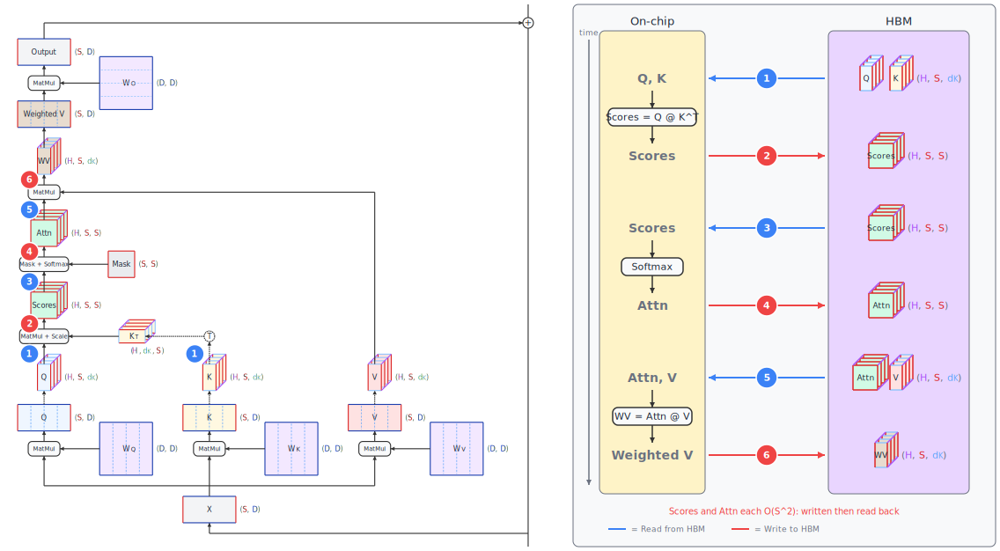
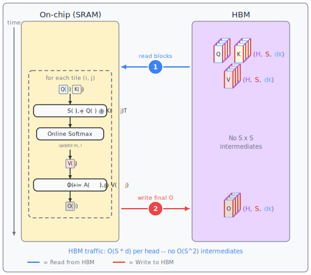

# Request Compute, Memory, and Latency Bottlenecks {#sec-request}

The previous chapter tackled scheduling --- how to keep the GPU busy by managing how requests are handled.
This chapter examines the efficiency with which individual requests are handled.
The first two sections address memory-bandwidth bottlenecks at the kernel level -- optimizations that apply to both prefill and decode.
The remaining sections target the sequential decoding constraint, exploring techniques that generate multiple tokens per step or amortize the cost of each one.

## Memory-Aware Attention Kernels {#sec-attention-kernels}

### Why standard attention wastes bandwidth

To understand why attention is expensive in practice, you need to think about where data lives during computation. Recall from @sec-bottleneck-framework that the GPU has a small, fast on-chip registers and SRAM, and a large, slow off-chip HBM. 
The standard implementation of self-attention is depicted in @fig-std-attn-hbm and works roughly like this:

{#fig-std-attn-hbm .lightbox}

1. Read the $Q$ and $K$ tensors, each shape **([H]{.dim-h}, [S]{.dim-s}, $\dimdk{d_K}$)** --- reminder, this would be **(B, [H]{.dim-h}, [S]{.dim-s}, $\dimdk{d_K}$)** with batched processing but we're avoiding the clutter of repeatedly list the batch dimension.
2. Compute the score matrix $\text{Scores} = QK^T$ and write $\text{Scores}$, shaped **([H]{.dim-h}, [S]{.dim-s}, [S]{.dim-s})**, to HBM.
3. Read $\text{Scores}$ shaped **([H]{.dim-h}, [S]{.dim-s}, [S]{.dim-s})** back from HBM.
4. Apply SoftMax to get the attention weights and write $\text{Attn}$, also shaped **([H]{.dim-h}, [S]{.dim-s}, [S]{.dim-s})**, to HBM.
5. Read $\text{Attn}$ shaped **([H]{.dim-h}, [S]{.dim-s}, [S]{.dim-s})** back from HBM, compute the weighted values $\text{Weighted Values} = \text{Attn}V$.
6. Write the weighted values, shaped **([H]{.dim-h}, [S]{.dim-s}, $\dimdk{d_K}$)**, back to HBM

The read of $Q$ and $K$ at the beginning needs to happen in some form, and the writing of the weighted values also needs to happen at the end.
But the writing and reading back of the **([H]{.dim-h}, [S]{.dim-s}, [S]{.dim-s})** $\text{Scores}$ and $\text{Attn}$ tensors in the middle wastes bandwidth, especially as **[S]{.dim-s}** gets large.
For a sequence of length 4,096, the score matrix alone is $4096 \times 4096 = 16.7$ million entries per head.
The actual computations of the matrix multiplications and softmax are fast.
What's slow is the round-trip to HBM for these intermediate results.

This is a textbook example of a memory-bandwidth-bound operation.
The GPU spends most of its time waiting for data to move to and from HBM, not doing arithmetic.
And the problem scales quadratically with sequence length --- double the sequence length and you quadruple the intermediate memory traffic.

It's worth noting that even a single matmul like $\text{Scores} = QK^T$ doesn't happen as one monolithic operation.
The $Q$ and $K$ matrices are far too large to fit in SRAM, so the GPU kernel **tiles** the computation.
Consider $Q$ with shape **([S]{.dim-s}, $\dimdk{d_K}$)** and $K^T$ with shape **($\dimdk{d_K}$, [S]{.dim-s})**.
A standard tiled matmul loops over row-blocks of $Q$ (groups of query positions) and column-blocks of $K^T$ (groups of key positions).
For each pair, the kernel loads a block of $Q$ rows and a block of $K^T$ columns into SRAM, computes their partial product, and writes the result into the corresponding tile of $\text{Scores}$ in HBM.
Since $d_K$ is small (typically 64 or 128), the inner dimension often fits in a single pass.
But the outer dimensions don't: each block of $Q$ rows is re-read from HBM once for every column-block of $K^T$, and each column-block of $K^T$ is re-read for every row-block of $Q$.
This means the total HBM reads exceed the theoretical minimum of reading each matrix exactly once --- the GPU re-reads portions of $Q$ and $K$ multiple times to tile through the computation.
But that extra read traffic is modest and scales with **[S]{.dim-s}**, not $\dims{S}^2$.
The real waste in standard attention isn't within any single matmul --- it's the round-trips *between* operations: writing the **([H]{.dim-h}, [S]{.dim-s}, [S]{.dim-s})** $\text{Scores}$ matrix to HBM just so softmax can read it back, then writing the attention weights just so the next matmul can read them.

### FlashAttention

**FlashAttention** [@dao2022flashattention] solves this by never materializing the full attention matrix in HBM.
If we had enough SRAM, we could store these attention matrices there, and we would avoid the round trip to HBM, but we don't.
The core idea with FlashAttention is **tiling**: break the $Q$, $K$, and $V$ matrices into small blocks that fit in SRAM, then compute the attention output block by block, keeping all intermediate results on-chip.

The algorithm works in two nested loops.
The outer loop iterates over blocks of $K$ and $V$.
The inner loop iterates over blocks of $Q$.
For each pair of blocks, the kernel computes the local attention scores, applies a local softmax, and accumulates the weighted sum -- all in SRAM.
The tricky part is that softmax requires the maximum and sum over the full row of scores, not just the current block.
FlashAttention handles this with an **online softmax** technique that maintains running statistics and corrects the accumulated output as new blocks are processed.

```{=html}
<!-- Figure: FlashAttention tiling
ASCII art sketch:

  Q (S x d)          K^T (d x S)          V (S x d)
  +--------+         +--------+           +--------+
  | Block  | ---- -> |        |           |        |
  | Q_i    |    x    | K_j^T  |  ----- -> | V_j    |
  +--------+         +--------+           +--------+
       |                  |                    |
       +------ all in SRAM, no HBM write -----+
                          |
                    accumulate O_i
                   (update running max, sum)

  HBM reads:  Q, K, V  (each read once)     = O(S·d) per head
  HBM writes: O         (written once)       = O(S·d) per head
  Never materialized: S, P                   = saves O(S²) HBM traffic
-->
```

{#fig-flash-attention .lightbox}

The result: HBM traffic drops from $O(S^2)$ to $O(S \cdot d)$ for the attention matrix, where $d$ is the head dimension (typically 64 or 128).
For a 4K sequence with $d=128$, that's a reduction from 16.7 million elements to about 524K elements -- roughly a 32x reduction in memory traffic for the attention intermediates.

Here's the counterintuitive part: FlashAttention actually performs *more* FLOPs than standard attention.
The online softmax rescaling adds extra multiply-accumulate operations.
But wall-clock time drops substantially because the bottleneck was never the arithmetic -- it was the HBM traffic.
By trading a small increase in compute for a large decrease in memory movement, FlashAttention lands in a much better spot on the roofline.

FlashAttention applies to both prefill and decode.
During prefill, the sequence length $S$ is large (the full prompt), so the $O(S^2)$ savings are dramatic.
During decode, $S$ is just 1 for the query (the new token), but the key and value sequences span the entire context, so the tiled approach still avoids unnecessary intermediate writes.

### FlashAttention v1, v2, and v3

The original FlashAttention [@dao2022flashattention] established the tiling approach. Subsequent versions improved the implementation substantially:

**FlashAttention-2** restructured the algorithm to improve GPU parallelism.
The key change was swapping the inner and outer loops -- iterating over $Q$ blocks in the outer loop and $K/V$ blocks in the inner loop.
This reduced the amount of shared memory communication between warps (groups of 32 threads that execute together on the GPU) and improved occupancy on modern GPUs.
The result was roughly a 2x speedup over v1.

**FlashAttention-3** targeted the H100 specifically, exploiting its new hardware features.
It introduced **warp specialization** -- dedicating some warps to data loading while others perform computation, overlapping memory access and arithmetic within the same kernel.
It also leveraged the H100's FP8 tensor cores and hardware-assisted asynchronous memory operations.
These changes pushed FlashAttention closer to the theoretical peak throughput on H100 hardware.

The progression across versions illustrates a broader principle: writing a correct tiled attention kernel is one thing, but extracting maximum performance from a specific GPU architecture requires deep hardware-aware engineering.
This is why FlashAttention has become a de facto standard rather than something every team reimplements.

::: callout-note
FlashAttention handles the tiling of attention computation within a single GPU.
When the KV sequence is very long, you may also want to parallelize the attention computation *across* the sequence dimension using multiple GPU cores or even multiple GPUs.
This is the role of FlashDecoding, which we'll cover in @sec-sequence-parallelism.
:::


## Kernel Fusion and Compute Graph Optimization {#sec-kernel-fusion}

FlashAttention is a specific instance of a more general optimization strategy: reducing the number of times data makes a round trip to HBM by combining operations into fewer GPU kernels.
This section covers the general techniques.

### Kernel fusion

Every time the GPU finishes one kernel and starts the next, there's an implicit data handoff through HBM.
The output of the first kernel gets written to HBM, and the input of the second kernel gets read from HBM.
If those two kernels operate on the same data, this round trip is pure waste.

**Kernel fusion** combines multiple operations into a single GPU kernel so that intermediate results stay in registers or SRAM. Common fusion opportunities in transformer inference include:

- **Fused QKV projection**: instead of three separate matrix multiplications for $Q$, $K$, and $V$, fuse them into a single kernel that reads the input activations once and produces all three outputs
- **Fused softmax + mask**: apply the causal mask and softmax in one pass, avoiding a separate write-then-read for the masked scores
- **Fused add + LayerNorm**: combine the residual addition and layer normalization, keeping the intermediate sum in registers
- **Fused RoPE + attention**: apply rotary position embeddings to $Q$ and $K$ within the attention kernel itself

Each fusion eliminates one HBM round trip.
For a single transformer layer, there might be 10 or more such opportunities.
Across 80+ layers in a large model, these small savings add up to a meaningful reduction in total memory traffic and kernel launch overhead.

### CUDA graphs

We introduced CUDA graphs briefly in @sec-bottleneck-framework. Here's the full picture.

During decode, the GPU executes the same sequence of kernels at every step -- the same transformer layers in the same order with the same shapes (for a given batch size).
But the CPU doesn't know that.
At each step, it launches each kernel individually, waits for the GPU to be ready, sends the launch command, and moves on to the next kernel.
Each launch takes roughly 5--10 microseconds, which doesn't sound like much, but a single decode step through a large model might involve hundreds of kernel launches.
At 5 $\mu$s each, that's hundreds of microseconds of pure overhead -- time the GPU spends idle waiting for the CPU to tell it what to do next.

A **CUDA graph** captures a fixed sequence of kernel launches into a single replayable object.
You run the decode step once in "capture mode," which records every kernel launch, memory copy, and synchronization point.
Then on subsequent steps, you replay the entire graph with a single command.
The CPU issues one launch instead of hundreds, and the GPU executes the full sequence without waiting.

The main limitation is that CUDA graphs are static.
The captured graph assumes fixed tensor shapes and memory addresses.
If the batch size changes, or a request finishes and leaves the batch, the graph is invalidated and must be recaptured.
Serving frameworks handle this with a small pool of pre-captured graphs for common batch sizes and sequence lengths, falling back to eager execution for uncommon shapes.

### Computation graph compilation

Rather than manually fusing kernels, you can let a compiler do it.
**Computation graph compilers** analyze the full model graph, identify fusion opportunities, optimize memory layouts, and emit optimized GPU code.

**`torch.compile`** in PyTorch traces the model's computation graph and applies a series of optimizations including operator fusion, memory planning, and code generation through backends like Triton.
For inference workloads, it can deliver significant speedups with minimal code changes.

**TensorRT-LLM** takes a more aggressive approach.
It converts the model into NVIDIA's TensorRT format, which applies extensive graph-level optimizations -- layer fusion, precision calibration (auto-selecting FP16 or FP8 for each operation), kernel auto-tuning, and memory-efficient execution planning.
The compilation step takes longer, but the resulting engine is heavily optimized for the specific model and GPU.

The tradeoff is flexibility versus performance.
Eager execution (no compilation) is the most flexible but the slowest.
`torch.compile` offers a middle ground.
TensorRT-LLM produces the fastest code but requires a more involved build step and is harder to modify.
Most production serving frameworks use some form of graph compilation, often TensorRT-LLM for NVIDIA hardware.


## KV Cache Engineering {#sec-kv-cache}

The KV cache is one of the biggest memory consumers during inference, and managing it well has a direct impact on how many requests you can serve concurrently and how long sequences can be.
This section covers the core techniques for reducing KV cache memory pressure.

### KV cache memory formula

For a model with $L$ layers, $n_{kv}$ KV heads per layer, and head dimension $d_h$, each token adds the following to the KV cache:

$$\text{bytes per token} = 2 \times L \times n_{kv} \times d_h \times b_{\text{dtype}}$$

The factor of 2 accounts for both keys and values. $b_{\text{dtype}}$ is the bytes per element (2 for FP16/BF16, 1 for FP8/INT8).

For a concrete example, consider a 70B parameter model with $L = 80$ layers, $n_{kv} = 8$ GQA heads (see @sec-efficient-attention), $d_h = 128$, stored in FP16:

$$\text{bytes per token} = 2 \times 80 \times 8 \times 128 \times 2 = 327{,}680 \text{ bytes} \approx 320 \text{ KB}$$

For a sequence of 4,096 tokens, that's about 1.28 GB per request.
If you want to serve 32 concurrent requests, you need roughly 41 GB just for KV caches -- and that's before model weights, activations, and framework overhead.
On an 80 GB GPU that's already holding 35 GB of model weights (a 70B model in INT4), you're already over budget.

This arithmetic is why KV cache management is critical.
Every technique in this section -- paging, quantization, compression, and eviction -- is aimed at fitting more requests into the same memory budget.

### PagedAttention

In a naive implementation, you allocate a contiguous block of GPU memory for each request's KV cache sized for the maximum possible sequence length.
This wastes memory in two ways: **internal fragmentation** (allocated memory that's not yet used because the sequence hasn't grown that long) and **external fragmentation** (gaps between allocations that are too small to be useful).

**PagedAttention** [@kwon2023vllm], introduced in vLLM, borrows the virtual memory model from operating systems.
Instead of one big contiguous allocation per request, the KV cache is divided into fixed-size **pages** (also called blocks), typically holding 16 or 32 tokens each.
A request's KV cache is a linked list of pages that can be scattered anywhere in GPU memory.

```{=html}
<!-- Figure: PagedAttention memory layout
ASCII art sketch:

  Physical GPU Memory (KV cache region):
  +------+------+------+------+------+------+------+------+
  | Pg 0 | Pg 1 | Pg 2 | Pg 3 | Pg 4 | Pg 5 | Pg 6 | Pg 7 |
  +------+------+------+------+------+------+------+------+

  Request A (seq len 45, 16 tokens/page):
    Page table: [Pg 1] -> [Pg 4] -> [Pg 6]   (3 pages, last ~75% full)

  Request B (seq len 28, 16 tokens/page):
    Page table: [Pg 0] -> [Pg 3]              (2 pages, last ~75% full)

  Free pages: Pg 2, Pg 5, Pg 7

  No contiguous allocation needed.
  Fragmentation: only the last page of each request may be partially filled.
-->
```
{#fig-paged-attention .lightbox}

The benefits are significant:

- **Near-zero fragmentation**: the only wasted space is the partial last page of each request. With 16-token pages, average waste is 8 tokens per request -- negligible compared to the old approach of reserving memory for the maximum sequence length.
- **Dynamic allocation**: pages are allocated on demand as the sequence grows, so a short request doesn't tie up memory it will never use.
- **Sharing**: two requests that share a common prefix (same system prompt, for instance) can point to the same physical pages for the shared portion, storing the data once. This is the foundation for prefix caching, which we'll cover in @sec-prefix-caching.
- **Fine-grained preemption**: if the scheduler needs to free memory (@sec-request-scheduling), it can evict individual pages rather than killing an entire request. Pages can be swapped to CPU memory and swapped back later.

PagedAttention has become the standard approach for KV cache memory management.
Nearly every major serving framework -- vLLM, SGLang, TensorRT-LLM -- uses some variant of it.

### KV cache quantization

The KV cache formula above assumed FP16 storage.
If you store keys and values in INT8 or FP8 instead, you immediately halve the memory per token.
For our 70B model example, that drops per-request KV cache memory from 1.28 GB to 640 MB at 4K sequence length.

KV cache quantization is separate from weight quantization (@sec-quantization).
The model weights can be in one precision while the KV cache is stored in another.
In practice, many deployments run model weights in INT4 or FP8 while keeping the KV cache in FP8 or INT8 -- different components have different sensitivity to precision loss.

The quality impact is generally small.
Keys and values are intermediate activations, not learned parameters, and small quantization errors in individual KV entries tend to average out across the many entries involved in an attention computation.
The tradeoff is straightforward: half the memory for a small and often negligible reduction in output quality.

### KV cache compression

Rather than quantizing individual elements, you can compress the KV cache using a learned low-rank representation.
The idea is to store a compressed version of the keys and values that uses fewer dimensions, then reconstruct the full representation when needed for attention.

**Multi-Head Latent Attention (MLA)**, introduced in DeepSeek-V2 [@liu2024deepseekv2], is the most prominent example.
Instead of caching separate key and value tensors for each head, MLA compresses them into a single low-rank latent representation.
This can reduce KV cache size by 5--10x compared to standard multi-head attention, at the cost of additional compute to decompress during attention.
The key difference from the attention architecture changes covered in @sec-efficient-attention (like GQA and MQA) is that MLA achieves compression without reducing the number of effective attention heads -- it maintains full representational capacity while storing less data.

### Selective KV cache and token eviction

Not all tokens in the context are equally important for generating the next token.
In many attention patterns, a small fraction of tokens receive the vast majority of attention weight, while most tokens contribute very little.
This observation motivates **selective KV cache** strategies that drop or compress low-importance entries.

**Keyformer** [@ribar2024keyformer] identifies important tokens based on accumulated attention scores.
Tokens that consistently receive high attention weight across layers and heads are retained, while low-scoring tokens are evicted.
The retained set is refreshed periodically as the model generates more tokens and attention patterns shift.

**Native Sparse Attention (NSA)** [@yuan2025nsa] from DeepSeek takes a different approach, designing the sparsity pattern into the model architecture itself.
Rather than using a learned or heuristic eviction policy at inference time, NSA defines structured sparse attention patterns that combine compressed coarse-grained tokens, selected high-relevance tokens, and a sliding window of recent tokens.
This approach avoids the quality risk of post-hoc eviction because the model is trained to work with the sparse pattern.

The general tradeoff with token eviction is that it reduces memory but introduces risk.
If the eviction policy drops a token that turns out to be important for a later generation step, the output quality degrades.
Conservative eviction (keeping more tokens) is safer but saves less memory.
The most robust approach -- as NSA demonstrates -- is to build the sparsity into the model during training rather than bolting it on at inference time.


## Prompt and Prefix Caching {#sec-prefix-caching}

### The shared prefix opportunity

In many real-world deployments, a large fraction of requests share the same prefix.
A chatbot application might prepend a 2,000-token system prompt to every user message.
A RAG pipeline might prefix retrieved context that is identical across multiple queries.
A coding assistant might include the same repository-level context for every completion request.

Without caching, the system runs prefill on those 2,000 shared tokens for every single request -- computing the same key-value pairs over and over.
If you're serving 100 requests per second, that's 200,000 tokens of redundant prefill per second.
The wasted compute shows up directly as higher TTFT and lower throughput.

### RadixAttention

**RadixAttention** [@zheng2023sglang], introduced in the SGLang framework, stores KV cache entries in a **radix tree** keyed by token sequences.
A radix tree is a prefix-compressed trie: shared prefixes are stored once, and branches diverge only where token sequences differ.

```{=html}
<!-- Figure: RadixAttention radix tree
ASCII art sketch:

  Root
   |
   +-- [System prompt tokens: 0..2047] ──── KV pages shared
         |
         +-- [User msg A tokens: 2048..2100] ── KV pages for A
         |     |
         |     +-- [Response A tokens: 2101..2250] ── KV pages for A
         |
         +-- [User msg B tokens: 2048..2080] ── KV pages for B
         |
         +-- [User msg C tokens: 2048..2130] ── KV pages for C

  Requests A, B, C all share the system prompt KV cache.
  Only the divergent suffix needs prefill.
-->
```
{#fig-radix-attention .lightbox}

When a new request arrives, the system walks the radix tree matching its token sequence.
If the first 2,048 tokens match a cached prefix, those KV entries are reused directly -- no prefill needed for them.
The system only runs prefill on the remaining tokens that diverge from the cached prefix.
For a request with a 2,000-token system prompt and a 200-token user message, this cuts prefill work by roughly 90%.

The radix tree structure enables fine-grained prefix matching that goes beyond simple exact-prefix caching.
Two requests that share a system prompt but have different few-shot examples will still reuse the system prompt portion.
A multi-turn conversation reuses all KV entries from previous turns.

### Prompt caching in production APIs

The radix tree approach is what happens inside the inference engine.
At the API level, prompt caching is often exposed as an explicit feature.
When prefix caching is enabled, a provider hashes the prefix tokens and looks up cached KV entries.
If found, the cached entries are reused and the customer pays reduced cost for the cached portion.

This is a win for both sides: the user gets faster TTFT and lower cost, and the provider avoids redundant compute.
The effectiveness depends on how much prefix overlap exists in the workload -- applications with long, stable system prompts benefit enormously, while applications with unique prompts for every request see little benefit.

### Implementation dependencies

Prefix caching depends heavily on the paged KV cache from @sec-kv-cache.
In the PagedAttention model, the shared prefix pages are simply referenced by multiple requests through their page tables.
The pages themselves are stored once in GPU memory, and a reference count tracks how many requests are using each page.
When the last request using a shared prefix completes, the pages can be freed or kept for future reuse based on an eviction policy (typically LRU).

Without paged memory, sharing would require contiguous memory layouts to be identical across requests, which is impractical.
PagedAttention makes prefix sharing a natural consequence of the memory model.


## Multi-Token Prediction and Speculative Decoding {#sec-speculative}

Everything up to this point has optimized the cost of individual prefill or decode steps.
But there's a more fundamental constraint we haven't attacked yet: the autoregressive loop itself.
Standard decoding produces one token per forward pass, and each token depends on the previous one.
For a 500-token response, that's 500 sequential forward passes through the entire model.
Even if each pass is perfectly optimized, you're still bound by the serial dependency chain.

This section covers techniques that break or amortize that sequential constraint -- generating multiple tokens per model invocation.

### Multi-token prediction

{#fig-multi-token-prediction .lightbox}

**Multi-token prediction (MTP)** [@gloeckle2024mtp] modifies the model architecture to predict multiple future tokens at each position.
In addition to the standard next-token prediction head, the model has auxiliary heads that predict the token 2, 3, or $k$ steps ahead.
During training, all heads are trained simultaneously with a shared loss.

At inference time, the auxiliary heads generate candidate tokens for positions beyond the next token.
These candidates are then verified -- either through additional forward passes or by treating them as draft tokens in a speculative decoding framework.
When the candidates are accepted, the model has effectively generated multiple tokens from a single forward pass through the main body of the network.

DeepSeek-V3 uses MTP with two prediction heads, and Meta's Llama architecture has explored similar approaches.
The key advantage of MTP over external draft models (covered below) is that the draft candidates come from the model itself, so they tend to have high acceptance rates.
The cost is a modest increase in model size and training complexity from the auxiliary heads.

### The core idea of speculative decoding

**Speculative decoding** [@leviathan2023speculative; @chen2023speculative] is based on a simple but powerful observation: verifying a sequence of tokens is cheaper than generating them one at a time.

{#fig-speculative-decoding .lightbox}

Here's the setup.
You have a large **target model** -- the model you actually want to sample from -- and a small, fast **draft model**.
The draft model generates $k$ candidate tokens autoregressively (cheap, because the draft model is small).
Then the target model processes all $k$ candidates in a single forward pass, checking whether it would have generated the same tokens.
Accepted tokens are kept.
The first rejected token is resampled from the target model's distribution.
Then the cycle repeats.

The reason this works is the asymmetry between generation and verification.
Generating $k$ tokens with the target model requires $k$ sequential forward passes.
But *verifying* $k$ tokens requires just one forward pass, because you can feed all $k$ tokens as input and check them all in parallel -- the same way prefill processes multiple tokens at once.
The early related work on this idea is Blockwise Parallel Decoding [@stern2018blockwise].

```{=html}
<!-- Figure: Speculative decoding flow
ASCII art sketch:

  Draft model (small):
    Step 1: generate token d1
    Step 2: generate token d2 (given d1)
    Step 3: generate token d3 (given d1, d2)
    Step 4: generate token d4 (given d1, d2, d3)
    Cost: 4 small forward passes (fast)

  Target model (large):
    Single forward pass: verify [d1, d2, d3, d4] in parallel
    Result: accept d1 ✓, accept d2 ✓, reject d3 ✗
    Resample d3 from target distribution
    Output: 3 tokens verified in one large forward pass

  Net result: 3 tokens from the target model's distribution
              using 4 cheap drafts + 1 expensive verification
              instead of 3 expensive sequential passes
-->
```

### Acceptance rate and expected speedup

The **acceptance rate** $\alpha$ is the probability that the target model accepts a draft token.
It depends on how well the draft model approximates the target model's distribution for the current context and task.
Typical acceptance rates range from 0.6 to 0.9, depending on the draft model quality and the generation temperature.

The expected number of tokens generated per verification cycle is:

$$E[\text{tokens per cycle}] = \frac{1 - \alpha^{k+1}}{1 - \alpha}$$

where $k$ is the number of draft tokens. For $\alpha = 0.8$ and $k = 4$, this gives about 3.4 tokens per cycle on average.

The speedup depends on the relative cost of the draft and target models.
If the draft model runs at $c$ times the speed of the target model (so a draft forward pass takes $1/c$ the time of a target forward pass), the wall-clock speedup is approximately:

$$\text{speedup} \approx \frac{E[\text{tokens per cycle}]}{1 + k/c}$$

The denominator accounts for the cost of the $k$ draft passes (each costing $1/c$ of a target pass) plus the one verification pass.
For $c = 10$ (the draft model is 10x faster), $k = 4$, and $\alpha = 0.8$, the speedup is roughly $3.4 / 1.4 \approx 2.4\text{x}$.

A crucial property of speculative decoding is that it produces *exactly* the same distribution as the target model.
The acceptance/rejection mechanism is designed so that the output distribution is identical to what you'd get from running the target model autoregressively.
This is not an approximation -- it's a mathematically exact speedup.

### Tree-based speculative decoding

Instead of generating a single chain of $k$ draft tokens, the draft model can produce a **tree of candidates**.
At each position, the draft model proposes multiple alternatives, branching into different possible continuations.

The target model verifies the entire tree in a single forward pass using a carefully constructed attention mask.
The longest accepted path through the tree becomes the output.
Because the tree explores multiple branches, it has a higher chance of finding a long accepted sequence than a single chain does, especially when individual token acceptance rates are moderate.

The cost is that the tree contains more total tokens than a single chain, so the verification forward pass does more work.
But since the verification step is typically memory-bandwidth-bound (it's essentially a prefill over the tree tokens), the marginal cost of additional tree tokens is often small.

### Inference with reference

**Inference with reference** [@yang2023inference] is a specialized form of speculative decoding where the "draft" comes from an existing text -- a retrieved document, a cached previous response, or template text.
If the target model's likely output overlaps significantly with the reference text, you can propose long spans of reference tokens as candidates and verify them in a single forward pass.

This works especially well for tasks like text editing, summarization (where the output may quote the input), or regenerating a cached response with minor modifications.
The acceptance rate can be very high -- often above 0.95 for close matches -- making this one of the most efficient speculative decoding variants when it applies.

### Speculative speculative decoding

Standard speculative decoding has a subtle inefficiency: the draft model must wait for the target model to complete verification before it can start drafting the next batch of tokens.
This is because the draft model needs to know which tokens were accepted so it can condition on the correct prefix.

{#fig-speculative-speculative-decoding .lightbox}

**Speculative speculative decoding** [@mamou2025specspec] eliminates this dependency.
The draft model speculatively starts generating the next batch of candidates *before* the target model finishes verifying the current batch.
It does this by assuming all current draft tokens will be accepted and conditioning on that optimistic prefix.
If some tokens are rejected, the speculative draft work is discarded and redone -- but when acceptance rates are high, the speculation pays off, and the draft and target models can operate in a pipelined fashion with better hardware utilization.

### When speculative decoding helps vs. hurts

Speculative decoding is not a universal win. Several factors determine whether it helps:

**Temperature**: at low temperatures (greedy or near-greedy sampling), the draft model's predictions are more likely to match the target model, giving higher acceptance rates.
At high temperatures, the target model's distribution is more spread out, making it harder for the draft to guess correctly.
Speculative decoding works best for deterministic tasks like code generation and factual Q&A.

**Draft model quality**: a better draft model means higher acceptance rates and more tokens per cycle.
But better draft models are also larger and slower, which cuts into the speedup.
There's a sweet spot where the draft model is good enough to maintain high acceptance rates but small enough to be much faster than the target.

**Batch size**: this is the most important practical consideration.
Speculative decoding's benefit comes from replacing sequential target-model forward passes with one parallel verification pass.
But in high-throughput serving with large batch sizes, the target model's forward passes are already efficient -- the GPU is well-utilized because it's processing many requests at once.
Adding draft model overhead on top of an already-efficient pipeline can actually hurt throughput.
Speculative decoding shines in low-batch-size, latency-sensitive scenarios.


## Parallel Decoding {#sec-parallel}

Speculative decoding uses a separate draft model (or separate heads) to propose candidates.
**Parallel decoding** methods take a different approach: they generate multiple future tokens using the base model itself, without any auxiliary model.

### Lookahead decoding

**Lookahead decoding** [@fu2024lookahead] reformulates autoregressive generation as a fixed-point problem.
Instead of generating tokens one at a time, it maintains a window of $W$ future token positions, initialized with guesses.
Then it iteratively refines all positions in parallel using **Jacobi iteration**: at each step, every position computes what its token should be given the current values of all other positions.
When the sequence converges -- that is, when a contiguous run of positions doesn't change between iterations -- those tokens are accepted.

The intuition is that many tokens in a sequence are relatively predictable given their context.
Common phrases, syntactic patterns, and function words often converge quickly.
The tokens that take many iterations to converge are the "surprising" ones -- the genuinely creative or informative tokens.

Lookahead decoding requires no draft model, no extra parameters, and no changes to the base model.
The tradeoff is that each Jacobi iteration involves a forward pass over $W$ token positions, which is more expensive than a single-token decode step.
The method wins when enough tokens converge quickly to offset the cost of processing the wider window.

### Medusa

**Medusa** [@cai2024medusa] adds multiple lightweight **decoding heads** to the base model.
The standard model has one head that predicts the next token.
Medusa adds $k$ additional heads, where head $i$ predicts the token $i+1$ positions ahead.
These heads are small (typically just a single linear layer or a small MLP) and are trained on top of the frozen base model.

At inference time, all $k+1$ heads produce predictions simultaneously from the same hidden state.
The candidates from all heads are organized into a tree structure and verified using the tree-based attention approach described in @sec-speculative.
The longest accepted path through the tree gives the output.

Medusa has a practical advantage over speculative decoding with a separate draft model: since the heads share the base model's forward pass, there's no need to run a separate model.
The additional compute for the lightweight heads is small compared to the main model's forward pass.
The disadvantage is that the heads need to be trained for each specific base model, adding a fine-tuning step.

### Tree-based verification as a unifying framework

Looking across the techniques in these last two sections, a common pattern emerges.
Multi-token prediction, speculative decoding with a draft tree, Medusa, and even lookahead decoding all follow the same high-level structure:

1. **Propose**: generate multiple candidate tokens using some cheap mechanism (draft model, auxiliary heads, Jacobi iteration, or reference text)
2. **Organize**: arrange candidates into a tree (or chain) of possible continuations
3. **Verify**: run the target model on the full tree in a single forward pass, using the causal mask to check all candidates in parallel
4. **Accept**: take the longest prefix (or longest path through the tree) where the target model agrees with the proposals

The differences between techniques lie entirely in step 1 -- how candidates are generated.
The verification and acceptance steps are the same across all methods.
This unifying view makes it easier to reason about the tradeoffs: the quality and cost of the proposal mechanism determine the acceptance rate and overhead, while the verification step is always a single forward pass whose cost depends on the total number of candidate tokens.

This also explains why these techniques interact with batch size the same way.
The verification step is essentially a small prefill -- it processes multiple tokens in parallel.
At large batch sizes, the GPU is already busy with many requests, so the marginal cost of the extra verification tokens is higher relative to the benefit.
At small batch sizes, the GPU has spare capacity, and the extra tokens come nearly for free.

---

The techniques in this chapter operate at the level of individual requests -- optimizing attention kernels, managing KV cache memory, and breaking the sequential decoding constraint.
In @sec-scaling, we'll move up a level and consider what happens when a single GPU isn't enough: how to distribute the model across multiple devices while keeping communication overhead manageable.


## Further Reading

**Attention kernels.** The FlashAttention series of papers [@dao2022flashattention; @dao2023flashattention2; @shah2024flashattention3] is essential reading for understanding how IO-aware algorithm design can outperform naive implementations even when the naive version does fewer FLOPs.
The original FlashAttention paper is notable for its clear presentation of the tiling strategy and the online softmax trick.
FlashAttention-2 [@dao2023flashattention2] improves parallelism across the sequence dimension and reduces non-matmul FLOPs.
FlashAttention-3 [@shah2024flashattention3] targets Hopper-generation GPUs specifically, exploiting asynchronous memory transfers and FP8 computation.
Tri Dao's blog posts accompanying these papers are also worth reading for accessible explanations of the algorithms.

**KV cache management.** The PagedAttention paper [@kwon2023vllm] is the key reference for understanding KV cache fragmentation and the virtual-memory solution.
The paper's insight -- that contiguous pre-allocation wastes 60-80% of KV cache memory in practice -- motivates the entire paged approach.
For KV cache compression through token eviction, Keyformer [@ribar2024keyformer] introduces score-based key token selection, and NSA [@yuan2025nsa] combines sparse attention with compressed inter-block summaries.

**Prefix caching.** SGLang's RadixAttention [@zheng2023sglang] generalized prefix caching from simple exact-match lookups to a radix-tree-based system that automatically identifies and shares common prefixes across requests.
The paper is worth reading both for the caching mechanism and for its treatment of multi-call LLM programs, which create particularly large prefix-sharing opportunities.

**Speculative decoding.** The two foundational papers -- @leviathan2023speculative and @chen2023speculative -- were developed independently and published almost simultaneously.
Both prove that speculative decoding preserves the target model's output distribution exactly, which is a surprising and important property.
Leviathan et al. provide a cleaner theoretical treatment, while Chen et al. (from DeepMind) include more practical implementation details.
For tree-based speculative decoding, @cai2024medusa extends the idea with multiple lightweight decoding heads and tree-structured verification.
@stern2018blockwise is an earlier precursor that explored the same idea of draft-then-verify in the context of machine translation.
For lookahead decoding as an alternative that requires no draft model, see @fu2024lookahead.
