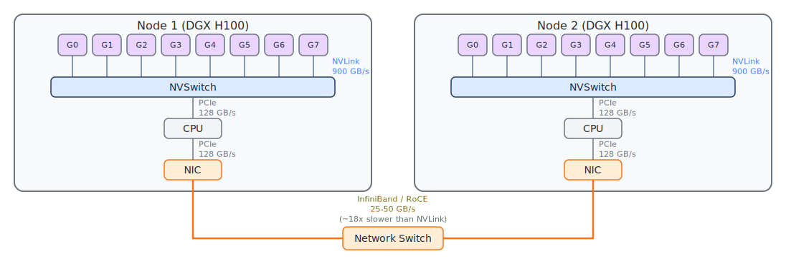
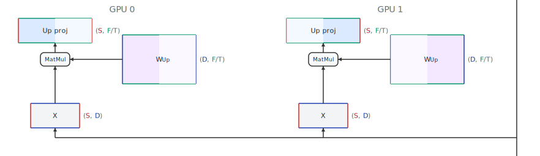
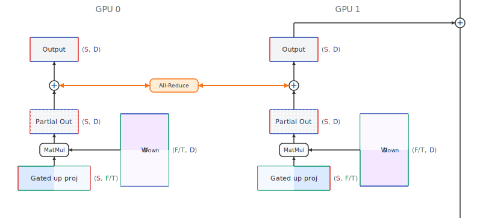
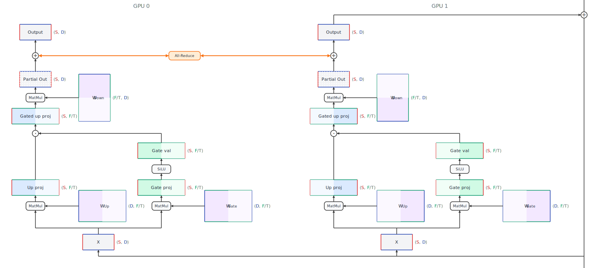
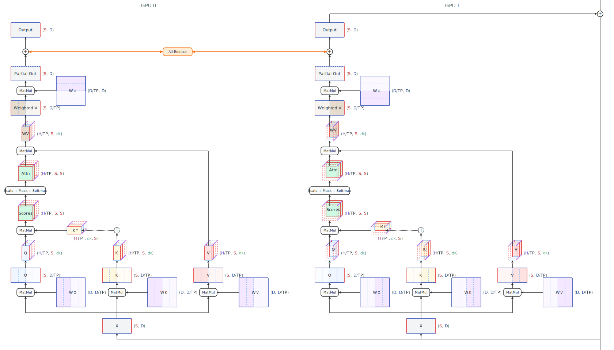
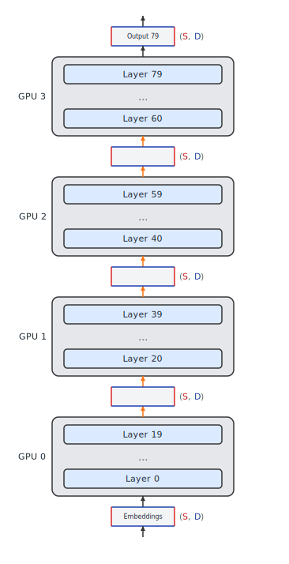
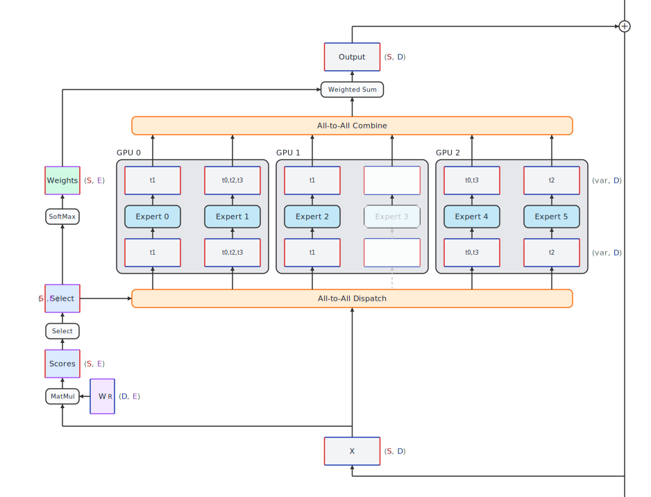
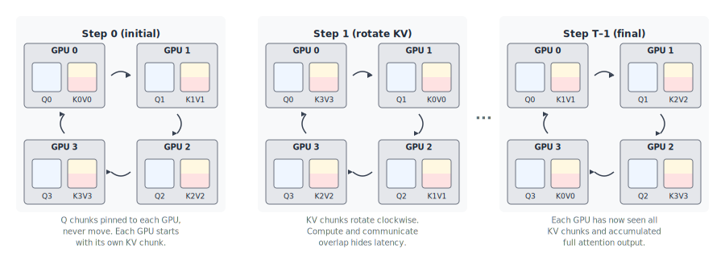

# Scaling Across Hardware {#sec-scaling}

Everything we've covered so far in this book operates on a single GPU.
That works fine for smaller models, but the largest LLMs today --- with hundreds of billions of parameters or more --- simply don't fit in the memory of a single device.
Even when a model does fit, you may want to spread the work across multiple GPUs.
This chapter is about how to do that.

The parallelism techniques used for inference are mostly the same ones developed for training.
The good news is that they're easier to implement for inference, because they only have to deal with the forward pass --- no activations to store for backpropagation, no gradient calculations, and no optimizer state.
The core challenge here is that every time we split work across devices, we introduce communication overhead between devices, and that communication can be much slower than communication within one device.

We'll start by understanding the communication fabric, then work through each parallelism strategy, and finish by analyzing when communication becomes the bottleneck.

## Interconnects and Multi-GPU Topology {#sec-interconnects}

Before we can reason about the cost of distributing work, we need to know how fast data moves between devices.
The answer varies enormously depending on which devices are talking to each other.
@fig-interconnect shows the different communication paths between GPUs in a cluster of two nodes, each with eight H100 GPUs, and the typical bandwidths for each path.

{#fig-interconnect .lightbox}

### Intra-node: NVLink and NVSwitch

Within a single server node, NVIDIA GPUs communicate over **NVLink**, a high-bandwidth point-to-point interconnect.
On the H100, each GPU has 18 NVLink connections providing 900 GB/s of bidirectional bandwidth [@nvidia2023h100].
That's roughly 7x the bandwidth of PCIe Gen5.

In an 8-GPU node like the NVIDIA DGX H100, an **NVSwitch** fabric connects all GPUs in a full-mesh topology, so any GPU can communicate with any other GPU at the full NVLink bandwidth without going through intermediate hops.
This is critical for collective operations like all-reduce, where every GPU needs to exchange data with every other GPU.

### PCIe

**PCIe** (Peripheral Component Interconnect Express) is the general-purpose interconnect between the CPU and all attached devices, including GPUs.
PCIe Gen5 x16 provides about 128 GB/s of bidirectional bandwidth, which we've noted is roughly 7x slower than NVLink.
PCIe is used for CPU-GPU data transfers (loading input tokens, returning results) and as a fallback communication path between GPUs when NVLink isn't available.

For inference, PCIe bandwidth matters in two scenarios: KV cache offloading to CPU memory (discussed in @sec-request-scheduling), and consumer/workstation GPU setups that lack NVLink entirely.
In those configurations, inter-GPU communication is bottlenecked at PCIe speeds, which severely limits the parallelism strategies that are practical.

### Multi-node networking

When you need more GPUs than fit in a single node, communication moves to the network.
The two dominant technologies are **InfiniBand** and **RDMA over Converged Ethernet (RoCE)**.

NVIDIA's HDR InfiniBand provides 200 Gb/s (25 GB/s) per port, and NDR doubles that to 400 Gb/s (50 GB/s) per port.
With multiple ports bonded together, a node can achieve aggregate network bandwidth in the hundreds of GB/s -- but this is still far below the 900 GB/s available over NVLink within the node.
Network latency is also significantly higher: a few microseconds for InfiniBand versus roughly 100 nanoseconds for NVLink.

This bandwidth gap is the fundamental reason why multi-node inference is hard.
Strategies that require frequent all-to-all communication, like tensor parallelism, work beautifully within a node over NVLink but become impractical across nodes.

### Bandwidth comparison

| Interconnect   | Bandwidth (bidirectional) | Typical latency | Scope      |
|:---------------|:--------------------------|:----------------|:-----------|
| NVLink (H100)  | 900 GB/s per GPU          | \~100 ns        | Intra-node |
| PCIe Gen5 x16  | 128 GB/s                  | \~1 μs          | Intra-node |
| InfiniBand NDR | 50 GB/s per port          | \~1-2 μs        | Multi-node |
| InfiniBand HDR | 25 GB/s per port          | \~1-2 μs        | Multi-node |
| RoCE v2        | 25-50 GB/s per port       | \~2-5 μs        | Multi-node |

: Interconnect bandwidth and latency comparison for common GPU infrastructure. {#tbl-interconnects .striped}

### Beyond NVIDIA

While this book focuses on NVIDIA GPUs, it's worth noting the competitive landscape.
**AMD's MI300X** offers 192 GB of HBM3 memory --- significantly more than the H100's 80 GB --- connected via AMD's Infinity Fabric with bandwidth comparable to NVLink.
**Google's TPU v4 and v5** use a custom 3D torus interconnect (ICI) that provides high-bandwidth, low-latency communication between chips without needing an explicit switch fabric.
**AWS Inferentia** and **Trainium** chips use NeuronLink for inter-chip communication.
**Cerebras** takes a radically different approach with wafer-scale integration, eliminating inter-chip communication entirely within a single wafer.
Each of these platforms has different communication characteristics, but the fundamental tradeoffs between computation, memory, and communication apply universally.

## Parallelism Overview and Data Parallelism {#sec-parallelism-overview}

There are several ways to distribute inference across multiple devices.
Each strategy partitions a different dimension of the problem:

- **Data parallelism (DP)**: spreads the batch dimension across devices. The simple approach replicates the entire model on different devices, and then splits requests across replicas, with no communication between them.
- **Tensor parallelism (TP)**: spreads the model dimension across devices. This involves splitting individual layers across devices.
- **Pipeline parallelism (PP)**: assigns different layers to different devices
- **Expert parallelism (EP)**: assigns different MoE experts to different devices
- **Sequence/context parallelism (SP/CP)**: spreads the sequence dimension across devices. Care is required to maintain dependencies between tokens.

In practice, modern frameworks support, and production systems combine, multiple parallelism strategies.
A common pattern is TP within a node (where NVLink provides the bandwidth for frequent all-reduce operations) and PP across nodes (where only point-to-point activations need to cross the network).

### Data Parallelism

Simple **Data parallelism** is the easiest approach: place a complete copy of the model on each GPU and route different requests to different replicas.
There's no communication between replicas during inference.
Since there are no data dependencies between different requests, each replica processes its requests independently.

Without any communication overhead, DP scales throughput linearly with the number of replicas.
If one GPU can serve 50 tokens per second, eight GPUs can serve 400 tokens per second.
However, DP does nothing for single-request latency, so throughput increases without reducing TPOT.
When running DP as the only parallelism strategy, it requires each device to have enough memory to hold the full model.
For a 70B parameter model in FP16, that's 140 GB of weights, already beyond the capacity of a single H100 with 80 GB of HBM3.

When the model fits on a single device, DP is the go-to strategy for scaling throughput.
When it doesn't, we need the techniques that follow.

## Tensor Parallelism (TP) {#sec-tensor-parallelism}

**Tensor parallelism** splits data tensors and weight matrices across devices, so each GPU computes a slice of each layer.
This is the most communication-intensive parallelism strategy, but it directly reduces per-device memory and enables serving models that don't fit on a single GPU.

### Column-parallel and row-parallel linear layers

The core idea is to partition each linear layer's weight matrix along either its columns or its rows.
For the following, assume we have **T** GPUs and a weight matrix $W$ of shape **($d_{\text{in}}$, $d_{\text{out}}$)**.
By splitting $W$ into **T** parts, we can distribute the storage requirement and computations involving $W$ across the GPUs.
How we split $W$ determines the communication patterns.

In a **column-parallel** linear layer, the weight matrix $W$ is split along the output dimension into **T** parts, each with $d_{\text{out}}$**/T** columns.
Each GPU holds a subset of the weights $W_i$ with shape **($d_{\text{in}}$, $d_{\text{out}}$/T)**.
Each GPU receives the full input activation $x$ of shape **($d_{\text{in}}$)** and computes $x W_i$ locally, producing a partial output of shape **($d_{\text{out}}$/T)**.
No communication is needed yet --- each GPU has an independent slice of the result.

{#fig-tp-column .lightbox}

@Fig-tp-column shows an example of a column-parallel linear layer with 2-way tensor parallelism, i.e. **T** = 2.
The darker shaded portion of the weight matrix $W_{\text{Up}}$ shows the half that is stored on each GPU.
When multiplied by the full input $x$, each GPU produces a half-sized output, represented by the darker shaded portion of the output tensor.

In a **row-parallel** linear layer, the weight matrix is split along the input dimension into **T** parts, each with $d_{\text{in}}$**/T** rows.
Each GPU holds a subset of the weights $W_i$ with shape **($d_{\text{in}}$/T, $d_{\text{out}}$)** and receives only its slice of the input $x_i$, which is of shape **($d_{\text{in}}$/T)**.
Each GPU computes $x_i W_i$, producing a partial result.
This partial result is the correct shape of **($d_{\text{out}}$)**, but it's only a fraction of the correct value because it was computed with only part of the input.
To get the correct output, we need an **all-reduce** operation to sum the partial results from all **T** GPUs.

{#fig-tp-row .lightbox}

@Fig-tp-row shows an example of a row-parallel linear layer with tensor parallelism **T** = 2.
The darker shaded portion of the weight matrix $W_{\text{Down}}$ shows the half that is stored on each GPU.
When multiplied by the partial input called "Gated up proj," each GPU produces a partial output represented by the dotted and dashed tensor.
To get the full output, we need to sum the partial outputs from both GPUs using an all-reduce operation, which is a collective communication primitive that efficiently sums tensors across multiple devices.

The standard pattern with tensor parallelism is to pair column-parallel and row-parallel layers so that only one all-reduce is needed per pair.
In a transformer block:

1.  The MLP up-projection and the QKV projection use column-parallel splits
2.  The MLP down-projection and the attention output projection use row-parallel splits
3.  An all-reduce follows each row-parallel layer

This means each transformer layer (with both attention and MLP) requires **two all-reduce operations**, one after the attention block and one after the MLP block.

### Gated MLP under TP

We start with the simpler FFN block and show attention next.
@Fig-tp-mlp shows what 2-way tensor parallelism looks like for the gated MLP, which is now the more common form of FFN.

{#fig-tp-mlp .lightbox}

### Multi-head attention under TP

Attention is naturally suited to tensor parallelism because the heads are independent.
With **[H]{.dim-h}** attention heads split across **T** GPUs, each GPU handles **[H]{.dim-h}**/**T** heads.
The Q, K, and V projection matrices are split column-parallel by head, each GPU computes attention for its local heads, and the output projection is row-parallel with an all-reduce to combine results.
This effect is depicted in @fig-tp-attn with 2-way tensor parallelism for the attention layer.

The **KV cache** is also sharded: each GPU only stores the K and V tensors for its local heads.
With GQA or MQA (discussed in @sec-efficient-attention), there are fewer KV heads than query heads, so the KV cache per device is even smaller.
For example, with 8 KV head groups split across 8 GPUs with TP=8, each GPU holds just one KV head group --- the minimum possible.

{#fig-tp-attn .lightbox}

### Communication cost

The all-reduce operation sums tensors across all **T** GPUs.
Using the ring all-reduce algorithm, the communication volume per all-reduce is approximately:

$$V_{\text{all-reduce}} = 2 \times \frac{T-1}{T} \times \dimd{D} \times \text{bytes\_per\_element}$$

where the factor of 2 accounts for the reduce-scatter and all-gather phases.
With two all-reduces per transformer layer and **[L]{.dim-l}** layers, the total communication per forward pass is 2 × **[L]{.dim-l}** all-reduce operations.

For a 70B model with **[D]{.dim-d}** = 8192 and TP=8 on H100 NVLink (900 GB/s), each all-reduce for a single-token decode step moves roughly 2 × 8192 × 2 bytes ≈ 32 KB.
That completes in well under a microsecond, which is negligible.
But for prefill with thousands of tokens, or with larger batch sizes, the communication volume scales linearly with sequence length and batch size, and it can start to matter.

The key insight is that TP requires **high-bandwidth, low-latency** communication every layer, making it a costly slowdown across nodes where network bandwidth is 10-30x lower than NVLink.

## Pipeline Parallelism (PP) {#sec-pipeline-parallelism}

**Pipeline parallelism** takes a different approach: instead of splitting each layer across devices, it assigns entire layers to different devices.
If you have 80 transformer layers and 4 GPUs, each GPU gets 20 consecutive layers.
This is depicted in @fig-pipeline-parallelism.

{#fig-pipeline-parallelism .lightbox}

### How it works

The forward pass flows through the pipeline stages sequentially.
GPU 0 processes the input through layers 0-19 and sends the activation tensor to GPU 1, which runs layers 20-39, and so on.
The communication pattern is simple point-to-point transfers between adjacent stages --- no all-reduce needed.

With **P** pipeline stages, the activation tensor passed between stages has shape **([S]{.dim-s}, [D]{.dim-d})**, and it only happens **P** - 1 times, resulting in a much smaller volume of communication than the 2 × **L**{.dim-l} all-reduce operations in TP.
This low communication volume makes PP better-suited for **multi-node** deployment, where network bandwidth is more limited.

### The pipeline bubble

The downside of PP is the **pipeline bubble**.
When processing a single request, only one stage is active at a time.
The other stages sit idle, waiting for their turn.
With **P** pipeline stages, the bubble fraction is roughly $(\text{P}-1)/\text{P}$.
With 4 stages, 75% of the hardware is idle at any given moment.

**Micro-batching** is the standard solution.
Instead of sending the entire batch through the pipeline, break it into smaller micro-batches.
While Stage 1 processes micro-batch 2, Stage 0 can start processing micro-batch 3.
With enough micro-batches in flight, all stages stay busy and the bubble shrinks.

For inference, the bubble problem is less severe than in training for two reasons.
First, during decode, each step generates just one token per request, so the pipeline latency per step is short.
Second, with continuous batching (@sec-batching), there are usually many concurrent requests to keep the pipeline full.

However, PP does add latency to each decode step, since the activation must travel through all stages sequentially.
With **P** stages, the minimum latency for a single forward pass is **P** times the per-stage compute time, plus the communication time between stages.
For latency-sensitive applications, this overhead may be noticeable.

## Expert Parallelism (EP) {#sec-expert-parallelism}

Mixture-of-Experts (MoE) models, like Mixtral, DeepSeek-V2, and many recent large models, replace the dense MLP block with a set of expert MLPs, where a router selects a small number of experts for each token.
This significantly reduces per-token compute, but it still requires the full set of expert weights to be in memory.

**Expert parallelism** assigns different experts to different GPUs.
With 64 experts and 8 GPUs, each GPU holds 8 experts.
When a token is routed to an expert on another GPU, the token's activation must be sent to that GPU and the result sent back.

### All-to-all communication

@Fig-ep-mlp shows the data flow for expert parallelism.
The communication pattern for EP is **all-to-all**: every GPU potentially needs to send tokens to every other GPU and receive results back.
Each MoE layer requires two all-to-all operations --- one to dispatch tokens to the correct experts, and one to collect results.

The communication volume depends on the routing decisions, but in expectation, with **T** total GPUs, each GPU sends $(T-1)/T$ of its tokens to other GPUs (since only $1/T$ of experts are local).
For a model with many MoE layers, this all-to-all traffic adds up.

{#fig-ep-mlp .lightbox}

### Load balancing

A practical challenge with EP is **load imbalance**.
If the router sends most tokens to a few popular experts, the GPUs holding those experts become bottlenecks while others sit idle.
Training-time auxiliary losses encourage balanced routing, but inference workloads may still exhibit skewed expert utilization.
Some systems address this by placing popular experts on multiple GPUs (expert replication) or by capping the number of tokens each expert processes and dropping overflow tokens.

Advanced routing strategies for EP try to colocate experts that are frequently co-activated on the same GPU, reducing the all-to-all communication.
This is accomplished during training using techniques such as additional routing terms in the loss function [@liu2024deepseekv2] and learnable bias weights in the routing network [@liu2024deepseekv3].

EP pairs naturally with TP and PP.
A common configuration for large MoE models is TP within a node for the attention layers and EP across nodes for the expert layers, since the all-to-all communication pattern of EP is more tolerant of network latency than the all-reduce pattern of TP.

## Context / Sequence Parallelism (CP/SP) {#sec-sequence-parallelism}

The parallelism strategies we've covered so far partition the model.
**Context parallelism** (also called **sequence parallelism**) partitions the input sequence, splitting a long sequence of tokens across multiple GPUs so that each GPU processes a subsequence.

This is primarily useful during **prefill** of long contexts.
If you're processing a 128K-token prompt, the attention computation is $O(\dims{\text{S}}^2)$ and the KV cache for that single request may not fit on one GPU.
Splitting the sequence across 4 GPUs gives each one a 32K-token chunk to process.

### Ring attention

**Ring self-attention** [@li2021ring] arranges the GPUs in a logical ring.
Each GPU starts with a local chunk of queries and an initial chunk of keys and values.
Through a series of ring-pass steps, the K/V chunks rotate around the ring, and each GPU accumulates partial attention scores from all chunks.
After **T** steps (where **T** is the number of GPUs), every GPU has computed attention over the full sequence.
This pattern is depicted in @fig-ring-attn for **T** = 4 GPUs.

{#fig-ring-attn .lightbox}

The ring communication pattern overlaps neatly with computation: while a GPU computes attention with the current K/V chunk, it simultaneously sends that chunk to its neighbor and receives the next chunk.
With enough computation per chunk, the communication is fully hidden.

**DistFlashAttn** [@li2023distflashattn] combines ring attention with FlashAttention's IO-aware tiling (see @sec-attention-kernels), getting both the distributed memory benefit and the HBM traffic reduction of FlashAttention.

### NVIDIA sequence parallelism

NVIDIA's variant of **sequence parallelism** is designed to work alongside tensor parallelism.
In a TP-sharded model, operations that are not parallelized by TP -- like LayerNorm and dropout -- are replicated across all GPUs, which wastes memory.
NVIDIA SP partitions the sequence dimension for these operations, so each GPU handles a fraction of the sequence during LayerNorm and other non-TP layers, then all-gathers the full sequence before the TP-parallel matrix multiplications.

### DeepSpeed Ulysses

**DeepSpeed Ulysses** [@jacobs2023ulysses] leverages the multi-head nature of attention.
Instead of passing K/V chunks around a ring, it uses all-to-all communication to transpose the Q, K, and V tensors from a sequence-partitioned layout to a head-partitioned layout.
Each GPU then computes full-sequence attention for its subset of heads, equivalent to tensor parallelism's head-based split, but derived from a sequence-partitioned starting point.
After attention, another all-to-all transposes back.

The advantage of this approach is that each GPU computes standard FlashAttention on its local heads without the complexity of incremental partial-attention accumulation.
The cost is two all-to-all operations per attention layer.

### FlashDecoding

**FlashDecoding** is worth mentioning here even though it operates within a single GPU.
It parallelizes the attention computation across the KV sequence dimension, splitting the cached keys and values across multiple thread blocks that compute partial attention in parallel, then reducing the results.
This addresses the problem that during decode, the single query token produces very little parallelism across the head dimension, leaving most of the GPU idle.
FlashDecoding gives the GPU more work to do in parallel by splitting the "long" dimension, which is the cached sequence.

### When sequence parallelism helps

Context parallelism is most effective for **long-context prefill**, where the sequence length creates both a compute and memory bottleneck.
For short-context decode, the sequence dimension is short and there's little benefit to splitting it further.
The overhead of the extra communication typically outweighs any gains from utilizing multiple devices.

## Communication Cost Analysis {#sec-communication-cost}

With all the parallelism strategies laid out, let's compare their communication patterns and costs.

| Strategy | Collective op | Ops per layer | Communication volume per op | Best interconnect |
|:-----------|:-----------|:-----------|:------------------------|:-----------|
| TP | All-reduce | 2 | $2 \times \frac{T-1}{T} \times \dimd{D} \times B$ bytes | NVLink |
| PP | Point-to-point | 1 | $\dimd{D} \times B$ bytes (activation) | Network OK |
| EP | All-to-all | 2 | Routing-dependent; \~$\frac{T-1}{T}$ of tokens | NVLink or network |
| CP/SP | Ring-pass or all-to-all | **T** or 2 | $O((\dims{S}/T) \times \dimd{D})$ per step | NVLink |

: Communication patterns and costs for each parallelism strategy. **T** = number of devices, **[D]{.dim-d}** = model dimension, **B** = batch size in tokens, **[S]{.dim-s}** = sequence length. {#tbl-parallelism-methods .striped}

The key observation is that **TP is the most communication-hungry** strategy, requiring two all-reduce operations per layer.
This is why TP is confined to within a single node over NVLink.
PP has the lightest communication --- just a single activation tensor between adjacent stages --- making it the natural choice for spanning nodes.

### Combined TP + PP

The most common multi-node configuration is **TP within a node, PP across nodes**.
For example, serving a 70B model on 2 nodes of 8 GPUs each: use TP=8 within each node (splitting layers across all 8 GPUs via NVLink), and PP=2 across the two nodes (first half of layers on node 1, second half on node 2).
The frequent all-reduces stay on the fast NVLink fabric, and only the occasional activation transfer crosses the network.

### Combining EP with other strategies

Combining EP with other strategies works slightly differently because EP only uses a subset of a layer's experts for each token.
DP, TP, and PP always require all devices to fully participate for each token.
The averaging of work across devices with EP is more complex, and averages better with larger numbers that smooth out the routing decisions.
Whereas simple DP can be performed with replicas that don't interact, DP with EP works better if the replicas share load balancing of EP across devices.
It's also difficult to manage multiple communication patterns simultaneously.
This is the reason why vLLM reuses the DP / TP communications mesh for EP, rather than introducing a separate communication mesh just for the experts.

### Communication-bound regime

When does communication become the bottleneck?
During decode with small batch sizes, the per-layer computation is tiny (a few matrix-vector multiplications), and each layer's all-reduce, even if it's only transferring tens of KB, has a latency floor that can dominate.
The all-reduce latency depends on both bandwidth and the number of sequential steps in the algorithm.

A useful rule of thumb: if the communication time per layer exceeds the compute time per layer, you've over-parallelized.
Adding more TP devices beyond this point will increase latency rather than decrease it, because you're spending more time synchronizing than computing.
This is why TP=8 is a common sweet spot on 8-GPU nodes.
It matches the NVLink connectivity, and going to TP=16 across nodes rarely makes sense.
Note also that TP up to the number of KV heads efficiently shards the KV cache, but beyond that, requires replication of the KV cache across devices, which is less beneficial.

## Multi-Node Inference {#sec-multi-node}

When a model is too large for a single node, or when you need more throughput than one node can provide, you're in multi-node territory.
This introduces the network as a hard constraint on performance.

### Network latency as a floor

During decode, each token generation requires a full forward pass through the model.
If that forward pass spans two nodes connected by InfiniBand, each pipeline stage boundary (or TP all-reduce, if you're running TP across nodes) adds network latency.
InfiniBand NDR round-trip latency is roughly 2-5 μs, compared to \~100 ns for NVLink.
This latency is per layer for TP or per stage for PP, and it accumulates across the forward pass.

For a model using PP=2 across nodes, the activation transfer between stages adds a few microseconds per decode step.
That's usually acceptable.
But for TP across nodes, where you need two all-reduces per layer across potentially 80+ layers, the cumulative latency can add milliseconds to each token, directly increasing TPOT.

### Practical deployment patterns

In practice, multi-node inference for large models follows a few common patterns:

- **DP across nodes**: when the model fits on a single node, the simplest scale-out is running independent replicas. No cross-node communication during inference at all.
- **TP within node, PP across nodes**: the standard approach, as discussed above. Minimizes cross-node communication.
- **TP within node, EP across nodes for MoE**: expert parallelism's all-to-all pattern is more latency-tolerant than TP's all-reduce, making it more viable across nodes.

::: callout-note
The distinction between what's practical within a node versus across nodes is driven almost entirely by the bandwidth gap in @tbl-interconnects.
NVLink provides 900 GB/s; the network provides 50 GB/s.
That 18x gap is why the parallelism strategy changes at the node boundary.
:::

### Memory and KV cache considerations

One often-overlooked benefit of distributing a model across more GPUs is that it frees up memory for the **KV cache**.
If a 70B FP16 model uses 140 GB across 8 GPUs (17.5 GB per GPU), that leaves about 62 GB per GPU on H100 for KV cache and activations.
With quantized weights (e.g., INT4), the model only consumes \~35 GB total, leaving even more room.
More KV cache memory means you can serve larger batches or longer sequences, directly improving throughput.

This is a genuine advantage of tensor parallelism beyond just enabling large models: by spreading weight memory across more devices, you increase the aggregate memory available for serving.
Combined with KV cache sharding from GQA/MQA models (@sec-efficient-attention) and PagedAttention (@sec-kv-cache), multi-GPU setups can serve substantially more concurrent requests than the raw parameter count might suggest.

The next chapter (@sec-production) will share how all of these techniques come together in production serving systems, including how frameworks like vLLM and TensorRT-LLM configure parallelism strategies automatically based on available hardware.

## Further Reading {#sec-further-scaling}

**Overviews of parallelism strategies.**
Lilian Weng's "How to Train Really Large Models on Many GPUs?" [@weng2021trainlarge] is the most widely recommended introduction to all the parallelism strategies covered in this chapter.
It covers data, tensor, pipeline, and expert parallelism with clear diagrams.
The writing is from a training perspective, but the forward-pass mechanics are identical for inference.
The Hugging Face documentation on parallelism methods [@hf2024parallelism] is a good practical companion, with a decision table for choosing a strategy based on your hardware setup.

**The hardware perspective.**
"How to Scale Your Model" [@austin2025scaling], an online book from the JAX team at Google DeepMind, approaches parallelism from the hardware up.
It starts with the TPU architecture, works through the roofline model, and then explains each parallelism strategy in terms of the communication costs they impose on different interconnects.
Much of the focus is on training, but there is a chapter dedicated to inference, and all of the content is rich with details.

**Scaling inference specifically.**
@pope2022scaling is one of the best analyses of how parallelism strategies interact with the unique characteristics of inference --- the distinction between prefill and decode, the impact of batch size on communication-to-compute ratio, and the tradeoffs between latency and throughput.
For a more recent and practical treatment, Meta's engineering blog post on scaling LLM inference [@zhao2025metascaling] covers how they combine tensor, context, and expert parallelism in production, including their work on context parallelism for million-token sequences.

**Mixture of Experts.**
The Hugging Face blog post "Mixture of Experts Explained" [@sanseviero2023moe] provides an accessible introduction to MoE architectures, including the routing mechanism, load balancing challenges, and how expert parallelism fits into the picture.
For the systems-level challenges of serving MoE models at scale, the AlpaServe paper [@li2023alpaserve] explores how to automatically determine parallelism strategies across heterogeneous clusters, balancing latency constraints against hardware utilization.
