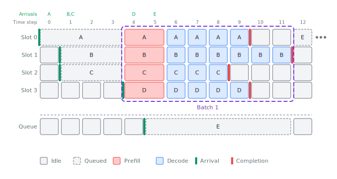
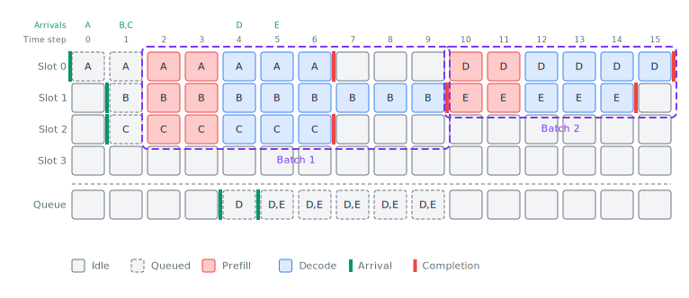
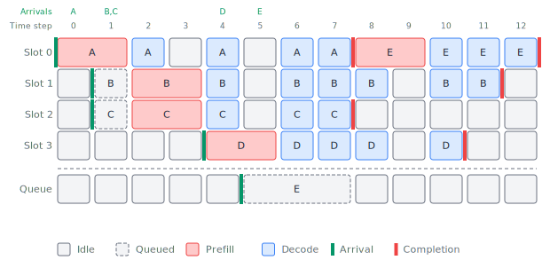
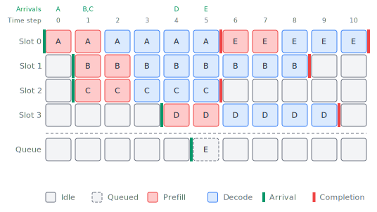
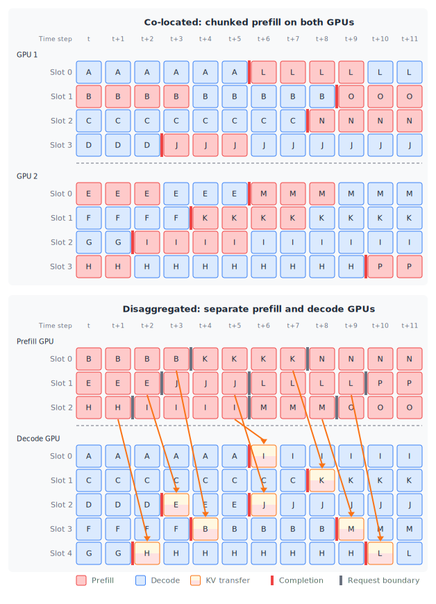
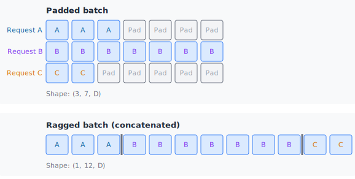
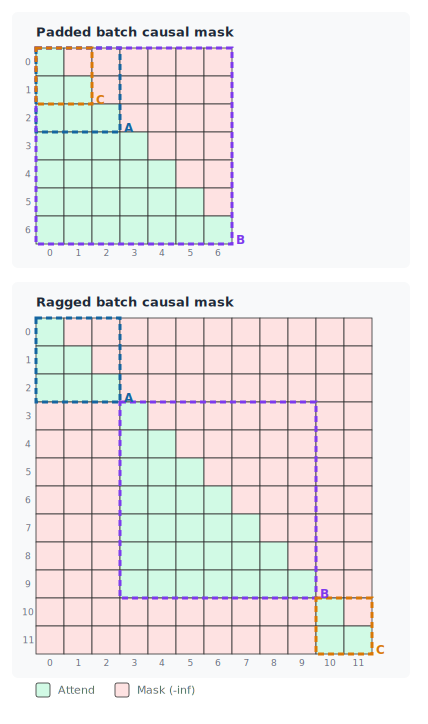
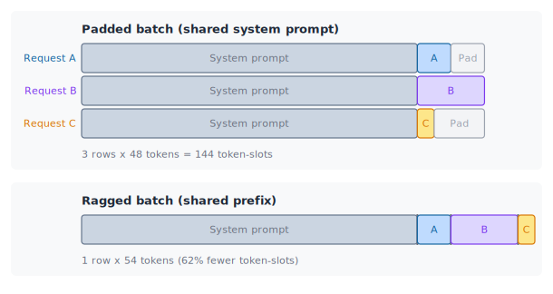

# Scheduling Bottlenecks {#sec-scheduling}

The previous chapter focused on making the model itself smaller and faster -- fewer parameters, lower precision, more efficient attention mechanisms.
Those techniques change what gets computed.
This chapter drills into how requests flow through the system.
Even with a well-optimized model, a naive scheduler can leave the GPU sitting idle while requests wait in line, waste compute on padding tokens that contribute nothing, or let a single long prefill block dozens of shorter requests from making progress.

The techniques here --- batching strategies, prefill management, and request scheduling --- act on the serving system layer.
They're about keeping the GPU busy doing useful work as much of the time as possible, regardless of what model is being used.

## Batching Strategies {#sec-batching}

### Why batching matters

In @sec-bottleneck-framework, we established that decode is deeply memory-bandwidth-bound.
Each decode step reads the entire set of model weights from HBM to produce just one token per request.
On an H100 SXM with a 70B parameter model in FP16, that's roughly 140 GB of weight data read through 3.35 TB/s of bandwidth -- about 42 ms just to stream the weights, and all of that work produces a single token.

**Batching** changes this equation.
When you process **B** requests in a single decode step, you still read the weights once, but you apply them to **B** token vectors instead of one.
The compute scales linearly with **B**, but the data movement stays roughly constant (dominated by the weight read).
This directly increases the **arithmetic intensity** -- the ratio of FLOPs to bytes moved -- pushing decode toward the compute-bound side of the roofline.

Let's put concrete numbers on this. For a single linear layer with weight matrix of shape **([D]{.dim-d}, [D]{.dim-d})** in FP16:

- **Data moved**: $2\dimd{D}^2$ bytes (reading the weight matrix)
- **Compute**: $2B\dimd{D}^2$ FLOPs ($B$ matrix-vector multiplications)
- **Arithmetic intensity**: $2B\dimd{D}^2 / 2\dimd{D}^2 = B$ FLOP/byte

Recall @fig-roofline-batching.

With batch size 1, the arithmetic intensity is about 1 FLOP/byte -- far below the H100's FP16 ridge point of ~295 FLOP/byte.
The GPU's tensor cores are almost entirely idle, waiting for data to arrive from HBM.
With batch size 64, the intensity rises to 64 FLOP/byte.
Still below the ridge point, but now the GPU is doing 64x more useful work per byte read.
With batch size 256, we're approaching the ridge point and the GPU's compute units are finally getting busy.

```{=html}
<!-- Figure: Roofline diagram showing decode at different batch sizes
ASCII art sketch:
Attainable FLOP/s (log scale)
        |
  990T  |                          ___________________________  <-- Compute ceiling
        |                        /
        |                      /
        |                    /
        |                  /         * B=256 (approaching ridge)
        |                /
        |              /
        |            /       * B=64
        |          /
        |        /
        |      /
        |    /   * B=16
        |  / * B=1
        |/______________|______________________________________
                       295                    Arithmetic intensity (FLOP/byte)

   B=1:   ~1 FLOP/byte     (deeply memory-bound, GPU mostly idle)
   B=16:  ~16 FLOP/byte    (still memory-bound, but 16x more useful work)
   B=64:  ~64 FLOP/byte    (closing the gap)
   B=256: ~256 FLOP/byte   (near the ridge point, GPU well utilized)
-->
```

The throughput gain is dramatic.
A system decoding one request at a time on an H100 might produce ~30 tokens/s.
The same system decoding a batch of 64 requests might produce ~1500 tokens/s total -- roughly the same latency per step, but 50x the throughput.
This is why batching is the single most important lever for inference cost efficiency.

### The memory cost of batching

There's a catch, and it's a big one.
Each request in the batch needs its own **KV cache** -- the stored key and value tensors from every layer, accumulated across every token processed so far.
As we'll cover in detail in @sec-kv-cache, the KV cache for a single request can consume several gigabytes for long sequences with large models.

If your model weights occupy 30 GB on an 80 GB GPU, you have roughly 50 GB left for KV caches (minus activation memory and framework overhead).
How many requests fit depends on the model architecture, the KV cache precision, and the sequence lengths involved.
A batch of 64 requests, each with 2,048 tokens of context, might consume far more than 50 GB of KV cache -- at which point you simply can't fit that many requests.

This is the central batching tradeoff: **larger batches improve GPU utilization and throughput, but each additional request in the batch consumes KV cache memory**.
Push the batch size too high and you'll run out of GPU memory.
Keep it too low and you're leaving performance on the table.
The memory management techniques in @sec-kv-cache and the preemption policies we'll discuss at the end of this chapter exist to navigate this tradeoff.

### Example workload

To compare the batching strategies that follow, we'll use the same small workload throughout: five requests arriving at staggered times, each needing 2 prefill steps and a varying number of decode steps.

| Request | Arrival time | Decode steps |
|---------|-------------|-------------|
| A       | 0           | 4           |
| B       | 1           | 6           |
| C       | 1           | 3           |
| D       | 4           | 4           |
| E       | 5           | 3           |

: Example workload used in the batching diagrams below. {#tbl-batching-workload .striped}

This is a toy example.
In practice, prefill time depends on input length and can vary enormously across requests, queuing delays can stretch to seconds under heavy load, and decode runs for hundreds or thousands of steps.
We've flattened all of that to keep the diagrams readable.
The point is to show how each strategy handles staggered arrivals and variable-length outputs, not to depict realistic timescales.

### Static batching

The simplest batching strategy is **static batching**: collect a fixed number of requests, process them all together, and don't start the next batch until every request in the current batch has finished generating.

{#fig-static-batching .lightbox}

@Fig-static-batching shows the results of our workload with a static batch size of 4 requests.
Requests A through D start work at time step 4 and finish at time step 11.
At time step 12, Request E is still waiting for three more requests to arrive, and could finish much later.
There are obvious problems with these results.
First, the GPU sits idle for the first four time steps even though we have requests in hand, because we don't have a full batch yet.
Next, Requests A, C, and D finish earlier but their batch slots sit empty. The GPU does no useful work for those slots while continuing to work just on Request B to complete.
Request E is stuck in the queue even though there are free batch slots starting at time step 9.
This problem where a single slow request holds up the entire batch is known as **head-of-line blocking**.
Imagine how much worse this problem would be if B were a very long request generating thousands of tokens.
There are also issues with prefill, which are not so obvious from our simplified diagram.
If requests have different input lengths and prefill is done with all of them at the same time (as shown here with A, B, C, and D), then the shorter inputs need to be padded to match the longest one, wasting compute on dummy tokens during prefill.

Static batching works fine for offline workloads where all inputs and outputs have uniform length -- say, scoring a dataset of fixed-length classification examples.
Having the entire dataset available at the beginning, instead of dealing with unknown arrival times, makes scheduling much easier.
For anything with variable-length inputs, variable-length outputs, and stochastic arrival time, which is the common case in online LLM generation, it wastes too many GPU cycles.

### Dynamic batching

**Dynamic batching** improves on static batching by allowing the batch size to vary.
Instead of fixing the batch size up front, the scheduler collects requests from a queue and forms a batch based on what's available, subject to a maximum batch size and a timeout.
If the batch size is 32 and only 5 requests are waiting, once the timeout elapses, a batch with 5 requests will start processing, rather than waiting for a full batch of 32.
This reduces queuing delay and adapts to variable arrival rates.

{#fig-dynamic-batching .lightbox}

@Fig-dynamic-batching shows the results of dynamic batching on the sample workload in @tbl-batching-workload for a maximum batch size of 4 and a timeout of 2 time steps.
Now, the first batch starts at time step 2 and finishes requests A, B, and C by time step 9.
Requests D and E start immediately after Batch 1 finishes.
These two requests start at time step 10 and finish at time step 15.
Compared to static batching, we have reduced the amount of waiting before Batch 1 starts.
But it still has the same fundamental problem as static batching during decode: the batch doesn't complete until the last request finishes generating.
Short-output requests leave batch slots that sit idle while they wait for long-output requests to wrap up, so a really long Request B still wastes a lot of GPU capacity.
In our example, requests D and E stay queued until time step 10 even though the GPU has capacity starting at time step 7.

### Continuous batching

The breakthrough that modern serving systems are built on is **continuous batching**, also called **in-flight batching**, introduced by Orca [@yu2022orca].
The key insight is to operate at the granularity of individual decode iterations rather than complete requests.

In continuous batching, the scheduler makes a decision at every decode step: which requests should be in this step's batch?
When a request finishes generating (by hitting a stop token or a length limit), its slot is immediately freed and can be filled by a new request from the queue, without waiting for the rest of the batch to finish.
This eliminates head-of-line blocking.

{#fig-continuous-batching .lightbox}

On our workload from @tbl-batching-workload, we see in @fig-continuous-batching that continuous batching completes all five requests by time step 10!
Requests A, B, C, and D each start as soon as they arrive.
Request E does have to wait, but it starts processing as soon as the first batch slot is available, at time step 6.
Continuous batching has eliminated unnecessary GPU idle time waiting for batches to be full as well as waiting for every request in a batch to complete.

The throughput improvement from continuous batching can be substantial.
Under workloads with high variance in output length, continuous batching can improve throughput by 2-3x or more compared to static batching, simply by keeping batch slots occupied with useful work.
This is why continuous batching is the foundational scheduling technique in serving frameworks like vLLM [@kwon2023vllm] and SGLang [@zheng2023sglang].

::: callout-note
Continuous batching requires the serving system to manage per-request state (KV cache, position counters, stop conditions) independently for each slot, and to handle the bookkeeping of inserting and removing requests mid-generation.
This is more complex than static batching but is well worth the implementation effort for any production system.
:::

Continuous batching has eliminated most of the GPU idle time, but it has created a new problem with long prefills causing requests that are doing decoding to wait.
In a simple implementation where the prefill for each input is processed all at once, we don't have the ability to insert multiple decode requests during the middle of a prefill.
And it's worthwhile to remember that the prefill of a long input can take many times longer than a decode step (not just double as we've depicted).

This is less of a GPU utilization problem, which would show in MFU, than it is a problem with increasing TPOT and overall request completion latency.
In the next section, we will unpack more of the issues with prefill and decode, and ultimately solve this issue with holes in decoding.

## Prefill Strategies {#sec-prefill-strategies}

### The prefill--decode tension

In @sec-prefill-decode, we characterized prefill as compute-bound and decode as memory-bandwidth-bound.
This difference creates a scheduling headache when the system has to do both at the same time.

Consider a serving system running continuous batching with 30 requests in the decode phase.
A new request arrives with a 4,096-token prompt.
The system needs to prefill this request before it can start decoding.
But the prefill for a 4,096-token prompt is a large, compute-intensive operation that can take hundreds of milliseconds -- during which the 30 decode requests are blocked from making progress.

From those 30 requests' perspective, this is terrible.
Each one is generating text for a user, and they all just stalled for the duration of someone else's prefill.
Their TPOT spikes, the streaming output freezes, and the user experience degrades.
This is the **prefill--decode tension**: serving a new request's prefill comes at the cost of stalling existing requests' decode steps.

The tension gets worse as prompt lengths increase.
With the trend toward longer contexts -- 32K, 128K, or even longer -- a single prefill can take multiple seconds, creating an unacceptable stall for all active decode requests.

### Chunked prefill

**Chunked prefill**, introduced by Sarathi [@agrawal2023sarathi], resolves this tension by splitting a long prefill into smaller chunks and interleaving them with decode steps.

Instead of processing all 4,096 input tokens in one large forward pass, the system might break the prefill into 8 chunks of 512 tokens each.
At each iteration, the scheduler runs one prefill chunk alongside the batch of decode tokens.
The decode requests make progress every iteration, and the new request's prefill completes over 8 iterations instead of blocking everything for one long pass.

The chunk size is a tuning parameter.
Smaller chunks mean smoother decode progress but increase the number of iterations needed to complete the prefill, adding overhead from additional kernel launches and attention computations across chunk boundaries.
Larger chunks reduce this overhead but create longer pauses in decode progress.
In practice, chunk sizes of 256--2,048 tokens are common, depending on the model size, the capability of the GPU (or other hardware accelerator), and the latency sensitivity of the workload.

{#fig-chunked-prefill .lightbox}

For our sample workload from @tbl-batching-workload, we can now improve upon continuous batching by breaking up our prefills (which we simplified to all be exactly twice as long as a decode step) into separate chunks.
@Fig-chunked-prefill shows Requests A, B, and D all complete one time step sooner than with vanilla continuous batching.
(In reality, if prefill was dozens of times slower than decode, the savings would be even greater.)

Chunked prefill has a nice bonus: it improves GPU utilization during decode iterations.
The prefill chunk is compute-heavy and the decode tokens are bandwidth-heavy, so combining them in the same iteration gives the GPU a mix of both types of work.
The prefill chunk tokens keep the compute units busy while the decode tokens are heavily utilizing GPU bandwidth to feed the compute units.
It doesn't take the GPU any longer to complete a prefill chunk with other decode steps than it would to do the prefill chunk alone.
This piggybacking effect can be as significant as the reduced stalling.

::: callout-note
Chunked prefill interacts well with continuous batching.
The scheduler treats each prefill chunk as a partial request that occupies a "prefill slot" for one iteration.
When the last chunk completes, the request transitions to the decode phase and joins the regular decode batch.
The system never has to choose between serving new requests and making progress on existing ones -- it does both simultaneously.
:::

### Disaggregated prefill

Chunked prefill is effective, but it's still a compromise -- prefill and decode share the same GPU and compete for the same resources.
**Disaggregated prefill** takes a more radical approach: run prefill and decode on entirely separate hardware instances [@zhong2024distserve].

The idea is straightforward.
Prefill is compute-bound, so prefill instances should be optimized for compute throughput.
Decode is memory-bandwidth-bound, so decode instances should be optimized for memory bandwidth and capacity.
By disaggregating the two phases onto separate hardware, each can be independently optimized and scaled without interfering with the other.

The workflow looks like this:

1. A request arrives and is routed to a **prefill instance**
2. The prefill instance processes the full input and generates the KV cache
3. The KV cache is transferred over a fast interconnect (such as NVLink or InfiniBand) to a **decode instance**
4. The decode instance generates tokens autoregressively using the transferred KV cache

{#fig-disaggregated-prefill .lightbox}

The main cost is the KV cache transfer.
For a large model with a long prompt, the KV cache can be several gigabytes, and this data needs to move between machines before decoding can begin.
The transfer latency adds directly to TTFT, so disaggregated prefill needs a fast interconnect to be practical.
With NVLink or high-speed InfiniBand, this transfer can be completed in tens of milliseconds, which is often acceptable.

The benefits go beyond eliminating interference.
Disaggregated prefill lets you scale prefill and decode capacity independently.
If your workload has long prompts but short outputs, you might need more prefill capacity and less decode capacity.
If you're serving a chatbot with short prompts but long responses, the ratio flips.
With disaggregated serving, you allocate hardware to match the workload rather than being stuck with a fixed ratio.

Disaggregated prefill is a more complex deployment architecture, and the KV cache transfer adds latency and requires fast networking.
For many deployments, chunked prefill provides enough isolation between the phases.
But at large scale, where the workload is diverse enough and the infrastructure supports fast interconnects, disaggregation can provide significant efficiency gains.


## Ragged batching

Even with continuous batching, there's still a source of waste: when requests in a batch have different sequence lengths, the shorter sequences need padding to match the longest one in the batch for the attention computation.
**Ragged batching** eliminates this by concatenating all the tokens from different requests into a single flat sequence, with appropriate attention masks to prevent cross-request attention.

Instead of a padded batch tensor of shape $[B, S_{\text{max}}]$ where shorter sequences waste compute on pad tokens, ragged batching creates a packed tensor of shape $[T_{\text{total}}]$ where $T_{\text{total}}$ is the sum of all actual token counts.
An index array tracks where each request's tokens begin and end, and the attention mask ensures that tokens from one request can't attend to tokens from another.

{#fig-ragged-batching .lightbox}

{#fig-ragged-mask .lightbox}

This matters most during prefill, where the input lengths across requests can vary widely.
A batch with one 2,048-token prompt and three 128-token prompts would waste enormous compute on padding without ragged batching.
With ragged batching, the compute is proportional to the actual number of tokens: $2{,}048 + 3 \times 128 = 2{,}432$ tokens instead of $4 \times 2{,}048 = 8{,}192$ tokens.

{#fig-ragged-batching .lightbox}

The benefits of ragged batching combine really well with prefix caching, which we will discuss in @sec-prefix-caching.
Here is a quick diagram showing how sharing the prefix in ragged batching can save huge amounts of compute with long shared prefixes, such as a long system prompt.


## Request Scheduling and Prioritization {#sec-request-scheduling}

### Granularity of scheduling

TODO: write about how scheduling at the step-level gives more control. Where does this go relative to the other sections?

### Priority-based scheduling

Not all requests are equally urgent.
A real-time chatbot response that a user is waiting on matters more -- at least from a latency perspective -- than a background batch job scoring a dataset.
**Priority-based scheduling** lets the serving system express this difference.

In a priority-aware scheduler, each incoming request is assigned a priority level.
High-priority requests are placed at the front of the scheduling queue, while lower-priority requests wait until there's spare capacity.
The scheduler decides at each iteration which requests to include in the batch, and high-priority requests get scheduled first.

This enables a common production pattern: a system serves both real-time and batch traffic on the same hardware.
Real-time requests get low TTFT because they jump the queue.
Batch requests fill in the gaps when real-time traffic is light, keeping the GPU busy during off-peak periods.
The result is better overall utilization without sacrificing the latency SLA for interactive users.

SLA-aware scheduling takes this a step further.
Instead of simple priority levels, the scheduler tracks each request's deadline -- for example, "this request must produce its first token within 500 ms."
The scheduler then makes admission decisions based on whether it can meet the deadline.
If admitting a new request would cause an existing request to miss its deadline, the scheduler may defer the new request or take other action.

::: callout-note
The details of how serving frameworks like vLLM and SGLang implement their iteration-level schedulers -- deciding which mix of prefill chunks and decode tokens to process each step -- are covered in @sec-serving-frameworks.
The scheduler is the beating heart of a serving system, and getting it right has a large impact on goodput.
:::

### Preemption

What happens when the system runs out of KV cache memory?
With continuous batching, the scheduler is constantly admitting new requests into the batch.
Each new request needs KV cache memory, and the existing requests' KV caches grow with each decode step.
Eventually, something has to give.

**Preemption** is the mechanism for handling this.
When KV cache memory is exhausted and a new high-priority request needs to be served, the scheduler can preempt one or more existing requests -- suspending them and freeing their KV cache memory to make room.
When resources become available later, the preempted requests resume.

There are two strategies for handling the KV cache of a preempted request:

**Swap** evicts the preempted request's KV cache blocks from GPU memory to CPU memory.
When the request resumes, the blocks are swapped back.
This preserves the work already done -- the request picks up exactly where it left off without any recomputation.
The cost is the time to transfer data over the PCIe bus.
For a KV cache of several hundred megabytes, a swap to CPU memory at PCIe Gen5 speeds (~64 GB/s) takes a few milliseconds.
This is usually acceptable, but the CPU needs enough free memory to hold the evicted blocks, and the PCIe bandwidth is shared with other transfers.

**Recomputation** takes a simpler but more expensive approach: discard the preempted request's KV cache entirely.
When the request resumes, the system reruns prefill from scratch to rebuild the KV cache.
This frees GPU memory immediately and requires no CPU memory, but it wastes the compute that went into the original prefill plus all the KV cache entries accumulated during decode.
For a request with a long prompt, recomputation can be very costly.

| Strategy      | GPU memory freed | CPU memory needed | Resume cost            | Best when                          |
|---------------|------------------|-------------------|------------------------|------------------------------------|
| Swap          | Yes              | Yes               | Transfer latency       | Plenty of CPU memory, short pauses |
| Recomputation | Yes              | No                | Full prefill re-run    | Limited CPU memory, rare preemption|

: Comparison of preemption strategies. See @sec-memory-preemption for production policies.

The choice between swap and recomputation depends on the situation.
If the system has ample CPU memory and preemptions are brief, swapping is clearly better -- you avoid redoing work.
If CPU memory is tight or the preempted request would sit idle for a long time (making the cached data stale anyway), recomputation may be simpler and more predictable.
Some systems use a hybrid approach: swap when possible, fall back to recomputation when CPU memory is full.

### OOM handling and graceful degradation

Preemption is ideally a rare event -- it happens only when the system is under heavy load and the scheduler can't fit all active requests into memory.
But in adversarial conditions -- a sudden burst of long-context requests, for example -- preemption alone may not be enough.
The system can run out of both GPU and CPU memory for KV caches.

At this point, the system needs a last-resort strategy. Options include:

- **Rejecting new requests**: return an error and let the client retry later. This protects existing requests but reduces throughput.
- **CPU offloading**: proactively keep some fraction of KV cache blocks on CPU memory, streaming them to the GPU as needed. This trades PCIe bandwidth for GPU memory capacity.
- **Reducing batch size**: admit fewer concurrent requests, prioritizing the ones already in progress. New requests queue up and wait.

The details of how production systems handle these failure modes -- and how to configure policies that balance throughput, latency, and reliability -- are covered in @sec-failure-modes.

### Putting scheduling together

The scheduling techniques in this chapter form a stack.
At the bottom, the batching strategy determines how requests are grouped for each forward pass.
Continuous batching provides the foundation, keeping batch slots full at all times.
Ragged batching eliminates padding waste within each batch.
On top of that, chunked or disaggregated prefill manages the tension between serving new requests and making progress on existing ones.
And the priority and preemption policies govern which requests get resources when demand exceeds supply.

```{=html}
<!-- Figure: Scheduling stack
ASCII art sketch:
+--------------------------------------------------+
|  Priority Scheduling and Preemption Policies     |
|  (which requests get resources)                   |
+--------------------------------------------------+
|  Prefill Strategy: Chunked / Disaggregated       |
|  (how new requests are admitted without stalling) |
+--------------------------------------------------+
|  Continuous Batching + Ragged Batching            |
|  (how requests are grouped per iteration)         |
+--------------------------------------------------+
|  GPU Hardware                                     |
+--------------------------------------------------+
-->
```

None of these techniques change the model or its weights.
They don't reduce the number of FLOPs needed to process a token or shrink the KV cache per token.
What they do is ensure that the FLOPs the GPU performs are useful FLOPs -- not wasted on padding, not blocked by long prefills, not sitting idle while a slow request holds up the batch.
In the next chapter, we'll turn to techniques that operate on individual requests: optimizing the attention computation, managing the KV cache efficiently, and breaking the one-token-at-a-time constraint of autoregressive decoding.


## Further Reading

The Orca paper [@yu2022orca] is the foundational reference for continuous batching.
It introduced **iteration-level scheduling** -- the idea that the scheduler should make decisions at every decode step rather than waiting for an entire batch to complete.
If you read one paper from this chapter, make it this one.
The system design is clean, and the evaluation clearly shows the throughput gains over static batching.

Sarathi [@agrawal2023sarathi] introduced chunked prefill and the idea of piggybacking decode tokens onto prefill chunks to keep the GPU busy during long prefills.
The paper includes a clear analysis of how unchunked prefills create latency bubbles for co-scheduled decode requests, and how chunk sizing trades off between prefill throughput and decode latency stability.

DistServe [@zhong2024distserve] takes the opposite approach to managing the prefill-decode tension: rather than interleaving them on the same GPU, it disaggregates them onto separate hardware.
The paper's key contribution is showing that the optimal hardware configuration for prefill (maximize compute) is fundamentally different from decode (maximize memory bandwidth), and that separating them improves goodput.
Splitwise [@patel2024splitwise] independently explored a similar disaggregation idea, with additional analysis of how to balance capacity between prefill and decode pools as workload mix changes.

For a broader treatment of how request scheduling interacts with memory management and SLA compliance, the vLLM paper [@kwon2023vllm] covers not just PagedAttention but also the preemption and swap policies that sit on top of the memory allocator.
The scheduling policy discussion in sections 4-5 of that paper complements the treatment here.
